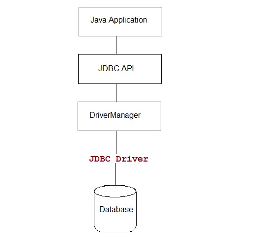
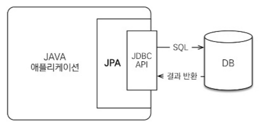

# 1. JPA

#### 들어가기전.. 

자바에서 데이터베이스를 접근하려면 JDBC API를 이용하여 SQL을 데이터베이스에 전달하여 처리를 할 수 있었다. 그 중 많이 이용했던 라이브러리가 Mybatis(ibatis)가 아닌가 싶다.
Mybatis는 JDBCTemplate를 제공하여 매핑된 xml(or 자바 코드 어노테이션)에서 SQL쿼리를 작성하여 데이터베이스에 전달해 처리 했었다. 그래서 보다 편리하게 SQL쿼리를 작성할 수 있었다. 하지만, 개발자는 코드를 짜는 시간보다 쿼리를 작업하는 시간이 많았던거 같았고, 새로운 요구사항이 발생하면 수정할 분량도 많았다. 또한 데이터베이스(Mysql, Oracle, MsSql etc..)마다 쿼리 언어가 달라서 기존 DB을 다른 DB로 바꾸려고하면 쿼리를 다 바꿔야한다. 그리고 자바코드보단 쿼리에 의존적이지 않았나 한다.

[JDBC API를 이용한 데이터베이스 접근]

#### 그럼 JPA는 무엇일까?

JPA는 Java Persistence API로 자바 진형의 ORM 표준 기술이다.

ORM(Object-Relational Mapping)은 객체와 관계형 데이터베이스를 매핑한다는 뜻으로 ORM 프레임워크를 사용하면 객체와 테이블을 매핑하여 개발자 대신 패러다임의 불일치 문제를 해결해준다.