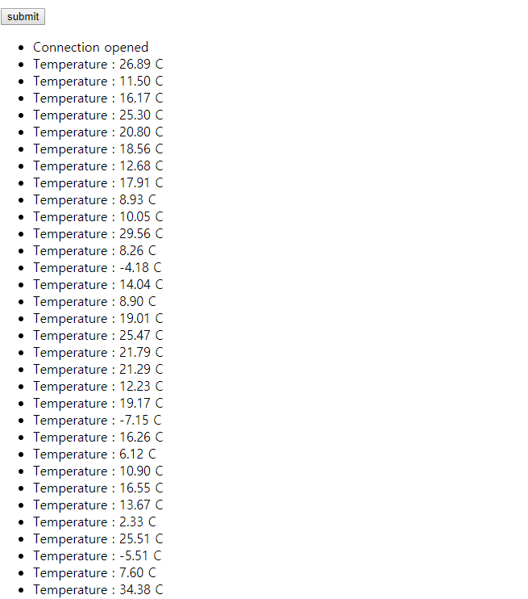

# @EventListener를 사용한 발행-구독 패턴

스프링 프레임워크는 @EventListener 어노테이션과 이벤트 발행을 위한 ApplicationEventPublisher 클래스를 제공한다.


Observer Pattern과 달리 발행-구독 패턴을 이용하면 게시자와 구독자는 서로 알 필요가 없다.
그리고 게시자와 구독자 간에 간접적인 계층을 제공하고 구독자는 브로드캐스트하는 이벤트 채널로부터 받고, 게시자는 누군지 신경쓰지 않는다. 이벤트 채널은 동시에 몇 명의 게시자가 있는지 알 수 있으며, 수신 메시지를 구독자에게 배포하기 전에 필터링 작업을 할 수도 있고, 필터링 및 라우팅은 메시지 내용이나 메시지 주제, 때로는 둘 다 발생할 수 있다. 따라서 토픽 기반 시스템(Topic-Based System)의 구독자느 ㄴ관심 토픽에 게시된 모든 메시지를 수신하게 된다.

스프링 프레임워크의 @EventListener는 Topic 기반 라우팅과 내용 기반 라우팅 모두 사용할 수 있다.


### **@EventListener를 이용한 응용프로그램 개발**

**리액티브 디자인** 에 따라 애플리케이션을 만들어야 하므로 고전적인 방식의 풀링 모델(pulling model)을 사용해 데이터를 조회할 수 없다. 서버에서 클라이언트로 비동기 메시지 전달을 할 수 있는 Web Socket, SSE(Server-Sent Events)이 있다. SSE를 사용하면 클라이언트가 서버에서 자동으로 업데이트를 수신할 수 있으므로 브라우저에서 메시지를 업데이트하거나 연속적인 데이터 스트림을 보내는데 사용한다. HTML5을 지원하는 최신 브라우저는 EventSource라는 자바스크립트 API가 있는데 이벤트 스트림을 수신하기 위해 특정 URL을 호출하는데 사용한다.

스프링 프레임워크에서 발행-구독 패턴을 이용하여 방 안의 온도를 보여주는 간단한 웹 페이지를 만들어보자.

- 온도센서는 섭씨로 표현된 현재온도를 이벤트로 보낸다
- 난수생성하여 온도 센서를 시뮬레이터로 구현

**1. 서비스 계층 생성 및 구현**

[Temperature.java]
```java
import lombok.Data;

@Data
public class Temperature {
    private final double value;
}

```

[TemeratureSensor.java]
```java

@Component
public class TemeratureSensor {
    //이벤트를 시스템에 발행하는 클래스
    private final ApplicationEventPublisher publisher;
    private final Random random = new Random();
    //스케쥴 스레드 풀
    private final ScheduledExecutorService executor = Executors.newSingleThreadScheduledExecutor();

    public TemeratureSensor(ApplicationEventPublisher publisher) {
        this.publisher = publisher;
    }

    @PostConstruct
    public void startProcessing() {
        this.executor.schedule(this::probe, 1, TimeUnit.SECONDS);
    }

    private void probe() {
        double temperature = 16 + random.nextGaussian() * 10;
        publisher.publishEvent(new Temperature(temperature));
        //랜덤한 지연시간(0~5초)을 두고 다음 읽기 스케줄을 예약
        executor.schedule(this::probe, random.nextInt(5000), TimeUnit.MICROSECONDS);
    }
}
```


**2. 스프링 Web MVC를 이용한 비동기 HTTP 통신**

Servlet 3.0에서는 비동기로 HTTP 요청을 처리하는 기능이 추가되었으며, 이는 컨테이너 스레드를 사용하는 방식으로 구현되어 있다.

Spring Web MVC의 @Controller는 단일 타입 T 이외에도 Callable<T> 또는 DeferredResult<T>도 반환할 수 있게 됐다. 또한 4.2버전 부터 DeferredResult와 비슷한 ResponseBodyEmitter를 반환할 수 있다. ResponseBodyEmitter는 메시지 컨버터(HttpMessageConverter 인터페이스로 정의)에 의해 개별적으로 만들어진 여러 개의 오브젝트를 전달하는 용도로 사용할 수 있다.

SseEmitter는 ResponseBodyEmitter를 상속하고, SSE Protocol 요구사항에 따라 하나의 수신 요청에 대해 다수의 발신 메시지를 보낼 수 있다. 또한 StreamingResponseBody 지원하는데 이 인터페이스를 사용하면 @Controller에서 반환될 때 데이터(페이로드)를 비동기적으로 보낼 수 있다. StreamingResponseBody는 서블릿 스레드를 차단하지 않고 큰 파일을 스트리밍 해야하는 경우 유용하다.

**Controller 구현**

[TemperatureController.java]
```java
import com.study.reactive.domain.Temperature;
import lombok.extern.slf4j.Slf4j;
import org.springframework.context.event.EventListener;
import org.springframework.http.MediaType;
import org.springframework.scheduling.annotation.Async;
import org.springframework.web.bind.annotation.GetMapping;
import org.springframework.web.bind.annotation.RestController;
import org.springframework.web.servlet.mvc.method.annotation.SseEmitter;

import javax.servlet.http.HttpServletRequest;
import java.util.ArrayList;
import java.util.List;
import java.util.Set;
import java.util.concurrent.CopyOnWriteArraySet;

@Slf4j
@RestController
public class TemperatureController {
    private final Set<SseEmitter> clients = new CopyOnWriteArraySet<>();

    @GetMapping("/temperature-stream")
    public SseEmitter events(HttpServletRequest request) {
        SseEmitter sse = new SseEmitter();
        log.info("hsa");

        clients.add(sse);

        log.info("clt size : {}", clients.size());
        sse.onTimeout(() -> clients.remove(sse));
        sse.onCompletion(() -> clients.remove(sse));
        return sse;
    }


    @Async //비동기 수행
    @EventListener
    public void handleMessage(Temperature temperature) {
        List<SseEmitter> deadEmitters = new ArrayList<>();

        clients.forEach(sseEmitter -> {
            try {
                sseEmitter.send(temperature, MediaType.APPLICATION_JSON_UTF8);
            } catch (Exception e) {

                deadEmitters.add(sseEmitter);
            }
        });
        clients.removeAll(deadEmitters);
    }
}
```

SseEmitter는 스프링 Web MVC에서 SSE 이벤트를 보내는 목적으로 사용된다. 요청 처리 메서드가 SseEmitter인 인스턴스를 반환하더라도 SseEnitter.complete()메서드가 호출되거나 오류 발생 또는 시간 초과가 발생할 때까지 실제 요청 처리를 계속한다.


**3. 스프링 부트 Main class 생성**

@EnableAsync 어노테이션을 추가하면 비동기 실행이 가능한 스프링 부트 애플리케이션으로 된다.

[ReactiveApplication.java]
```java
import org.springframework.aop.interceptor.AsyncUncaughtExceptionHandler;
import org.springframework.aop.interceptor.SimpleAsyncUncaughtExceptionHandler;
import org.springframework.boot.SpringApplication;
import org.springframework.boot.autoconfigure.SpringBootApplication;
import org.springframework.scheduling.annotation.AsyncConfigurer;
import org.springframework.scheduling.annotation.EnableAsync;
import org.springframework.scheduling.concurrent.ThreadPoolTaskExecutor;
import sun.java2d.pipe.SpanShapeRenderer;

import java.util.concurrent.Executor;

@EnableAsync
@SpringBootApplication
public class ReactiveApplication implements AsyncConfigurer {

    public static void main(String[] args) {
        SpringApplication.run(ReactiveApplication.class, args);
    }

    @Override
    public Executor getAsyncExecutor() {
        ThreadPoolTaskExecutor executor = new ThreadPoolTaskExecutor();
        executor.setCorePoolSize(Runtime.getRuntime().availableProcessors());
        executor.setMaxPoolSize(100);
        executor.setQueueCapacity(5);
        executor.initialize();
        return executor;
    }

    /**
     * 비동기 Exception 처리
     * @return
     */
    @Override
    public AsyncUncaughtExceptionHandler getAsyncUncaughtExceptionHandler() {
        return new SimpleAsyncUncaughtExceptionHandler();
    }
}

```


**4. SSE UI 페이지 구현**

[index.html]

```html
<!DOCTYPE html>
<html lang="en">
<head>
    <meta charset="UTF-8">
    <title>Title</title>
</head>
<body>
    <button type="button" onclick="action()">submit</button>
    <ul id="events"></ul>

<script type="application/javascript">
    function add(message) {
        var el = document.createElement("li");
        el.innerHTML = message;
        document.getElementById("events").appendChild(el);
    }

    function action() {
        var eventSource = new EventSource("/temperature-stream");
        eventSource.addEventListener("message", function (e) {
            var t = JSON.parse(e.data);
            var fixed = Number(t.value).toFixed(2);
            add('Temperature : ' + fixed + ' C');
        }, true);
        eventSource.addEventListener("open", function (e) {
            add('Connection opened');

        }, true);
        eventSource.addEventListener("error", function(e) {
            add('Connection closed');
        }, false);

    /*    eventSource.onmessage = e => {
            const t = JSON.parse(e.data);
            const fixed = Number(t.value).toFixed(2);
            add('Temperature : ' + fixed + ' C');
        };
        eventSource.onopen = e => add('Connection opened');
        eventSource.onerror = e => add('Connection closed');*/
    }
</script>
</body>
</html>
```


**결과**



위 프로그램의 문제점

1. 스프링에서 제공하는 발행-구독 구조를 사용
   - 응용 프로그램 성명주기 이벤트를 저리하기 위해 도입되었고, 고부하 및 고성능 시나리오를 위한 것은 아니다.
2. 비지니스 로직을 정의하고 구현하기 위해 스프링 프레임워크 내부 메커니즘을 사용
   - 프레임워크의 사소한 변경으로 인해 응용 프로그램의 안전성을 위협
3. 많은 메서드에 @EventListener 애노테이션이 붙어 있고, 전체 워크플로를 설명하는 한 줄의 명시적 스크립트도 없는 응용 프로그램이다.
4. SseEmitter를 사용하면 스트림 종료와 오류 처리에 대한 구현을 추가할 수 있지만 @EventListener는 그렇지 않다. 따라서 스트림 종료 또는 오류 발생을 알리기 위해 별도의 오브젝트 또는 클래스 상속 구조를 정의해야 하는데 처리가 쉽지 않다.
5. 비동기적으로 브로드캐스팅하기 위해 스레드 풀을 사용하기 때문에 진정한 리액티브 접근이 아니다.
6. 클라이언트 수와 관계없이 하나의 이벤트 스트림만 생성하는데 클라이언트가 없을 때도 이벤트가 발생하므로 자원이 낭비된다.
  
