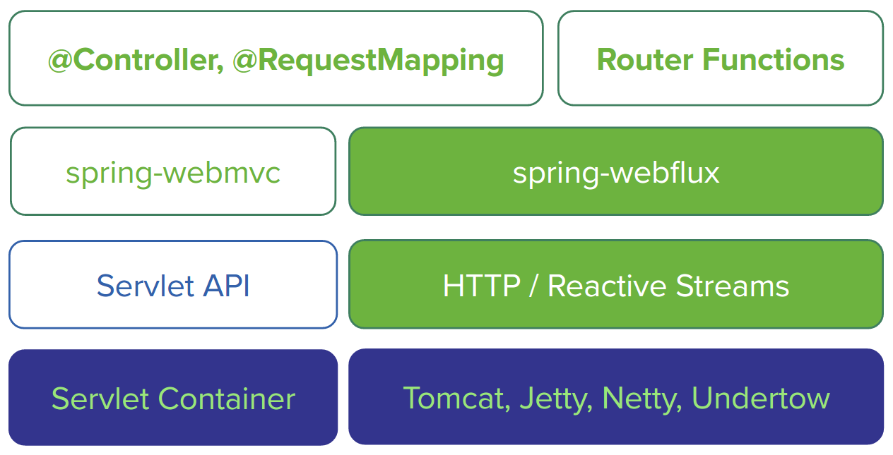

# WebFlux

Webflux는 Reactive system을 개발하기 위하여 Spring에서 제공하는 라이브러리이다. Spring Framework는 원래 Servlet API, 컨테이너용을 간단하고 편리하게 사용하기 위해 개발된 프레임워크였다(spring-webmvc를 제공). 그리고 근본은 Blocking, Synchronous(동기)방식이다. 추후 Servlet 3.1에서 비동기 처리 방식을 지원했지만, 서블릿은 응답을 기다리는 동안 Pool안에 있는 스레드를 지연시킬 수 있어서 Reactive해야 하는 요구를 충족하지 못햇다. 그래서 스프링 5.x 버전부터 Spring WebFlux가 추가되었고 웹 요청 처리를 Reactive하게 다루고 Non-Blocking을 구현할 수 있도록 초점을 맞추고 있다(spring-webflux를 제공).


아래 다이어그램은 이 두가지가 어떤 공통점과 차이점을 가지고 있는지 알 수있다. 


이와같이 Webflux는 스프링 MVC의 일부 기능을 가져와서 별도의 리액티브 웹 프로그래밍을 구현할 수 있다.


위 그림과 같이 스프링 MVC는 컨테이너는 서블릿 컨테이너가 필요한 자바 서블릿 API의 상위 계층이다. 스프링 Webflux는 서블릿 API와 서블릿 컨테이너를 연계하지 않고 Netty가 기본이며 Undertow, Tomcat, Jetty, Servlet3.1 이상을 지원한다.


**리액티브 스프링 MVC?**

> 스프링 Webflux에서 컨트롤러가 Mono, Flux같은 리액티브 타입을 반환하지만, 기존 스프링 MVC에서도 리액티브 타입을 반환할 수 있다. 차이점으로 Webflux는 요청이 이벤트 루프로 처리되는 리액티브 웹 프레임워크인 반면, 스프링 MVC는 다중 스레드에 의존하여 다수의 요청을 처리하는 서블릿 기반 웹 프레임워크이다.

## 1.스프링 Webflux 의존성 추가

* maven - pom.xml
```xml
<dependency>
    <groupId>org.springframework.boot</groupId>
    <artifactId>spring-boot-starter-webflux</artifactId>
    <version>2.3.5.RELEASE</version>
</dependency>
```

* gradle - build.gradle
```gradle
implementation 'org.springframework.boot:spring-boot-starter-webflux'
```


## 2. 리액티브 컨트롤러

```java
@GetMapping("/fruits")
public Flux<Fruit> getFruits() {
    String[] fruits = new String[]{"Apple", "Banana", "Grape", "Orange", "Melon"};
    List<Fruit> fruitList = new ArrayList<>();
    for (String s : fruits) {
        fruitList.add(new Fruit(s));
    }
    return Flux.fromIterable(fruitList);
}
```

## 3. 리액티브 API를 정의하기 위한 새로운 함수형 프로그래밍 모델

- RouterFunction : 일치하는 요청이 어떻게 핸들러에게 전달되어야 하는지 선언
-  RouterPredicates : 처리될 요청의 종류를 선언
- ServerRequest : HTTP 요청을 나타내며, Header 와 Body 의 정보를 사용할 수 있다.
- ServerResponse : HTTP 응답을 나타내며, Header 와 Body 의 정보를 포함한다.
      
```java
   /**
     * RouterFunction : 일치하는 요청이 어떻게 핸들러에게 전달되어야 하는지 선언
     * RouterPredicates : 처리될 요청의 종류를 선언
     * ServerRequest : HTTP 요청을 나타내며, Header 와 Body 의 정보를 사용할 수 있다.
     * ServerResponse : HTTP 응답을 나타내며, Header 와 Body 의 정보를 포함한다.
     * @return RouterFunction
     */
    @Bean
    public RouterFunction<?> helloRouterFunction() {
        return RouterFunctions.route(RequestPredicates.GET("/")
                        , request -> ServerResponse.ok().body(Mono.just("hello world!"), String.class))
                .andRoute(RequestPredicates.GET("/hello")
                        , request -> ServerResponse.ok().body(Mono.just("Say Hello"), String.class));
    }
```


## 스프링 웹 플럭스 도입 이유

- 100% (I/O 데이터 처리) 논블록킹 개발
- 확장성과 고효율성이 매우 중요
- 업, 다운 스트리밍과 Back pressure가 필요 
- (MSA)고속 서비스 오케스트레이션 개발 
- 유사한 프로그래밍 모델 경험
- 본격적인 함수형 프로그래밍 모델 사용
- 유연한 커스터마이징 가능한 웹 프레임워크 구성


## 사용하지 않는게 좋은 이유

- 웹 플럭스가 왜 필요한지 모름
   - 비동기/논블로킹 바식 도입 x
   - 리액티브 라이브러리 사용 x
- 블로킹이 서버, 코드, 라이브러리에 존재
   - 블로킹 IO, 블로킹 서블릿 필터
   - JPA(x), JDBC(x)
   - ADBA(O), AoJ(?), R2DBC(?)
    (ADBC (O) : Asynchronous Database Access API) : https://blogs.oracle.com/java/jdbc-next:-a-new-asynchronous-api-for-connecting-to-a-database
 (AoJ (?) : ADBA Over JDBC) : https://github.com/oracle/oracle-db-examples/tree/master/java/AoJ
 (R2DBC (?) : Reactive Relational Database Connectivity) : RDBMS 리액티브 라이브러리  https://brunch.co.kr/@springboot/178
 - Spring MVC로 개발했더니 아무 문제 없음(x)

## 웹플럭스는 기존 MVC를 이용 할 수 있다.
 ### 웹 플럭스의 다양한 기능과 모델
 - 비동기/논블로킹 API 호출
 - 비동기/논블로킹 데이터 엑세스
 - 리액티브 데이터 조회, 전송
 - 비동기 웹 요청 처리
 - 서버 스트리밍
 - 클라이언트 스트리밍 
 - Reactor(Flux, Mono), RxJava, Flow등을 이용한 코드
 - MVC에서 WebClient 사용이 가장 좋은 출발점
  - RestTemplate 대체


### 리엑티브 프로그래밍
- 연속적으로 일어나는 이벤트를 다루는 프로그래밍 기법
- UI 이벤트, 비동기적인 I/O 이벤트, 통제 불가능한 이벤트 스트림처리
- 동시성, 비동기/논블로킹 호출을 다루는데 탁월
- 조합 가능한 비동기 로직을 다루는 함수형 프로그래밍

### 동기/블로킹 API 호출 - RestTemplate 
- 장점 : 쉽고 간편
- 단점 : IO 블로킹, 시스템 특성에 따라 매우 비효율적이 될 수 도 있다.($(money)로 해결)

### 비동기/논블로킹 API 호출
- AsyncRestTemplate(Spring 4) 
- Async/Await(Java8+)
- WebClient(Spring 5) 
- 장점 : 확장성 용이, 높은 처리율과 낮은 레이턴시
- 단점 : 장점을 얻을만한 경우가 많지 않고, 코드가 복잡해지고 이해하기 어렵


### StepVerifier 를 이용한테스트
- 비동기 논 블로킹으로 동작하는 테스트코드 툴
- 데이터 스트림의 검증
- 예외, 완료도 검증
- 가상시간을 이용해 오랜 시간의 이벤트 테스트


### 리액티브 HTTP API 통합테스트 MockWebServer를 이용