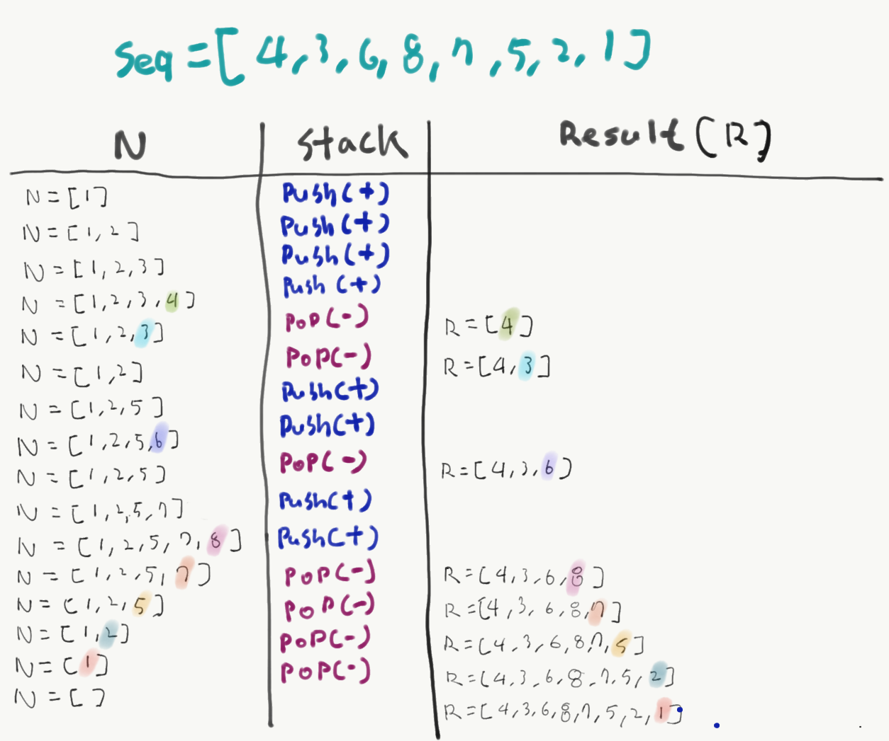

# [BaekJoon-1874] 스택수열(Stack Sequence)

## 문제
스택 (stack)은 기본적인 자료구조 중 하나로, 컴퓨터 프로그램을 작성할 때 자주 이용되는 개념이다. 스택은 자료를 넣는 (push) 입구와 자료를 뽑는 (pop) 입구가 같아 제일 나중에 들어간 자료가 제일 먼저 나오는 (LIFO, Last in First out) 특성을 가지고 있다.

1부터 n까지의 수를 스택에 넣었다가 뽑아 늘어놓음으로써, 하나의 수열을 만들 수 있다. 이때, 스택에 push하는 순서는 반드시 오름차순을 지키도록 한다고 하자. 임의의 수열이 주어졌을 때 스택을 이용해 그 수열을 만들 수 있는지 없는지, 있다면 어떤 순서로 push와 pop 연산을 수행해야 하는지를 알아낼 수 있다. 이를 계산하는 프로그램을 작성하라.

## 입력
첫 줄에 n (1 ≤ n ≤ 100,000)이 주어진다. 둘째 줄부터 n개의 줄에는 수열을 이루는 1이상 n이하의 정수가 하나씩 순서대로 주어진다. 물론 같은 정수가 두 번 나오는 일은 없다.

## 출력

입력된 수열을 만들기 위해 필요한 연산을 한 줄에 한 개씩 출력한다. push연산은 +로, pop 연산은 -로 표현하도록 한다. 불가능한 경우 NO를 출력한다.


## 예제 입력 1 

```java
8
4
3
6
8
7
5
2
1
```

## 예제 출력 1 

```java
+
+
+
+
-
-
+
+
-
+
+
-
-
-
-
-
```

## 예제 입력 2 


```java
5
1
2
5
3
4
```

## 예제 출력 2 


```java
NO
```

## 힌트

1부터 n까지에 수에 대해 차례로 [push, push, push, push, pop, pop, push, push, pop, push, push, pop, pop, pop, pop, pop] 연산을 수행하면 수열 [4, 3, 6, 8, 7, 5, 2, 1]을 얻을 수 있다.


## 풀이

- 1부터 N까지의 수를 스택에 넣었다가 뽑음으로 하나의 수열을 만듬
- push 순서 오르차순
- 임의 수열이 주어졌을 때 풀 수 있는지 없는지 있을 경우 Push (+) pop(-) // 풀수없을 경우 NO 출력

예제입력 seq = [4, 3, 6, 8, 7, 5, 2, 1] 가 주어 졌을 때
출력 + + + + - - + + - + + - - - - - 이 된다.

1. 일단 1부터 N까지의 순차적으로 루프를 돌며 seq[i] 번째 데이터와 일치할 때 가지 루프를 돌며 스택에 데이터를 push한다.
2. seq[i] 번째 값이 스택에 있으면 pop해 나간다.




## 소스코드

```java

import java.io.BufferedReader;
import java.io.BufferedWriter;
import java.io.InputStreamReader;
import java.io.OutputStreamWriter;
import java.util.Arrays;
import java.util.Stack;

public class Main {

    public static void main(String[] args) throws Exception {
        stackSequence();
    }

    public static void stackSequence() throws Exception {
        BufferedReader in = new BufferedReader(new InputStreamReader(System.in));
        BufferedWriter out = new BufferedWriter(new OutputStreamWriter(System.out));
        int n = Integer.parseInt(in.readLine());
        int[] seq = new int[n];
        for (int i = 0; i < n; i++) {
            seq[i] = Integer.parseInt(in.readLine());
        }

        Stack<Integer> stack = new Stack<>();
        StringBuilder sb = new StringBuilder();
        int m = 0;
        for (int data : seq) {
            if (m < data) {
                while (m < data) {
                    stack.push(++m);
                    sb.append("+\n");
                }
                stack.pop();
                sb.append("-\n");
            } else {
                if (stack.peek() != data) {
                    System.out.println("NO");
                    return;
                }
                stack.pop();
                sb.append("-\n");
            }
        }

        out.write(sb.toString());
        out.flush();
        out.close();
        in.close();
    }
}
```


*문제 사이트* : https://www.acmicpc.net/problem/1874