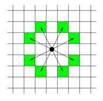

# 나이트의 이동

## 문제

체스판 위에 한 나이트가 놓여져 있다. 나이트가 한 번에 이동할 수 있는 칸은 아래 그림에 나와있다. 나이트가 이동하려고 하는 칸이 주어진다. 나이트는 몇 번 움직이면 이 칸으로 이동할 수 있을까?



## 입력
입력의 첫째 줄에는 테스트 케이스의 개수가 주어진다.

각 테스트 케이스는 세 줄로 이루어져 있다. 첫째 줄에는 체스판의 한 변의 길이 l(4 ≤ l ≤ 300)이 주어진다. 체스판의 크기는 l × l이다. 체스판의 각 칸은 두 수의 쌍 {0, ..., l-1} × {0, ..., l-1}로 나타낼 수 있다. 둘째 줄과 셋째 줄에는 나이트가 현재 있는 칸, 나이트가 이동하려고 하는 칸이 주어진다.

## 출력
각 테스트 케이스마다 나이트가 몇 번만에 이동할 수 있는지 출력한다.

## 예제 입력 1
```
3
8
0 0
7 0
100
0 0
30 50
10
1 1
1 1
```

## 예제 출력 1

```
5
28
0
```

## 풀이

8칸 이동할 수 있는 나이트의 이동범위를 설정해주고 BFS 를 이용하여 문제를 해결할 수 있다.

```java
private static int[][] PATH = {{1,2}, {2,1}, {-1,2}, {-2,1}, {1,-2}, {2,-1}, {-1,-2}, {-2,-1}};
```

BFS 코드
```java
public static void bfs(Queue<Edge> queue, int l) {
        while (!queue.isEmpty()) {
            Edge e = queue.poll();
            int x = e.x;
            int y = e.y;
            for (int k = 0 ; k < 8; k ++) {
                int nx = x + PATH[k][0];
                int ny = y + PATH[k][1];
                if (nx >= 0 && nx < l && ny >=0 && ny < l) {
                    if (depth[nx][ny] == -1) {
                        depth[nx][ny] = depth[x][y] + 1;
                        queue.add(new Edge(nx, ny));
                    }
                }
            }
        }
    }
```

## 소스코드
```java
import java.util.Arrays;
import java.util.LinkedList;
import java.util.Queue;
import java.util.Scanner;

/**
 * 7562 : 나이트의 이동
 */
public class Main {
    private static int[][] PATH = {{1,2}, {2,1}, {-1,2}, {-2,1}, {1,-2}, {2,-1}, {-1,-2}, {-2,-1}};
    private static int[][] depth;
    static class Edge {
        int x;
        int y;
        Edge (int x, int y) {
            this.x = x;
            this.y = y;
        }
    }
    public static void main(String[] args) {
        Scanner scan = new Scanner(System.in);
        int t = scan.nextInt();

        while (t-- != 0) {
            int l = scan.nextInt();
            depth = new int[l][l];

            int sx = scan.nextInt();
            int sy = scan.nextInt();
            int dx = scan.nextInt();
            int dy = scan.nextInt();

            for (int i = 0; i < l; i++) {
                Arrays.fill(depth[i], -1);
            }

            Queue<Edge> queue = new LinkedList<>();
            queue.offer(new Edge(sx,sy));
            depth[sx][sy] = 0; //시작
            bfs(queue, l);
            System.out.println(depth[dx][dy]);
        }
    }

    public static void bfs(Queue<Edge> queue, int l) {
        while (!queue.isEmpty()) {
            Edge e = queue.poll();
            int x = e.x;
            int y = e.y;
            for (int k = 0 ; k < 8; k ++) {
                int nx = x + PATH[k][0];
                int ny = y + PATH[k][1];
                if (nx >= 0 && nx < l && ny >=0 && ny < l) {
                    if (depth[nx][ny] == -1) {
                        depth[nx][ny] = depth[x][y] + 1;
                        queue.add(new Edge(nx, ny));
                    }
                }
            }
        }
    }
}

```