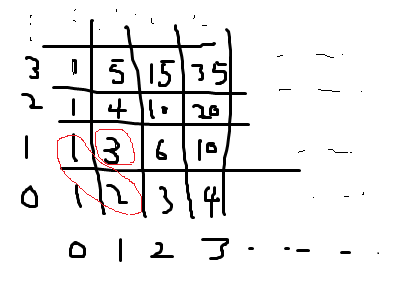

# [BAEKJOON:2775]부녀회장이 될테야

#### 문제
평소 반상회에 참석하는 것을 좋아하는 주희는 이번 기회에 부녀회장이 되고 싶어 각 층의 사람들을 불러 모아 반상회를 주최하려고 한다.

이 아파트에 거주를 하려면 조건이 있는데, “a층의 b호에 살려면 자신의 아래(a-1)층의 1호부터 b호까지 사람들의 수의 합만큼 사람들을 데려와 살아야 한다” 는 계약 조항을 꼭 지키고 들어와야 한다.

아파트에 비어있는 집은 없고 모든 거주민들이 이 계약 조건을 지키고 왔다고 가정했을 때, 주어지는 양의 정수 k와 n에 대해 k층에 n호에는 몇 명이 살고 있는지 출력하라. 단, 아파트에는 0층부터 있고 각층에는 1호부터 있으며, 0층의 i호에는 i명이 산다.

#### 입력
첫 번째 줄에 Test case의 수 T가 주어진다. 그리고 각각의 케이스마다 입력으로 첫 번째 줄에 정수 k, 두 번째 줄에 정수 n이 주어진다. (1 <= k <= 14, 1 <= n <= 14)

#### 출력
각각의 Test case에 대해서 해당 집에 거주민 수를 출력하라.

예제입력
2
1
3
2
3

예제출력
6
10

#### 해결



 - k층의 n호에는 몇명이 살고 있는지 출력하는 문제
 - 아파트에는 0층부터 있고 0층 i호에는 i명이 살으므로 0층은 1 ~ i만큼 증가
 - 1층 2호에 살려면 1호부터 2호까지 사람수의 합만큼 대려와야한다. 그래서 1층 2호는 3명
 - 그러면 그림처럼 k-1만큼 n-1의 위치의 합을 구하면 몇 명인지 알 수 있으므로
 - **점화식 : data[k][n] = data[k-1][n] + [k][n-1]**


#### 코드

```java

import java.util.Scanner;

public class Main {

	public static void main(String[] args) {
		int[][] data = init();
		Scanner scan = new Scanner(System.in);

		int t = scan.nextInt();

		for (int i = 0; i < t; i++) {
			int k = scan.nextInt();
			int n = scan.nextInt();
			System.out.println(data[k][n-1]);
		}

		scan.close();
	}

	public static int[][] init() {
		int[][] data = new int[15][15];
		for (int i = 0; i < 15; i++) {
			data[i][0] = 1;
			data[0][i] = i + 1;
		}

		for (int a = 1; a < 15; a++) {
			for (int b = 1; b < 15; b++) {
				data[a][b] = data[a][b - 1] + data[a - 1][b];
			}
		}
		return data;
	}
}

```
