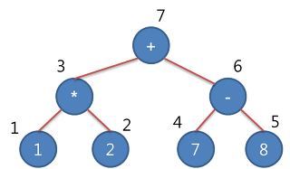

# ExpressionTree(수식트리)

하나의 연산자가 두 개의 피 연산자를 취한다는 가정아래 두 가지 규칙을 가짐

1.	피연산자는 Left Node
	
2.	연산자는 root Node or Branch Node




`ex) 1 * 2 + (7-8)은 위와 같이 수식트리로 만들 수 있음(후위표기)`

## 알고리즘

1.	수식을 뒤에서부터 앞쪽으로 읽어옴
2.	수식에서 제일 마지막에 있는 토큰은 루트노드가 된다.
3.	후위표기식에서 가장 마지막에 있는 토큰은 항상 연산자이다.
4.	수식에서 읽어낸 토큰이 연산자인 경우 가지노드가 되고, 이 토큰 다음에 따라오는 두 개의 토큰은 각각 오른쪽과 왼쪽 자식노드가 된다.
5.	다음 토큰에도 연속해서 연산자인 경우 토큰으로부터 만들어지는 하위 트리가 완성된 이후에 읽어낸 토큰이 왼쪽 자식노드가 된다.
6.	수식에서 읽어낸 토큰이 숫자이면 Left노드이다.

## 소스코드

```java
package algorithm;

import java.math.BigDecimal;

public class ExpTree {
	class Node {
		private Object data;
		private Node left;
		private Node right;

		public Node() {
			data = null;
			left = null;
			right = null;
		}

		public Node(Object data) {
			this.data = data;
			left = null;
			right = null;
		}
	}

	public void expressionTree(StringBuilder postFixExp, Node node) {
		int len = postFixExp.length();
		char token = postFixExp.charAt(len - 1);
		postFixExp = postFixExp.deleteCharAt(len - 1);

		switch (token) {
		case '+':
		case '-':
		case '*':
		case '/':
			node = new Node(token);
			// Operator
			expressionTree(postFixExp, node.right);
			expressionTree(postFixExp, node.left);
			break;
		default:
			// Operand
			node = new Node(token);
			break;
		}
	}

	public double evaluate(Node tree) {
		double left = 0;
		double right = 0;
		double result = 0;
		if (tree == null) {
			return 0;
		}
		char data = (char) tree.data;
		System.out.println("char data : " + data);
		switch (data) {
		case '+':
		case '-':
		case '*':
		case '/':
			left = evaluate(tree.left);
			right = evaluate(tree.right);
			if (data == '+') {
				result = left + right;
			} else if (data == '-') {
				result = left - right;
			} else if (data == '*') {
				result = left * right;
			} else if (data == '/') {
				result = new BigDecimal(left).divide(new BigDecimal(right)).doubleValue();
			}
			break;
		default:
			result = new BigDecimal((char) tree.data).doubleValue();
			break;
		}
		return result;
	}

	public void postOrderPrint(Node tree) {
		if (tree == null) {
			return;
		}
		postOrderPrint(tree.left);
		postOrderPrint(tree.right);
		System.out.print(tree.data);

	}

	public void inOrderPrint(Node tree) {
		if (tree == null) {
			return;
		}
		System.out.print("(");
		inOrderPrint(tree.left);
		System.out.print(tree.data);
		inOrderPrint(tree.right);
    System.out.print(")");
	}
}

```
