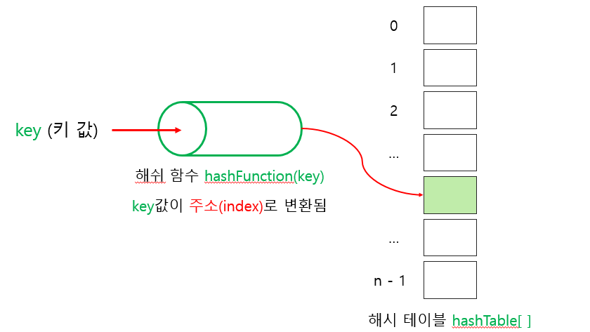
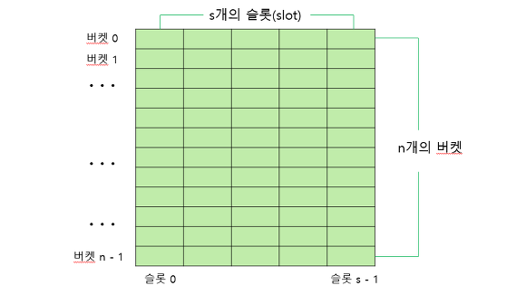

# 해싱 (Hashing)

- 해싱(Hashing)은 키 값에 직접 산술적인 연산을 적용하여 항목이 저장되어 있는 테이블의 주소를 계산하여 항목에 접근하는 자료구조. **해시 테이블(Hash Table)** 은 키 값의 연산에 의한 직접 접근이 가능한 구조로 해시 테이블(Hash Table)을 이용한 탐색을 **해싱(Hashin)** 이라고 한다.
- 어떤항목의 탐색 키만을 가지고 바로 항목이 저장되어 있는 배열의 인덱스를 결정하는 기법.
  
 
## 추상자료형

- 새로운 항목을 사입(add)
- 탐색 키에 관련된 항목을 삭제(delete)
- 탐색 키에 관련된 값을 탐색(search)

- 객체 : 일련의 (key, value) 쌍의 집합
- 연산
  - add(key, value) : (key, value)를 사전에 추가
  - delete(key) : key에 해당되는 (key, value)를 찾아서 삭제하고 관련된 value는 반환한다. 탐색에 실패하면 null을 반환
  - search(key) : key에 해당되는 value를 찾아서 반환. 만약 탐색이 실패하면 null을 반환

## 해싱의 구조

해싱은 자료를 저장하는데 배열을 사용한다. 원하는 항목이 저장된 위치를 알고 있다면 빠르게 삽입하거나 꺼낼 수 있다.

- **해시함수(Hash Function)** : 탐색 키를 입력받아 **해시 주소(Hash Address)** 를 생성하고 해시 주소가 배열로 구현된 **해시 테이블(Hash Table)** 의 인덱스가 된다.

- 해시 테이블 K를 받아서 해시 함수 h()로 연산한 결과인 해시 주소 h(k)를 인덱스로 사용하여 해시 테이블에 있는 항목에 접근한다.
- 해시테이블 ht는 M개의 **버켓(bucket)** 으로 이루어지는 테이블로써 ht[0], ht[1]... ht[M-1]의 원소를 가진다.

- 버켓은 s개의 **슬롯(slot)** 을 가질 수 있으며, 하나의 슬롯에는 하나의 항목이 저장된다. 하나의 버켓에 여러 개의 슬롯을 두는 이유는 서로 다른 두 개의 키가 해시 함수에 의해 동일한 주소로 변환될 수 있으므로 여러 개의 항목을 동일한 버켓에 저장하기 위해서이지만, 대부분의 경우 하나의 버켓에 하나의 슬롯을 가진다.

- 해시테이블에 존재하는 버켓의 수가 M이므로 해시 함수 h()는 모든 k에 대해 $0 \le h(k) \le M-1$ 의 범위 값을 제공해야한다. 대부분의 경우 해시 테이블의 버켓 수는 키가 가질 수 있는 모든 경우의 수보다 매우 작으므로 여러 개의 서로 다른 탐색 키가 해시 함수에 의해 같은 해시 구조로 사상(Mapping)되는 경우가 자주 발생한다.

- 서로다른 두 개의 탐색 키 K1와 K2에 대하여 h(k1) = h(k2)인 경우를 **충돌(Collision)** 이라고 한며, 이러한 키 k1, k2를 **동의어(synonym)** 라 한다.

- 만약 충돌이 발생하면 같은 버켓에 있는 다른 슬롯에 항목을 저장하게 된다.

- 충돌이 자주 일어나면 버켓 내부에서 순차탐색 시간이 길어져 탐색 성능이 저하될 수 있으므로 해시 함수를 수정하거나 해시 테이블의 크기를 적절하게 조절해야한다.

- 충돌이 버켓에 할당된 슬롯 수보다 많이 발생하게 되면 버켓에 더 이상 항목을 저장할 수 없게 되는 오버플로(overflow)가 발생한다. 만약 버켓당 슬롯의 수가 하나(s==1)이면 충돌이 곧 오버플로를 의미한다. 
- 오버플로가 발생하면 더 이상 항목을 저장할 수 없으므로 오버플로를 해결하기 위한 방법이 반드시 필요.

