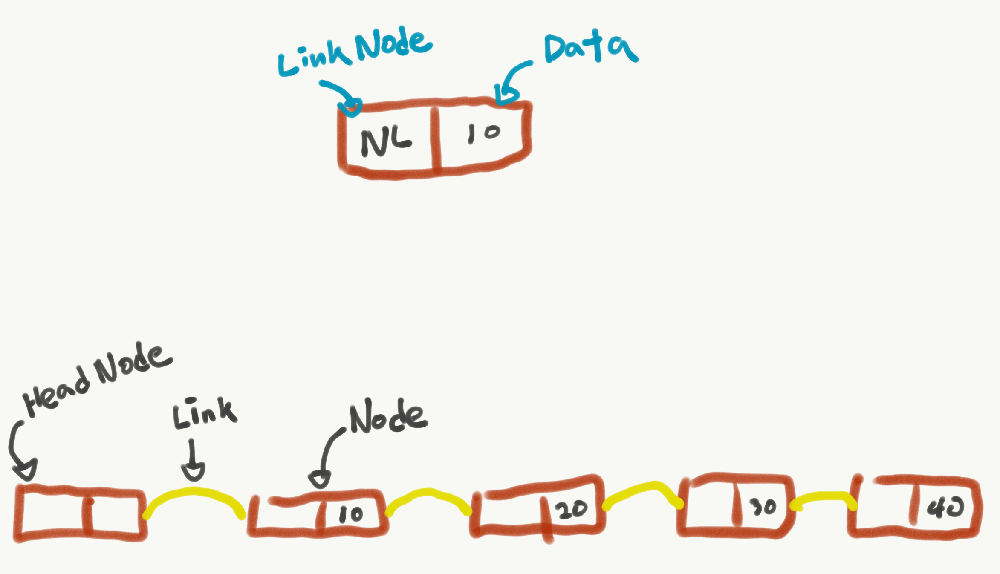
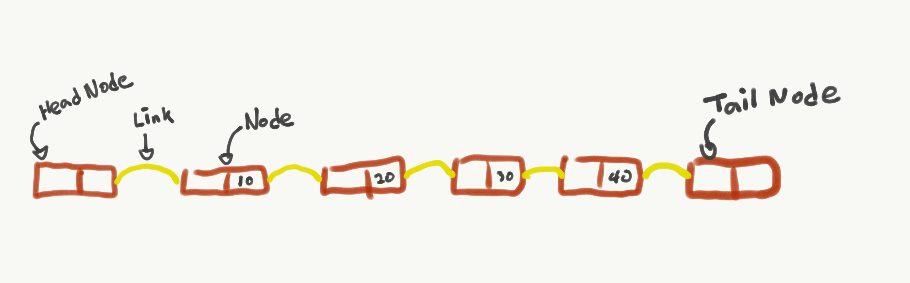
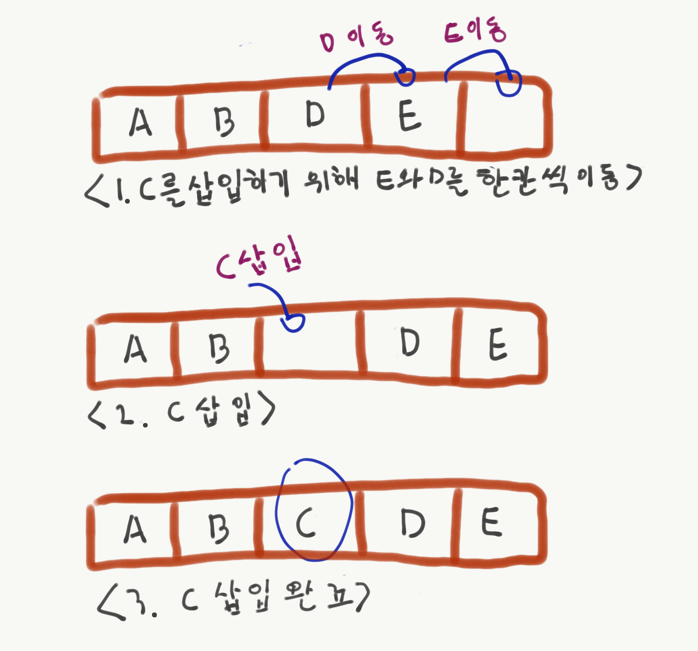
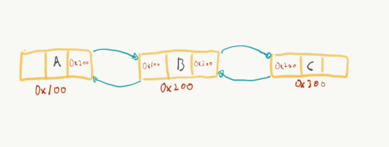

# 연결리스트(Linked List)


## 개념과 구조

-	데이터가 연속적인 리스트

-	새로운 노드를 삽입하거나 삭제가 간편

-	링크라는 개념을 통해 물리 메모리를 연속적으로 사용하지 않아도 된다.

-	데이터를 구조체로 묶어 포인터로 연결

Linked List에는 기본적으로 Node와 Link라는 용어를 사용




> HeadNode에는 데이터를 저장하지 않는다. 단지 LinkedList의 시작부분임을 나타낸다.(ex:기관차에서 headNode는 승객이 타지 않음)

LinkedList의 마지막 부분을 나타내는 노드도 있다. End Node or Tail Node라고 불리며, 데이터를 저장하지 않는다. 즉, Head, Tail(End) 노드는 데이터를 저장하지 않음(저장할 수 없다는 것이 아니라 묵시적으로 데이터를 저장하지 않는다는 것)



-	링크에 화살표가 표시되어 있는 방향은 Head Node 부터 시작해 연결된 다음 노드들을 계속 가리키다보면 D에는 EndNode를 가리키고 EndNode는 아무것도 가리키지 않는 상태가 된다. 이와 같이 자신의 노드에서 다음 노드만 가리킬 수 있는 형태가 전형적이 LinkedList 의 형태이다.

## 연결리스트의 구조체  
**c**

```
typedef struct _Node {
    char data; //데이터
    struct _Node *next; //다음노드 꼬리 Link
} Node;
```

**java**

```java
private class Node {
  private Object data;
  private Node next;
}
```

## 연결리스트의 장 단점

**장점**

-	새로운 노드의 추가, 삽입, 삭제가 쉽고 빠름, 배열은 삽입 삭제가 어렵 - 현재 노드의 다음 노드를 얻어오는 연산에 대해 비용이 발생하지 않음

**단점**

-	다음 노드를 가리키려는 포인터 때문에 각 노드마다 4byte의 메모리가 추가로 필요
-	특정 위치에 있는 노드(중간삽입)를 얻는데 비용이 크며 속도가 느림
-	노드의 개수가 n개면 최악의 경우 n개의 노드 탐색 루프를 실행해야 특정 위치에 있는 노드를 찾을 수 있는 반면 배열은 상수 시간에 노드를 얻을 수 있음

## 연결리스트의 삽입과 삭제

Q. 배열을 사용하지 않고 LinkedList를 사용하는 이유

-	배열은 생성할 때 데이터를 저장하는데 필요한 모든 메모리를 한번에 확보해 사용할 수 있게 해주므로 프로그램이 실행되는 중간에 배열의 크기를 바꿀 수 없다.

-	배얼 안에 저장되어 있는 값들을 정렬할 때에도 메모리에 저장되어 있는 각각의 값을 바꿔줘야한다.

-	배열은 연속적인 메모리를 사용하지만 연결리스트는 반드시 연속적이라고 불 수 없다

-	연결리스트는 연속적이지 않은 데이터들을 링크로 서로 연결시키는 개념으로 볼 수 있다.


### 배열에서의 삽입

배열에서 B와 D 사이에 C 데이터 추가하려면 배열의 끝에서부터 한 칸씩 뒤로 이동해야 한다 즉 E와 D가 한칸씩 이동하고 B 와 D 사이에 C가 들어간다.



**배열 데이터 삽입(C언어)**

```cpp
void insertArray(char* array, char data,int length) {
    int i, cur;
    char tmp, tmp2;
    for (i=0; i< length; i++) {
        if (array[i] > data) {
            break;
        }
    }
    tmp = array[i];
    array[i] = data;
    i++;

    for (; i<length; i++) {
        tmp2 = array[i];
        array[i] = tmp;
        tmp = tmp2;
    }
}
```

### 연결리스트의 삽입

ㅁㅁ -> A -> B - **C** - D -> E -> ㅁㅁ  
(B와 D 사이에 새로운 노드 C 삽입)

B와 D 노드에 새로 삽입되는 노드 C가 있다면 C가 노드 D를 가리키도록 하고 원래 노드 D를 가리키던 B노드는 C 노드를 가리키도록 해야한다.

**연결리스트 삽입(C언어)**

```cpp
void insertNode(Node *newNode) {
  Node *idxNode;
  for (idxNode = head; idxNode != end; idxNodx = idxNode->Next) {
    if (idxNode->next->data > newNode->data) {
      break;
    }
  }
  newNode->next = idxNode->next;
  idxNode->next = newNode;
}
```

#### 연결리스트에서 1개의 노드를 삽입하는 과정

1.	새로운 노드를 생성한다  
	`Node *noewNode = (Node*)malloc(sizeof(Node));`
2.	새로운 노드가 삽입될 위치를 검색한다.

	```c
	for (idxNode = head; idxNode != end; idxNodx = idxNode->Next) {
	  if (idxNode->next->data > newNode->data) {
	    break;
	  }
	}
	```

3.	새로운 노드의 Next를 새로운 노드가 삽입될 다음 노드로 연결

	`newNode->next = idxNode->next`

4.	새로운 노드가 삽입될 위치의 이전노드의 Next가 새로운 노드를 가리키도록 한다.

	`idxNode->next = newNode`

### 연결리스트에서 노드 삭제하는 과정

1.	이전 노드를 가리킬 포인터와 삭제할 노드를 가리킬 포인터를 선언

	`Node idxNode`  
	`Node removeNode`

2.	삭제할 노드 검색

	```cpp
	  for(idxNode = head; idxNode != end; idxNode = idxNode->next) {
	    if (idxNode->next->data == removeNode->data) {
	      removeNode = idxNode->next;
	      break;
	    }
	  }
	```

3.	이전 노드가 삭제할 노드를 건너뛰고 다음 노드를 가리키도록 새로 설정

	`idxNode->next = idexNode->next->next`

4.	free() 함수로 노드를 메모리에서 삭제

	`free(removeNode)`

## 연결리스트 c version

LinkedList.h

```cpp
#ifndef LINKEDLIST_H
#define LINKEDLIST_H

#include <stdio.h>
#include <stdlib.h>


typedef struct _Node {
    int data;
    struct _Node *next;
}Node;

Node* createNode(int data);

void add(Node** head, Node* newNode);
void addAfter(Node* cur, Node* newNode);
void addHead(Node** head, Node* newHead);
int removeNode(Node** head, Node* remove);
Node* getNode(Node* head, int idx);
void destoryNode(Node *node);

int getLength(Node* head) {
    int cnt = 0;
    Node* cur = head;
    while(cur != NULL) {
        cur= cur->next;
        cnt++;
    }
    return cnt;
}

#endif
```

LinkedList.c

```cpp

#include "LinkedList.h"

Node* createNode(int data) {
    Node *newNode = (Node*)malloc(sizeof(Node));
    newNode->data =data;
    newNode->next = NULL;
    return newNode;
}

void destoryNode(Node *node) {
    free(node);
}

void add(Node** head, Node* newNode) {
    if ((*head) == NULL) {
        *head = newNode;
    } else {
        Node* tail = (*head);
        while(tail->next != NULL) {
            tail = tail->next;
        }
        tail->next = newNode;
    }
}

void addAfter(Node* cur, Node* newNode) {
    newNode->next = cur->next;
    cur->next = newNode;
}
void addHead(Node** head, Node* newHead) {
    if (*head == NULL) {
        (*head) = newHead;
    } else {
        newHead->next = (*head);
        (*head) = newHead;
    }
}
int removeNode(Node** head, Node* remove) {
    if (*head == remove) {
        *head = remove->next;
    } else {
        Node* cur = *head;
        while(cur != NULL && cur->next != remove) {
            cur= cur->next;
        }
        if (cur != NULL) {
            cur->next = remove->next;
        }
    }
    destoryNode(remove);
}
Node* getNode(Node* head, int idx) {
    Node* cur = head;
    while(cur != NULL) {
        cur= cur->next;
    }
    return cur;
}

```

## 연결리스트 java version

List.java

```java
public interface List<T> {
	// 임의의 위치에 데이터 삽입
	public boolean add(T data, int index);

	// 맨 첫번째에 데이터 삽입
	public boolean addFirst(T data);

	// 맨 마지막에 데이터 삽입
	public boolean addLast(T data);

	// 맨 끝에 데이터 삽입
	public boolean add(T data);

	// 인덱스 값을 통해 임의 위치 값 줄력
	public T get(int index);

	// 리스트의 크기 값
	public int size();

	// 마지막 리스트 의 값 출력
	public T getLast();

	// 맨 첫번째 리스트의 값 출력
	public T getFirst();

	// 임의 위치에 삭제
	public T remove(int index);

	// 첫번째 위치 삭제
	public T removeFirst();

	// 마지막 위치 삭제
	public T removeLast();

	// 마지막 위치 삭제
	public T remove();
}

```

LinkedList.java

```java

public class LinkedList<T> implements List<T> {
	private Node header;
	private int length;

	public LinkedList() {
		header = new Node();
		length = 0;
	}

	private class Node {
		private T data;
		private Node next;

		Node() {
			data = null;
			next = null;
		}

		Node(final T data) {
			this.data = data;
			this.next = null;
		}
	}

	private Node getNode(int index) {
		if (header == null && (length == 0 || index <= 0 || index > length)) {
			throw new IndexOutOfBoundsException();
		}
		Node cur = header;
		for (int i = 0; i <= index; i++) {
			cur = cur.next;
		}
		return cur;
	}

	@Override
	public boolean add(T data, int index) {
		if (header != null) {
			if (index == 0) {
				addFirst(data);
				return true;
			}

			Node prev = getNode(index - 1);
			Node next = getNode(index);
			Node newNode = new Node(data);

			newNode.next = next;
			prev.next = newNode;
			length++;
			return true;
		}
		return false;
	}

	@Override
	public boolean addFirst(T data) {
		if (header != null) {
			Node newNode = new Node(data);
			if (header.next == null) {
				header.next = newNode;
				length++;
				return true;
			} else {
				newNode.next = header.next;
				header.next = newNode;
				length++;
				return true;
			}
		}
		return false;
	}

	@Override
	public boolean addLast(T data) {
		if (header != null) {
			if (length == 0) {
				addFirst(data);
				return true;
			}
			Node next = getNode(length - 1);
			Node newNode = new Node(data);
			next.next = newNode;
			length++;
			return true;
		}
		return false;
	}

	@Override
	public boolean add(T data) {
		addLast(data);
		return false;
	}

	@Override
	public T get(int index) {
		if (header == null && length == 0) {
			throw new IndexOutOfBoundsException();
		}
		Node cur = header;
		for (int i = 0; i < index; i++) {
			cur = cur.next;
		}
		return cur.data;
	}

	@Override
	public int size() {
		return this.length;
	}

	@Override
	public T getLast() {
		return get(length);
	}

	@Override
	public T getFirst() {
		return get(0);
	}

	@Override
	public T remove(int index) {
		if (header != null) {
			if (length < index) {
				throw new IndexOutOfBoundsException();
			} else if (length <= 0 || index < 0) {
				throw new IndexOutOfBoundsException();
			} else if (index == 0) {
				return removeFirst();
			} else {
				Node prev = getNode(index - 1);
				Node remove = getNode(index);
				if (remove.next == null) {
					prev.next = null;
					length--;
					return remove.data;
				} else {
					prev.next = remove.next;
					length--;
					return remove.data;
				}
			}
		}
		return null;
	}

	@Override
	public T removeFirst() {
		if (header == null && length ==0 ) {
			throw new IndexOutOfBoundsException();
		}

		Node remove = header.next;
		header.next = remove.next;
		length--;
		return remove.data;
	}

	@Override
	public T removeLast() {
		return remove(length - 1);
	}

	@Override
	public T remove() {
		return removeLast();
	}

	@Override
	public String toString() {
		Node temp = header.next;
		if (temp == null) {
			return "[ ]";
		} else {
			// StringBuilder 클래스를 이용하여 데이터를 출력
			StringBuilder sb = new StringBuilder("[");
			sb.append(temp.data);
			temp = temp.next;
			while (temp != null) {
				sb.append(", ");
				sb.append(temp.data);
				temp = temp.next;
			}
			sb.append("]");
			return sb.toString();
		}
	}
}

```


# Circular Linked List(원형 연결 리스트)

-	head와 tail로 연결되어 있는 연결 리스트

-	tail의 다음 노드 포인터가 헤드를 가리킴

  - 장점으로는 시작과 끝을 알 수 있다.

**노드추가**

```cpp
 typedef struct _Node {
   int data;
   struct _Node *prev;
   struct _Node *next;
 }Node;
```

```cpp
 void add(Node** head, Node* newNode) {
   if ((*head) == NULL) {
     *head = newNode;
     (*head)->next = *head;
     (*head)->prev = *head;
   }
   else {
      Node* tail = (*head)->prev;
      tail->next->prev = newNode;
      tail->next = newNode;
      newNode->nextNode = (*head)
      newNode->prevNode = tail;
   }
 }
```

**노드 삭제**

```cpp
void remove(Node** head, Node* remove) {
  if ((*head)->next == remove) {
    (*head)->prev->next = remove->next;
    (*head)->next->prev = remove->prev;
    *head = remove->nextNode;

    remove->prev = NULL;
    remove->next = NULL;
  }
  else {
    Node* tmp = remove;
    remove->prev->next = temp->next;
    remove->next->prev = temp->prev;

    remove->prev = NULL;
    remove->next = NULL;
  }
}
```

## Circular Linked List for Java

```java

public class CircularLinkedList<T> implements List<T> {

	private Node header;
	private int length;

	private class Node {
		private T data;
		private Node prev;
		private Node next;

		public Node(T data) {
			this.data = data;
			this.prev = null;
			this.next = null;
		}

		public Node() {
			this.data = null;
			this.prev = null;
			this.next = null;
		}
	}

	public CircularLinkedList() {
		header = new Node();
		header.prev = header;
		header.next = header;
		this.length = 0;

	}

	@Override
	public boolean add(T data, int index) {
		if (header != null) {
			if (index == 0) {
				return addFirst(data);

			} else if (index == length - 1) {
				return addLast(data);
			} else {
				Node prev = getNode(index - 1);
				Node newNode = new Node(data);

				newNode.next = prev.next;
				newNode.prev = prev;
				prev.next.prev = newNode;
				prev.next = newNode;
				length++;
				return true;
			}
		}
		return false;
	}

	@Override
	public boolean addFirst(T data) {
		if (header != null) {
			Node newNode = new Node(data);
			Node nextNode = header.next;
			newNode.next = nextNode;
			newNode.prev = header;
			nextNode.prev = newNode;
			header.next = newNode;
			length++;
			return true;
		}
		return false;
	}

	@Override
	public boolean addLast(T data) {
		if (header != null) {
			Node newNode = new Node(data);
			Node tailNode = header.prev;
			tailNode.next = newNode;
			newNode.prev = tailNode;
			newNode.next = header;
			header.prev = newNode;
			length++;
			return true;
		}
		return false;
	}

	@Override
	public boolean add(T data) {
		return addLast(data);
	}

	@Override
	public T get(int index) {
		if (header == null && length == 0) {
			throw new IndexOutOfBoundsException();
		}
		T data = null;
		if (index == 0) {
			data = getFirst();
		} else if (index == length - 1) {
			data = getLast();
		} else {
			Node cur = header;
			for (int i = 0; i < index; i++) {
				cur = cur.next;
			}
		}
		return data;
	}

	@Override
	public int size() {
		return this.length;
	}

	@Override
	public T getLast() {
		return header.prev.data;
	}

	@Override
	public T getFirst() {
		return header.next.data;
	}

	@Override
	public T remove(int index) {
		if (length < index) {
			throw new IndexOutOfBoundsException();
		} else if (length <= 0 || index < 0) {
			throw new IndexOutOfBoundsException();
		}
		if (header != null) {
		  if (index == 0) {
				return removeFirst();
			} else if (index == length - 1) {
				return removeLast();
			} else {
				Node remove = getNode(index);
				Node prev = remove.prev;
				prev.next = remove.next;
				remove.next.prev = prev;
				remove.next = null;
				remove.prev = null;
				length--;
				return remove.data;
			}
		}
		return null;
	}

	@Override
	public T removeFirst() {
		if (header == null && length == 0) {
			throw new IndexOutOfBoundsException();
		}

		Node remove = header.next;
		if (remove.next == header) {
			header.next = header;
			header.prev = header;
		} else {
			header.next = remove.next;
			remove.next.prev = header;
		}
		remove.next = null;
		remove.next = null;
		length--;
		return remove.data;
	}

	@Override
	public T removeLast() {
		if (header == null && length <= 0) {
			throw new IndexOutOfBoundsException();
		}
		Node remove = header.prev;

		if (remove.prev == header) {
			header.next = header;
			header.prev = header;
		} else {
			remove.prev.next = header;
			header.prev = remove.prev;
		}
		remove.next = null;
		remove.prev = null;
		length--;
		return remove.data;
	}

	@Override
	public T remove() {
		return removeLast();
	}

	@Override
	public String toString() {
		Node temp = header.next;
		if (temp == header) {
			return "[ ]";
		} else {
			StringBuilder sb = new StringBuilder("[");
			sb.append(temp.data);
			temp = temp.next;
			while (temp != header) {
				sb.append(", ");
				sb.append(temp.data);
				temp = temp.next;
			}
			sb.append("]");
			return sb.toString();
		}
	}

	private Node getNode(int index) {
		if (header == null && (length == 0 || index <= 0 || index > length)) {
			throw new IndexOutOfBoundsException();
		}
		Node cur = header;
		for (int i = 0; i <= index; i++) {
			cur = cur.next;
		}
		return cur;
	}
}

```

# Double Linked List(더블 연결 리스트)

## 정의

-	Double Linked List는 연결리스트의 탐색 기능을 개선한 자료구조이다.
-	연결리스트는 노드를 찾으려면 head에서 tail 방향으로만 탐색할 수 있지만 Double Linked List는 양방향 탐색이가능하다.




```c
typedef struct _Node {
  int data;             //데이터 필드
  struct _Node* prev;   //이전 노드를 가리키는 포인터
  struct _Node* next;   //다음 노드를 가리키는 포인텅
}Node;
```

## 생성/삽입/삭제

### 노드생성

```c
Node* createNode(int data) {
    Node* newNode = (Node*)malloc(sizeof(Node));
    newNode->data = data;
    newNode->prev = NULL;
    newNode->next = NULL;
    return newNode;
}
```

### 노드 삽입(순서대로)

```c
void add(Node** head, Node* newNode) {
  if ((*head) == NULL) {
    (*head)->next = newNode;
    newNode->prev = (*head);
  } else {
    Node* tail = (*head);
    while( tail->next != NULL) {
        tail = tail ->next;
    }
    tail->next = newNode;
    newNode->prev = tail;
  }
}
```

### 노드 중간 삽입

1.	newNode->next는 nextNode를 연결
2.	newNode->prev는 prevNode를 연결
3.	nextNode->prev는 newNode를 연결
4.	prevNode->next는 newNode를 연결

```c
  void addAfter(Node* cur, Node* newNode) {
    newNode->next = cur->next;
    newNode->prev = cur;
    if (cur->next != NULL) {
      cur->next->prev = newNode;
    }
    cur->next = newNode;
  }
```

### 노드 삭제

1.	prevNode->next에 nextNode를 연결
2.	nextNode->prev에 prevNode를 연결
3.	removeNode는 메모리 해제

```c
void removeNode(Node** head, Node* remove) {
  if (*head == remove) {
    *head = remove->next;
    if ((*head) != NULL) {
        (*head)->prev = NULL;
    }
    remove->prev = NULL;
    remove->next = NULL;
  } else {
    Node* tmp = remove;
    remove->prev->next = tmp->next;
    if (remove->next != NULL) {
      remove->next->prev = temp->prev;
    }
    remove->next = NULL;
    remove->prev = NULL;
  }
  free(remove);
}
```

## Double Linked List (java version)

List.java (interface)

```java
package algorithm;

public interface List<T> {
	// 임의의 위치에 데이터 삽입
	public boolean add(T data, int index);

	// 맨 첫번째에 데이터 삽입
	public boolean addFirst(T data);

	// 맨 마지막에 데이터 삽입
	public boolean addLast(T data);

	// 맨 끝에 데이터 삽입
	public boolean add(T data);

	// 인덱스 값을 통해 임의 위치 값 줄력
	public T get(int index);

	// 리스트의 크기 값
	public int size();

	// 마지막 리스트 의 값 출력
	public T getLast();

	// 맨 첫번째 리스트의 값 출력
	public T getFirst();

	// 임의 위치에 삭제
	public T remove(int index);

	// 첫번째 위치 삭제
	public T removeFirst();

	// 마지막 위치 삭제
	public T removeLast();

	// 마지막 위치 삭제
	public T remove();
}

```

DLinkedList.java

```java

public class DLinkedList<T> implements List<T> {
	private Node header;
	private int length;

	public DLinkedList() {
		header = new Node();
		length = 0;
	}

	private class Node {
		private T data;
		private Node next;
		private Node prev;

		Node() {
			data = null;
			next = null;
			prev = null;
		}

		Node(final T data) {
			this.data = data;
			this.next = null;
			this.prev = null;
		}
	}

	private Node getNode(int index) {
		if (header == null && (length == 0 || index <= 0 || index > length)) {
			throw new IndexOutOfBoundsException();
		}
		Node cur = header;
		for (int i = 0; i <= index; i++) {
			cur = cur.next;
		}
		return cur;
	}

	@Override
	public boolean add(T data, int index) {
		if (header != null) {
			if (index == 0) {
				addFirst(data);
				return true;
			}

			Node prev = getNode(index - 1);
			Node newNode = new Node(data);

			newNode.next = prev.next;
			newNode.prev = prev;
			prev.next.prev = newNode;
			prev.next = newNode;
			length++;
			return true;
		}
		return false;
	}

	@Override
	public boolean addFirst(T data) {
		if (header != null) {
			Node newNode = new Node(data);
			if (header.next == null) {
				header.next = newNode;
				newNode.prev = header;
				length++;
				return true;
			} else {
				newNode.next = header.next;
				newNode.prev = header;
				header.next.prev = newNode;
				header.next = newNode;
				length++;
				return true;
			}
		}
		return false;
	}

	@Override
	public boolean addLast(T data) {
		if (header != null) {
			if (length == 0) {
				addFirst(data);
				return true;
			}
			Node next = getNode(length - 1);
			Node newNode = new Node(data);
			next.next = newNode;
			newNode.prev = next;
			length++;
			return true;
		}
		return false;
	}

	@Override
	public boolean add(T data) {
		addLast(data);
		return false;
	}

	@Override
	public T get(int index) {
		if (header == null && length == 0) {
			throw new IndexOutOfBoundsException();
		}
		Node cur = header;
		for (int i = 0; i < index; i++) {
			cur = cur.next;
		}
		return cur.data;
	}

	@Override
	public int size() {
		return this.length;
	}

	@Override
	public T getLast() {
		return get(length);
	}

	@Override
	public T getFirst() {
		return get(0);
	}

	@Override
	public T remove(int index) {
		if (header != null) {
			if (length < index) {
				throw new IndexOutOfBoundsException();
			} else if (length <= 0 || index < 0) {
				throw new IndexOutOfBoundsException();
			} else if (index == 0) {
				return removeFirst();
			} else {
				Node prev = getNode(index - 1);
				Node remove = getNode(index);
				if (remove.next == null) {
					prev.next = null;
					remove.next = null;
					remove.prev = null;
					length--;
					return remove.data;
				} else {
					prev.next = remove.next;
					remove.next.prev = prev;
					remove.next = null;
					remove.prev = null;
					length--;
					return remove.data;
				}
			}
		}
		return null;
	}

	@Override
	public T removeFirst() {
		if (header == null && length ==0 ) {
			throw new IndexOutOfBoundsException();
		}

		Node remove = header.next;
		header.next = remove.next;
		remove.next.prev = header;
		remove.next = null;
		remove.next = null;
		length--;
		return remove.data;
	}

	@Override
	public T removeLast() {
		return remove(length - 1);
	}

	@Override
	public T remove() {
		return removeLast();
	}

	@Override
	public String toString() {
		Node temp = header.next;
		if (temp == null) {
			return "[ ]";
		} else {
			// StringBuilder 클래스를 이용하여 데이터를 출력
			StringBuilder sb = new StringBuilder("[");
			sb.append(temp.data);
			temp = temp.next;
			while (temp != null) {
				sb.append(", ");
				sb.append(temp.data);
				temp = temp.next;
			}
			sb.append("]");
			return sb.toString();
		}
	}
}

```


# 소스코드

**[github 이동 (Click)](https://github.com/pscheol/ILT/tree/master/algorithm/LinkedList)**