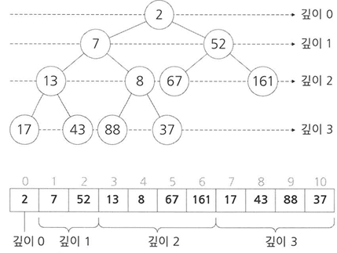

Priority Queue(우선순위 큐)
===========================

-	입력된 순서대로 출력되는 것이 아닌 데이터의 우선순위에 따라 출력순서가 결정되는 것.
-	핵심 = 데이터의 입/출력이 이루어질 때 최소의 비용으로 최소 우선순위의 데이터를 헤드에 위치시키는 것.
-	우선순위 큐는 삽입과 제거의 연산을 지원하는 자료구조

#### 우선순위 큐의 구현방법

1.	배열기반으로 구현하는 방법
2.	연결리스트로 구현하는 방법
3.	힙으로 구현하는 방법

#### 기본원리

(아래 조건은 배열 or 연결리스트로 구현하는 것을 예 로듬)

데이터가 작으면 우선순위가 높은 걸로 가정

우선순위 큐의 삽입 연산

1.	20이란 데이터를 집어 넣으려고 하면 queue에 있는 리스트들을 검색하여 19 보단 크고 21보다는 작은 데이터 사이에 추가한다.

우선순위 큐의 제거 연산

1.	제일 앞에 있는 데이터를 제거한다. (why? 데이터의 수가 가장 적은 것이 우선순위가 높다고 가정했으므로)

그러나 배열이나 연결리스트로 구현하게되면 삽입할 때마다 데이터를 당기고 밀어야 하고 데이터를 삽입하기위해 순차 탐색을 해야한다.

그래서 Heap이란 것을 사용한다.

#### Heap

-	Heap은 프로그래밍에서 말하는 Free Store가 아니라 Heap Order Property(힙 순서 속성)을 만족하는 완전 이진트리이다.

###### 위키백과에서 말하는 Heap의 정의

힙(heap)은 최댓값 및 최솟값을 찾아내는 연산을 빠르게 하기 위해 고안된 **완전이진트리(Complete binary tree)를 기본으로 한 자료구조(tree-based structure)** 로서 다음과 같은 힙 속성(property)을 만족한다.

-	A가 B의 부모노드(parent node) 이면, A의 키(key)값과 B의 키값 사이에는 대소관계가 성립한다.

###### 힙에는 두 가지 종류가 있다

-	최대 힙(Max Heap) : 부모노드의 key값이 자식노드의 키값보다 항상 큼

-	최소 힙(Min Heap) : 부모노드의 key값이 자식노드의 키값보다 항상 작은

key값의 대소관계는 오로지 부모노드와 자식노드 간에만 성립하며, 특히 형제 사이에는 대소관계가 정해지지 않는다.

각 노드의 자식노드의 최대개수는 힙의 종류에 따라 다르지만, 대부분의 경우는 자식노드의 개수가 최대 2개인 이진 힙(binary heap)을 사용한다.

힙에서는 가장 높은(혹은 가장 낮은) 우선순위를 가지는 노드가 항상 뿌리노드에 오게 되는 특징이 있으며, 이를 응용하면 우선순위 큐와 같은 추상적 자료형을 구현할 수 있다.

#### Heap에 새 노드 삽입

MAX HEAP

1.	Heap의 최고 깊이 최 우측에 새 노드를 추가하고 힙은 완전 이진 트리를 유지해야함.
2.	삽입한 노드는 부모노드와 비교하고 부모노드보다 삽입한 노드가 더 크면 부모노드와 위치를 바꾸고, 부모노드가 더 크면 현재 위치를 유지한다.
3.	삽입한 노드는 부모노드보다 더 크면 2번을 반복한다.

MIN HEAP

1.	Heap의 최고 깊이 최 우측에 새 노드를 추가하고 힙은 완전 이진 트리를 유지해야함.
2.	삽입한 노드는 부모노드와 비교하고 부모노드보다 삽입한 노드가 더 작으면 부모노드와 위치를 바꾸고, 부모노드가 더 작으면 현재 위치를 유지한다.
3.	삽입한 노드는 부모노드보다 더 작으면 2번을 반복한다.

#### Heap에 노드 삭제

MAX HEAP

1.	Heap에 있는 루트노드를 삭제(왜냐하면 제일 큰 값이기 때문에)
2.	힙 루트의 최고 깊이, 최 우측에 있는 노드를 루트노드로 옮긴다.
3.	루트노드로 옮긴 노드는 양쪽 자식노드랑 비교하여 큰 값을 갖는지 확인한다.
4.	큰 값이라면 현재 위치를 그대로 유지하고 그렇지 않으면 양쪽 자식노드 중 큰 값을 가지고 있는 노드와 위치를 바꾼다.
5.	3번, 4번을 반복한다.

MIN HEAP

1.	Heap에 있는 루트노드를 삭제(왜냐하면 제일 작은 값이기 때문에)
2.	힙 루트의 최고 깊이, 최 우측에 있는 노드를 루트노드로 옮긴다.
3.	루트노드로 옮긴 노드는 양쪽 자식노드랑 비교하여 작은 값을 갖는지 확인한다.
4.	작은 값이라면 현재 위치를 그대로 유지하고 그렇지 않으면 양쪽 자식노드 중 작은 값을 가지고 있는 노드와 위치를 바꾼다.
5.	3번, 4번을 반복한다.

#### 구현

-	Heap을 구현할 때 연결 리스트 기반으로 할 경우 힙의 가장 마지막 노드, 즉 최고 깊이의 최 우측 노드를 어떻게 찾을 것인가라는 문제의 효율적인 답을 얻기 어려우므로 배열을 자주 사용한다.

###### 완전 이진트리를 배열로 나타내는 방법

1.	깊이 0의 노드를 배열의 0번째 요소에 저장
2.	깊이 1의 노드(모두 2개)는 배열의 1~2번 요소에 저장
3.	깊이 2의 노드(모두 4개)는 배열의 3~6번 요소에 저장
4.	깊이 n의 노드(2^n개)는 배열의 2^n-1 ~2^n+1 - 2요소에 저장



###### 배열의 장점

-	완전트리인 힙의 각 노드의 위치를 부모/자식 관계등을 배열의 인덱스로만으로 단번에 알 수 있다

-	k번 인덱스에 위치한 노드의 양쪽 자식 노드들이 위치한 인덱스

	-	왼쪽 자식 노드 : 2k + 1
	-	오른쪽 자식 노드 : 2k + 2

-	k번 인덱스에 위치한 노드의 부모 노드가 위치한 인덱스 : (k-1)/2의 몫

공통요소

```cs
void HEAP_SwapNode(Heap* heap, int idx1, int idx2) {
    int size = sizeof(HeapNode);
    HeapNode* tmp = (HeapNode*)malloc(size);
    memcpy(tmp,&heap->nodes[idx1], size);
    memcpy(&heap->nodes[idx1], &heap->nodes[idx2], size);
    memcpy(&heap->nodes[idx2], tmp, size);
    free(tmp);
}
//부모노드 위치
int HEAP_GetParent(int curPosition) {
    return (curPosition -1) /2;
}
//왼쪽 자식노드 위치
int HEAP_GetLeftChild(int index) {
    return (index * 2) + 1;
}
//오른쪽 자식노드 위치
int HEAP_GetRightChild(int index) {
    return (index * 2) + 2;
}
```

삽입연산(최소힙)

```cs
void HEAP_InsertByMin(Heap* heap, HeapNode newNode) {

    int curPosition = heap->UsedSize;
    int parentPosition = HEAP_GetParent(curPosition);

    if (heap->Capacity == heap->UsedSize) {
        heap->Capacity *= 2;
        heap->nodes = (HeapNode *) realloc(heap->nodes, sizeof(HeapNode) * heap->Capacity);
    }
    heap->nodes[curPosition] = newNode;
    while(curPosition > 0 && heap->nodes[curPosition].priority < heap->nodes[parentPosition].priority) {
        HEAP_SwapNode(heap,curPosition, parentPosition);
        curPosition = parentPosition;
        parentPosition = HEAP_GetParent(curPosition);
    }

    heap->UsedSize++;
}
```

삽입연산(최대힙)

```cs
void HEAP_InsertByMax(Heap* heap, HeapNode newNode) {
    int curPosition = heap->UsedSize;
    int parentPosition = HEAP_GetParent(curPosition);

    if (heap->Capacity == heap->UsedSize) {
        heap->Capacity *= 2;
        heap->nodes = (HeapNode*)realloc(heap->nodes, sizeof(HeapNode) *heap->Capacity);
    }
    heap->nodes[curPosition] = newNode;

    while(curPosition > 0 && heap->nodes[curPosition].priority > heap->nodes[parentPosition].priority) {
        HEAP_SwapNode(heap, curPosition, parentPosition);
        curPosition = parentPosition;
        parentPosition = HEAP_GetParent(curPosition);
    }
    heap->UsedSize++;
}

```

삭제연산(최소힙)

```cs
void HEAP_DeleteByMin(Heap* heap, HeapNode* root) {
    int parentPosition = 0;
    int leftPosition = 0;
    int rightPosition = 0;

    memcpy(root, &heap->nodes[0], sizeof(HeapNode));
    memset(&heap->nodes[0], 0, sizeof(struct _HeapNode));


    heap->UsedSize--;
    HEAP_SwapNode(heap, 0,heap->UsedSize);
    leftPosition = HEAP_GetLeftChild(0);
    rightPosition = HEAP_GetRightChild(0);

    while(1) {
        int selectedChild = 0;
        if (leftPosition >= heap->UsedSize) {
            break;
        }
        if (rightPosition >= heap->UsedSize) {
            selectedChild = leftPosition;
        }
        else {
            if (heap->nodes[leftPosition].priority > heap->nodes[rightPosition].priority) {
                selectedChild = rightPosition;
            }
            else {
                selectedChild = leftPosition;
            }
        }

        if (heap->nodes[selectedChild].priority < heap->nodes[parentPosition].priority) {
            HEAP_SwapNode(heap, parentPosition, selectedChild);
            parentPosition = selectedChild;
        }
        else {
            break;
        }
        leftPosition = HEAP_GetLeftChild(parentPosition);
        rightPosition = HEAP_GetRightChild(parentPosition);
    }
    if (heap->UsedSize < (heap->Capacity/2)) {
        heap->Capacity /= 2;
        heap->nodes = (HeapNode*)realloc(heap->nodes, (sizeof(HeapNode) * heap->Capacity));
    }
}
```

삭제연산(최대힙)

```cs
void HEAP_DeleteByMax(Heap* heap, HeapNode* root) {
    int parentPosition = 0;
    int leftPosition = 0;
    int rightPosition = 0;

    memcpy(root, &heap->nodes[0], sizeof(HeapNode));
    memset(&heap->nodes[0], 0, sizeof(HeapNode));


    heap->UsedSize--;
    HEAP_SwapNode(heap, 0,heap->UsedSize);
    leftPosition = HEAP_GetLeftChild(0);
    rightPosition = HEAP_GetRightChild(0);


    while(1) {
        int selectedPosition = 0;
        if (leftPosition >= heap->UsedSize) {
            return;
        }
        if (rightPosition >= heap->UsedSize) {
            selectedPosition = leftPosition;
        }

        if (heap->nodes[leftPosition].priority > heap->nodes[rightPosition].priority) {
            selectedPosition = leftPosition;
        }
        else {
            selectedPosition = rightPosition;
        }

        if (heap->nodes[selectedPosition].priority > heap->nodes[parentPosition].priority) {
            HEAP_SwapNode(heap, selectedPosition, parentPosition);
        }
        else {
            return;
        }
        parentPosition = selectedPosition;
        leftPosition = HEAP_GetLeftChild(parentPosition);
        rightPosition = HEAP_GetRightChild(parentPosition);
    }

    if (heap->UsedSize < (heap->Capacity/2)) {
        heap->Capacity /= 2;
        heap->nodes = (HeapNode*)realloc(heap->nodes, (sizeof(HeapNode) * heap->Capacity));
    }
}
```
