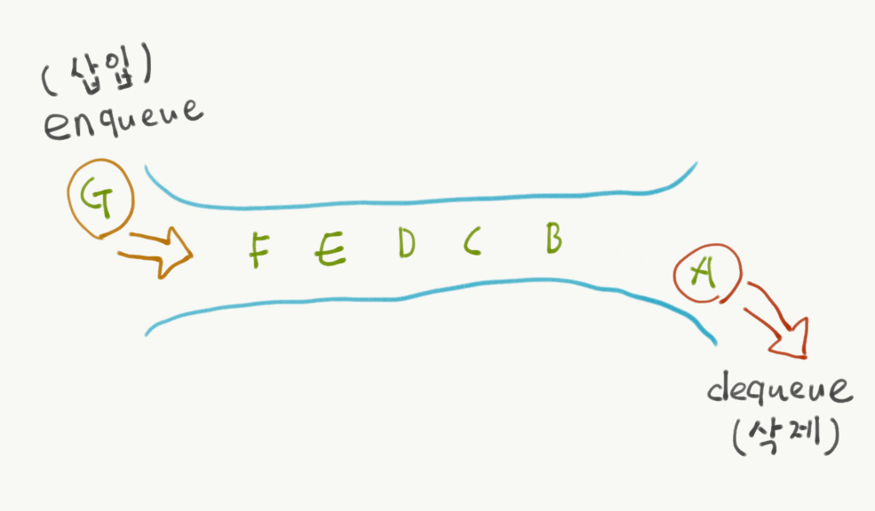

# 4. 큐(Queue)

## 정의

한쪽 끝에서 자료를 넣으면 다른 한쪽 끝에서 자료를 뺄 수 있는구조로 쉽게 말해서 먼저들어온 데이터가 먼저 나오는 구조라고해서 FIFO(First In First Out)라고 부른다.



## 큐의 연산

-	enqueue : 데이터를 큐에 삽입
-	dequeue : 제일 첫 번째 들어온 데이터를 제거
-	큐의 전단은 front, 후단은 rear로 이루어짐
-	새로운 데이터가 들어오면 rear가 하나씩 증가
-	데이터를 빼내면 front가 다음 queue에 저장되어 있는 데이터를 가리킴

### enqueue

```java

void enqueue(Object[] queue, int data) {
  queue[rear++] = data;
}
```

### dequeue

```java
Object dequeue(Object[] queue) {
  queue[front++] = data;

}
```

## 배열에서 단순 큐의 문제점

-	배열에서 큐가 차면 데이터를 빼내야 하고, front 앞의 배열에는 공백이 생긴다(가용용량이 줄어들어버림). 또 다른경우 데이터를 빼낼 때 기존 데이터를 배열의 첫 번 째 위치로 이동해야하는 연산이 생길 수 있다.
-	이런 문제를 해결하기 위해 Circular Queue 를 활용한다.

# 원형 큐(Circular Queue)

-	배열의 끝(rear)과 시작(front)부분을 이어 순환시키도록 하는 것.
-	배열의 rear에 데이터를 삽입하면서 rear의 다음이 front와 만나면 배열이 꽉차게 됨.


 >")

CircularQueue.c

```cs
#include "CircularQueue.h"

void createQueue(Queue **queue, int capacity) {
    (*queue) = (Queue*)malloc(sizeof(Queue));
    (*queue)->capacity = capacity;
    (*queue)->front = 0;
    (*queue)->rear = 0;
    (*queue)->nodes = (Node*)malloc(sizeof(Node)* (capacity+1));
}
void enqueue(Queue *queue, element data) {
    int rear = (queue->rear) % queue->capacity;
    queue->nodes[rear].data = data;    
    queue->rear = rear + 1;
}
void dequeue(Queue *queue) {
    int front = (queue->front) % queue->capacity;
    queue->nodes[front].data;
    queue->front = front+1;
}
int isEmpty(Queue *queue) {
    if (queue->front == queue->rear) {
        return TRUE;
    }
    return FALSE;
}
int isFull(Queue *queue) {
    if (queue->rear % queue->capacity == queue->front) {
        return TRUE;
    }
    else if (queue->front == (queue->rear+1) {
        return TRUE;
    }
    return FALSE;
}
```

CircularQueue.h

```cs
#include <stdio.h>
#include <stdlib.h>


#ifndef CIRCULARQUEUE_H
#define CIRCULARQUEUE_H

#define TRUE 1
#define FALSE 0

typedef int element;
typedef struct _Node {
    element data;
}Node;

typedef struct _Queue {
    int capacity;
    int front;
    int rear;
    Node* nodes;
}Queue;

void createQueue(Queue **queue, int capacity);
void enqueue(Queue *queue, element data);
void dequeue(Queue *queue);
int isEmpty(Queue *queue);
int isFull(Queue *queue);

#endif //CIRCULARQUEUE_H

```

## ArrayList Queue java version

Queue.java

```java
public interface Queue<T> {
	public void enqueue(T t);
	public T dequeue();
	public boolean isFull();
	public boolean isEmpty();
}

```

ArrayQueue.java

```java
public class ArrayQueue<T> implements Queue<T> {

	private Object[] queue;
	private int front;
	private int rear;
	private int capacity;
	private int length;
	private static final int DEFAULT_CAPACITY = 5;

	public ArrayQueue() {
		this.capacity = DEFAULT_CAPACITY;
		this.front = 0;
		this.rear = 0;
		this.length  = 0;
		this.queue = new Object[capacity];
	}
	public ArrayQueue(int capacity) {
		this.capacity = capacity;
		this.front = 0;
		this.rear = 0;
		this.length = 0;
		this.queue = new Object[capacity];
	}

	@Override
	public void enqueue(T data) {
		if (isFull()) {
			throw new IndexOutOfBoundsException("queue is Full...");
		}
		int rear = (this.rear) % this.capacity;
		queue[rear] = data;
		this.rear = rear+ 1;
		this.length++;
		System.out.println("enqueue : rear : "+  rear +" front : "+ front);
	}

	@Override
	public T dequeue() {
		if (isEmpty()) {
			throw new IndexOutOfBoundsException("queue is empty...");
		}
		int front = ((this.front) % this.capacity);
		Object data = queue[front];
		queue[front] = null;
		this.front  = front + 1;
		this.length--;
		System.out.println("dequeue : rear : "+  rear +" front : "+ front);
		return (T)data;
	}

	@Override
	public boolean isFull() {
		if (length == capacity) {
			return true;
		}
		return false;
	}

	@Override
	public boolean isEmpty() {

		if ( length == 0 || front == rear) {
			return true;
		}
		return false;
	}

	@Override
	public String toString() {
		if (length == 0) {
			return "[ ]";
		} else {
			StringBuilder sb = new StringBuilder("[");
			for(int i =0; i<length; i++) {
				sb.append(queue[i]);
				if (i != length-1) {
					sb.append(", ");
				}
			}
			sb.append("]");
			return sb.toString();
		}
	}

}
```

# 연결리스트 큐 (LinkedList Queue)

-	연결리스트 큐를 이용하면 용량상태를 확인할 필요가 없으며 용량의 제한이 없어서 가득찬다는 개념이 존재하지 않음
-	front에서 데이터를 빼낼 때 next Node를 연결 해제 해주면 되므로 삽입 삭제가 편리

LinkedQueue.h

```cs

#include <stdio.h>
#include <stdlib.h>

#ifndef LINKQUEUE_H
#define LINKQUEUE_H

#define TRUE 1
#define FALSE 0

typedef int element;
typedef struct _Node {
    element data;
    struct _Node* next;
}Node;

typedef struct _Queue {
    Node* front;
    Node* rear;
    int count;
}LinkedQueue;

Node *createNode(element data);
void createQueue(LinkedQueue **queue);
void enqueue(LinkedQueue *queue, Node* newNode);
void dequeue(LinkedQueue *queue);
int isEmpty(LinkedQueue *queue);

#endif //LINKQUEUE_H

```

LinkQueue.c

```cs
#include "LinkQueue.h"

void createQueue(LinkedQueue **queue) {
    (*queue) = (LinkedQueue*)malloc((sizeof(LinkedQueue)));
    (*queue)->front = NULL;
    (*queue)->rear = NULL;
    (*queue)->count = 0;
}
Node *createNode(element data) {
    Node* newNode = (Node*)malloc(sizeof(Node));
    newNode->data = data;
    newNode->next = NULL;
}
void enqueue(LinkedQueue *queue, Node* newNode) {
    if (queue->front == NULL) {
        queue->front = newNode;
        queue->rear = newNode;
        queue->count++;
    } else {
        queue->rear->next = newNode;
        queue->rear = newNode;
        queue->count++;
    }
}
void dequeue(LinkedQueue *queue) {
    Node* front = queue->front;
    if (queue->front->next == NULL) {
        queue->front = NULL;
        queue->rear = NULL;
    } else {
        queue->front =queue->front->next;
    }
    queue->count--;
}
int isEmpty(LinkedQueue *queue) {
    if (queue->count == 0) {
        return TRUE;
    }
    return FALSE;
}
```

## Linked Queue java version

LinkedQueue.java

```java
public class LinkedQueue<T> implements Queue<T> {

	private Node front;
	private Node rear;
	private static int length;
	private class Node {
		private T data;
		private Node next;
		public Node() {
			this.data = null;
			this.next = null;
		}
		public Node(T data) {
			this.data =data;
			this.next = null;
		}
	}

	public LinkedQueue() {
		this.length = 0;
	}
	@Override
	public void enqueue(T data) {
		Node newNode = new Node(data);
		if (front == null) {
			front = newNode;
			rear = newNode;
		} else {
			rear.next = newNode;
			rear = newNode;
		}
		length++;
	}

	@Override
	public T dequeue() {
		if (isEmpty()) {
			throw new IndexOutOfBoundsException("is empty");
		}
		Node remove = front;
		front = front.next;
		remove.next = null;
		length--;
		return remove.data;
	}


	@Override
	public boolean isEmpty() {
		if (length == 0) {
			return true;
		}
		return false;
	}
	@Override
	public boolean isFull() {
		// TODO Auto-generated method stub
		return false;
	}

	@Override
	public String toString() {
		Node temp = front;
		if (temp == null) {
			return "[ ]";
		} else {
			// StringBuilder 클래스를 이용하여 데이터를 출력
			StringBuilder sb = new StringBuilder("[");
			sb.append(temp.data);
			temp = temp.next;
			while (temp != null) {
				sb.append(", ");
				sb.append(temp.data);
				temp = temp.next;
			}
			sb.append("]");
			return sb.toString();
		}
	}
}

```

Queue.java

```java
public interface Queue<T> {
	public void enqueue(T t);
	public T dequeue();
	public boolean isFull();
	public boolean isEmpty();
}

```

 
# 소스코드

**[github 이동 (Click)](https://github.com/pscheol/ILT/tree/master/algorithm/Queue)**