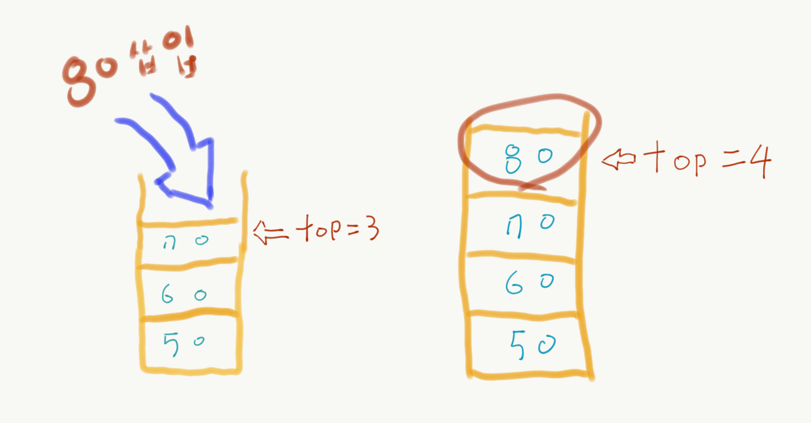
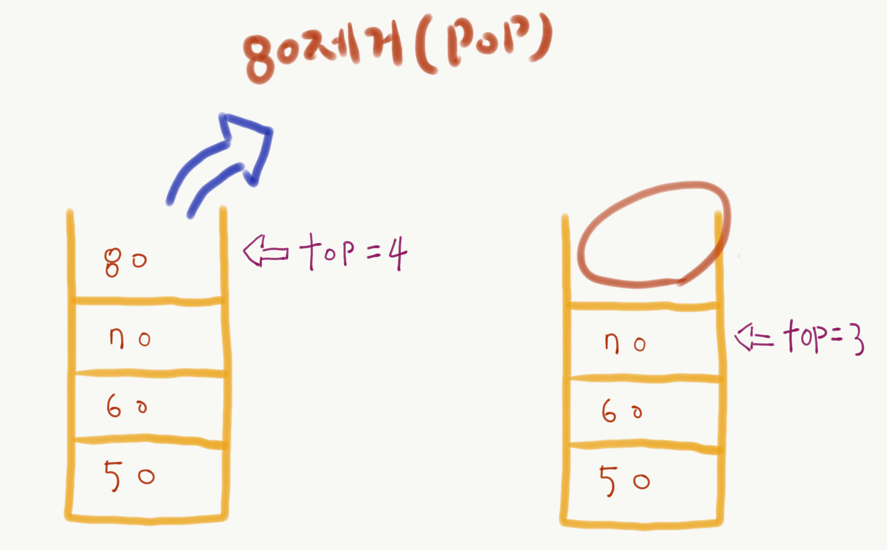
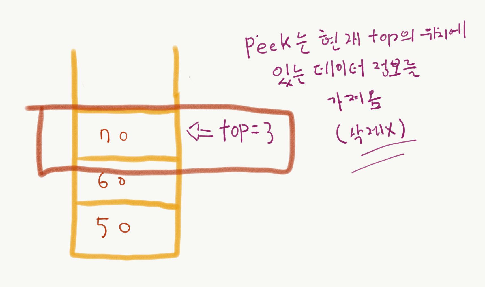

# 2. 스택(Stack)

-	먼저 들어간 데이터가 가장 마지막에 나오는 구조(Last In, First Out : LIFO)
-	삽입과 삭제가 한쪽 끝에서만 자료를 넣고 뺄 수 있다.
-	ex) 자동메모리, 네트워크 프로토콜

## 스택(Stack)의 주요 기능

**스택의 초기화**
```java
int stack[100]; //스택 배열
int size = 0; // 스태의 크기
```

### 삽입(Push)

- 스택 위에 새로운 노드를 쌓는 작업

```java
void push(int data) {
	stack[size] = data;
	size = size + 1;
}
```


<데이터 80 삽입>

  


### 삭제(Pop)

- 스택에서 최상위 노드를 걷어내는 작업
  
```java
int pop() {
	if (size < 0)
		return 0;		
	int pop = stack[size];
	size = size - 1;
	return pop;
}
```

<데이터 80 제거>

  

### Peek

- Top이 가리키는 위치의 데이터를 가져오는 작업

```java
int peek() {
	return stack[size];
}
```

  


### empty

- 스택이 비어있는지 비어있지 않은지 알아보는 작업

```java
boolean isEmpty() {
	return (size == 0) ? true : false;
}
```

### size
- 스택에 저장되어 있는 자료의 개수를 알아보는 작업

```java
int size() {
	return size;
}
```

## 배열로 구현하는 스택

-	동적으로 스택의 용량을 조절하기가 어렵다는 단점이 있다.
-	구현이 간단하다.

Java version

ArrayStack.java

```java
public class ArrayStack<T> implements Stack<T> {
	private static int DEFAULT_SIZE = 10;
	private static int top;
	private static int capacity;
	private Object[] stack;

	public ArrayStack() {
		top = -1;
		capacity = DEFAULT_SIZE;
		stack = new Object[capacity];
	}
	public ArrayStack(int capacity) {
		top = -1;
		capacity = DEFAULT_SIZE;
		stack = new Object[capacity];
	}
	@Override
	public void push(T data) {
		if (isFull()) {
			throw new IndexOutOfBoundsException("stack overflow");
		}
		stack[++top] = data;
	}
	@Override
	public T pop() {
		if (isEmpty()) {
			throw new IndexOutOfBoundsException("data impty");
		}
		return (T)stack[top--];
	}
	@Override
	public T peek() {
		return (T)stack[top];
	}
	@Override
	public boolean isFull() {
		if (top == capacity-1) {
			return true;
		}
		return false;
	}
	@Override
	public boolean isEmpty() {
		if (top == -1) {
			return true;
		}
		return false;
	}

}

```

Stack.java

```java
public interface Stack<T> {
	public void push(T data);
	public T pop();
	public T peek();
	public boolean isFull();
	public boolean isEmpty();
}

```

c language

ArrayList.h

```cs
//
// Created by Paik Seung Cheol on 2020. 3. 19..
//

#ifndef ARRAYSTACK_H
#define ARRAYSTACK_H


#include <stdio.h>
#include <stdlib.h>


#define TRUE 1
#define FALSE 0

typedef struct _Node {
    int data;
}Node;

typedef struct _Stack {
    int top;
    int capacity;
    Node* nodes;
}Stack;

void createStack(Stack** stack, int capacity);
int isFull(Stack* stack);
int isEmpty(Stack* stack);
void push(Stack* stack, int data);
int popup(Stack* stack);
int peek(Stack* stack);
#endif //ARRAYSTACK_H

```

ArrayList.c

```cs
//
// Created by Paik Seung Cheol on 2020. 3. 19..
//
#include "ArrayStack.h"

void createStack(Stack** stack, int capacity) {
    (*stack) = (Stack*)malloc(sizeof(Stack));
    (*stack)->capacity = capacity;
    (*stack)->top = -1;
    (*stack)->nodes = (Node*) malloc(sizeof(Node)* capacity);
}

int isFull(Stack* stack) {
    if ((stack)->top == (stack)->capacity-1) {
        return TRUE;
    }
    return FALSE;
}
int isEmpty(Stack* stack) {
    if ((stack)->top == -1) {
        return TRUE;
    }
    return FALSE;
}
void push(Stack* stack, int data) {
    if (isFull(stack)) {
        printf("stack overflow\n");
        exit(1);
    }
    stack->nodes[++stack->top].data = data;
}
int popup(Stack* stack) {
    if (isEmpty(stack)) {
        printf("is empty\n");
        exit(1);
    }
    return stack->nodes[stack->top--].data;
}

int peek(Stack* stack) {
    if (isEmpty(stack)) {
        printf("is empty\n");
        exit(1);
    }
    return stack->nodes[stack->top].data;
}

```

## 연결리스트로 구현하는 스택

- 스택의 용량에 제한을 두지 않는다.

```java
//
// Created by Paik Seung Cheol on 2020. 3. 19..
//
public class LinkedListStack<T> implements Stack<T> {

	private Node stack;
	private Node top;
	private static int length;

	public class Node {
		private T data;
		private Node top;

		public Node() {
			this.data = null;
			this.top = null;
		}

		public Node(T data) {
			this.data = data;
			this.top = null;
		}
	}

	public LinkedListStack() {
		stack = new Node();
		top = new Node();
		length = 0;
	}

	@Override
	public void push(T data) {
		Node newNode = new Node(data);
		if (stack.top == null) {
			stack.top = newNode;
		} else {
			Node oldStack = stack;
			do {
				oldStack = oldStack.top;
			} while (oldStack.top != null);
			oldStack.top = newNode;
		}
		top = newNode;
		length++;
	}

	@Override
	public T pop() {
		if (isEmpty()) {
			throw new IndexOutOfBoundsException("Stack is Empty ");
		}
		Node remove = top;
		if (stack.top == top) {
			stack.top = null;
			top = null;
		} else {
			Node curTop = stack;
			do {
				curTop = curTop.top;
			} while (curTop.top != top);
			curTop.top = null;
			top = curTop;

		}
		length--;
		return remove.data;
	}

	@Override
	public T peek() {
		if (isEmpty()) {
			throw new IndexOutOfBoundsException("stack is empty");
		}
		return top.data;
	}

	@Override
	public boolean isFull() {
		// TODO Auto-generated method stub
		return false;
	}

	@Override
	public boolean isEmpty() {
		if (length == 0 && stack.top == null) {
			return true;
		}
		return false;
	}

	@Override
	public String toString() {
		Node temp = stack.top;
		if (temp == null) {
			return "[ ]";
		} else {
			// StringBuilder 클래스를 이용하여 데이터를 출력
			StringBuilder sb = new StringBuilder("[");
			sb.append(temp.data);
			temp = temp.top;
			while (temp != null) {
				sb.append(", ");
				sb.append(temp.data);
				temp = temp.top;
			}
			sb.append("]");
			return sb.toString();
		}
	}
}

```

Ex) 후위표기 사칙연산 계산

```java
//
// Created by Paik Seung Cheol on 2020. 3. 19..
//
public class Calculator {
	public static void main(String[] args) {
		double result = postFixCalc("132**");
		System.out.println(result);
	}

	public static double postFixCalc(String data) {
		Stack<Double> stack = new ArrayStack<>();

		for (int i = 0; i < data.length(); i++) {
			switch (data.charAt(i)) {
			case '*':
			case '-':
			case '+':
			case '/':
				double op1 = new BigDecimal(stack.pop()).doubleValue();
				double op2 = new BigDecimal(stack.pop()).doubleValue();
				double result = calculate(data.charAt(i), op1, op2);
				stack.push(result);
				break;
			default:
				int num = Character.digit(data.charAt(i),10);
				stack.push(new BigDecimal(num).doubleValue());
			}
		}
		double result = 0;
		while(!stack.isEmpty()) {
			result = stack.pop();
		}
		return result;
	}

	private static double calculate(char postfixExp, double op1, double op2) {
		double result =0;

		switch (postfixExp) {
		case '*':
			result = new BigDecimal(op1).multiply(new BigDecimal(op2)).doubleValue();
			break;
		case '-':
			result = new BigDecimal(op1).subtract(new BigDecimal(op2)).doubleValue();
			break;
		case '+':
			result = new BigDecimal(op1).add(new BigDecimal(op2)).doubleValue();
			break;
		case '/':
			result = new BigDecimal(op1).divide(new BigDecimal(op2)).doubleValue();
			break;
			default :
				break;
		}
		return result;
	}
}


```


# 소스코드

**[github 이동 (Click)](https://github.com/pscheol/ILT/tree/master/algorithm/Stack)**