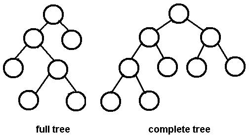
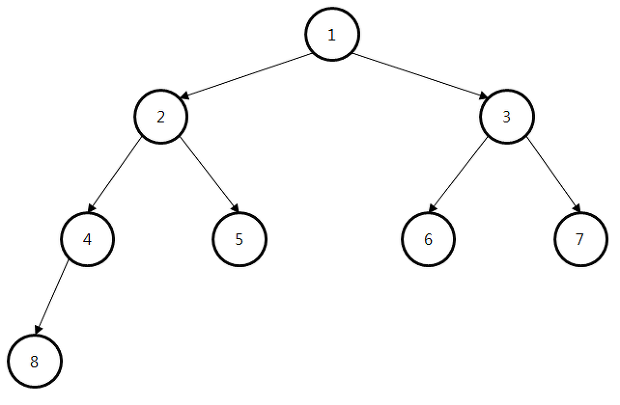

Binary Tree(이진트리)
=====================

-	모든 노드가 최대 2개의 자식노드를 가질 수 있는 트리로 루트 노드를 중심으로 둘로 나뉘는 두 개의 서브 트리도 이진트리어야 하고 하위 트리도 이진트리로 구성되어 있다.
-	최대 노드의 차수는 2이므로 자식 노드가 아예 없거나 하나 또는 둘 뿐이다.

#### 이진트리의 종류



-	포화 이진 트리(Full Binary Tree) : 모든 레벨별로 노드가 꽉 찬 이진 트리를 말한다.

-	완전 이진 트리(Complete Binart Tree) : 포화 이진 트리를 이루기 전 단계의 트리로, 잎 노드들이 왼쪽부터 차곡차곡 채워진 이진 트리이며 모든 노드에 자식 노드가 하나도 없거나 아니면 2개의 자식 노드를 갖는 이진 트리이다.

-	높이 균형 트리(Height Balanced Tree) : 왼쪽 하위 트리와 오른쪽 하위 트리의 높이가 1 이상 차이나지 않는 트리

-	완전 높이 균형 트리(Completely Height Balanced Tree) : 왼쪽 하위 트리와 오른쪽 하위 트리의 높이가 같은 트리

#### 이진트리의 순회

-	트리 내 노드들 사이를 돌아다니는 것

종류



-	전위순회 (Preorder Traversal)

	1.	방문순서 : root->left->right

	2.	root node 부터 시작하여 아래로 내려오며

	3.	왼쪽 하위 트리의 방문이 끝나면

	4.	오른쪽 하위트리를 방문 하는 방식

	5.	순서 : 1->2->4->8->5->3->6->7

	6.	( 1( 2(4(8),5), 3( 6, 4) ))

-	중위순회 (Inorder Traversal)

	1.	방문순서 : left->root->right
	2.	왼쪽 하위 트리부터 시작해서
	3.	루트를 거쳐
	4.	오른쪽 하위 트리를 방문
	5.	순서 : 8->4->2->5->1->6->3->7

-	후위순회 (Postorder Traversal)

	1.	방문순서 : left->right->root
	2.	왼쪽 하위 트리부터 시작해서
	3.	오른쪽 하위트리를 거쳐서
	4.	루트를 방문
	5.	순서 : 8->4->5->2->6->7->3->1

#### 이진트리 구현

BinaryTre.h

```cs
#include <stdio.h>
#include <stdlib.h>

#ifndef BINARYTREE_H
#define BINARYTREE_H

typedef char Element;
typedef struct _Node {
    struct _Node* left;
    struct _Node* right;
    Element data;
}TreeNode;

TreeNode* createNode(Element element);
void inOrderTree(TreeNode* node);
void preOrderTree(TreeNode* node);
void postOrderTree(TreeNode* node);

#endif //BINARYTREE_H

```

BinaryTree.c

```cs
//
// Created by Paik Seung Cheol on 2017. 9. 11..
//

#include "BinaryTree.h"


TreeNode* createNode(Element element) {
    TreeNode* newNode = (TreeNode*)malloc((sizeof(TreeNode)));
    newNode->data = element;
    newNode->left = NULL;
    newNode->right = NULL;
}
/**
 * left->root->right;
 * @param node
 */
void inOrderTree(TreeNode* node) {
    if (node == NULL)
        return;
    inOrderTree(node->left);
    printf("%c ");
    inOrderTree(node->right);
}
/**
 * root->left->right;
 * @param node
 */
void preOrderTree(TreeNode* node) {
    if (node == NULL)
        return;
    printf("%c ");
    preOrderTree(node->left);
    preOrderTree(node->right);
}
/**
 * left->right->root;
 * @param node
 */
void postOrderTree(TreeNode* node) {
    if (node == NULL)
        return;
    postOrderTree(node->left);
    inOrderTree(node->right);
    printf("%c ");

}

int main() {
    TreeNode* rootNode = createNode('A');
    TreeNode* BNode = createNode('B');
    TreeNode* CNode = createNode('C');
    TreeNode* DNode = createNode('D');
    TreeNode* ENode = createNode('E');
    TreeNode* FNode = createNode('F');
    TreeNode* GNode = createNode('G');

    rootNode->left = BNode;
    rootNode->right = CNode;
    BNode->left = DNode;
    BNode->right = ENode;
    CNode->left = FNode;
    CNode->right = GNode;

    printf("InOrder : ");
    inOrderTree(rootNode);
    printf("\n");
    printf("PreOrder : ");
    preOrderTree(rootNode);
    printf("\n");
    printf("PostOrder : ");
    postOrderTree(rootNode);
    printf("\n");

}
```
