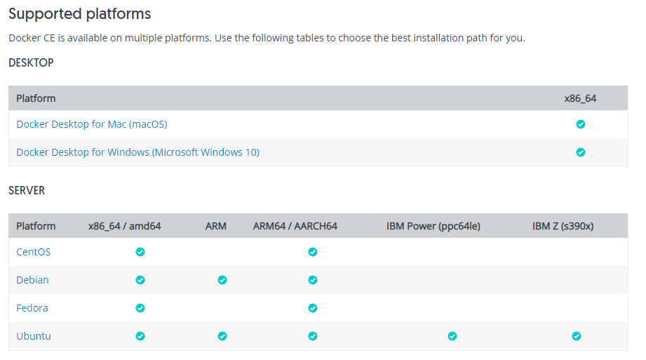

# Docker 설치


Docker를 설치하려면 도커 홈페이지 가서 설치를 하면된다.
설치 주소 : https://docs.docker.com/install/



지원 플랫폼을 확인하고 자신이 원하는 걸 다운 받아서 설치하면 된다.

### Window에서 Docker 설치

Windows에서 도커를 실행하려면 윈도우 10 이상이고 cpu와 보드에서 가상화를 지원해야한다. 아니면 VMWare에서 하면된다.

1. 윈도우에서 Hyper-V를 사용하도록 설정해야한다. [윈도우 10 에서 Hyper-V 설치](https://docs.microsoft.com/ko-kr/virtualization/hyper-v-on-windows/quick-start/enable-hyper-v)


2. https://docs.docker.com/docker-for-windows/install/ 페이지에서 도커 윈도우버전을 다운받아서 설치만 받으면 끝난다.

### Ubuntu에서 Docker 설치

https://docs.docker.com/install/linux/docker-ce/ubuntu/ 사이트에 가면 자세하게 나와있다.

1. Docker CE 설치

- 패키지를 업데이트한다

```shell
$ sudo apt-get update
```
- repository에서 도커 패키지를 설치한다.

```shell
$ sudo apt-get install \
    apt-transport-https \
    ca-certificates \
    curl \
    gnupg-agent \
    software-properties-common
```
- docker GPG key를 다운받아 등록한다.

```shell
$ curl -fsSL https://download.docker.com/linux/ubuntu/gpg | sudo apt-key add -
```


- fingerprint key **0EBFCD88** 를 입력

```shell
$ apt-key fingerprint 0EBFCD88
```

- stable 저장소 설정

```shell
$ sudo add-apt-repository \
   "deb [arch=amd64] https://download.docker.com/linux/ubuntu \
   $(lsb_release -cs) \
   stable"
```

- update 수행

```shell
$ sudo apt-get update

Hit:1 http://packages.confluent.io/deb/4.0 stable InRelease
Hit:2 https://download.docker.com/linux/ubuntu bionic InRelease
Hit:3 http://ppa.launchpad.net/linuxuprising/java/ubuntu bionic InRelease
Get:4 http://security.ubuntu.com/ubuntu bionic-security InRelease [88.7 kB]                                
Hit:5 http://us.archive.ubuntu.com/ubuntu bionic InRelease
Hit:6 http://us.archive.ubuntu.com/ubuntu bionic-updates InRelease
Hit:7 http://ppa.launchpad.net/webupd8team/java/ubuntu bionic InRelease
Hit:8 http://us.archive.ubuntu.com/ubuntu bionic-backports InRelease                 
Fetched 88.7 kB in 1s (63.5 kB/s)                              
Reading package lists... Done
```

- apt-cache madison docker-ce를 입력하면 docker-ce 버전별 패키지 목록이 나온다.

```shell
$ apt-cache madison docker-ce
 docker-ce | 5:18.09.7~3-0~ubuntu-bionic | https://download.docker.com/linux/ubuntu bionic/stable amd64 Packages
 docker-ce | 5:18.09.6~3-0~ubuntu-bionic | https://download.docker.com/linux/ubuntu bionic/stable amd64 Packages
 docker-ce | 5:18.09.5~3-0~ubuntu-bionic | https://download.docker.com/linux/ubuntu bionic/stable amd64 Packages
 docker-ce | 5:18.09.4~3-0~ubuntu-bionic | https://download.docker.com/linux/ubuntu bionic/stable amd64 Packages
 docker-ce | 5:18.09.3~3-0~ubuntu-bionic | https://download.docker.com/linux/ubuntu bionic/stable amd64 Packages
 docker-ce | 5:18.09.2~3-0~ubuntu-bionic | https://download.docker.com/linux/ubuntu bionic/stable amd64 Packages
 docker-ce | 5:18.09.1~3-0~ubuntu-bionic | https://download.docker.com/linux/ubuntu bionic/stable amd64 Packages
 docker-ce | 5:18.09.0~3-0~ubuntu-bionic | https://download.docker.com/linux/ubuntu bionic/stable amd64 Packages
 docker-ce | 18.06.3~ce~3-0~ubuntu | https://download.docker.com/linux/ubuntu bionic/stable amd64 Packages
 docker-ce | 18.06.2~ce~3-0~ubuntu | https://download.docker.com/linux/ubuntu bionic/stable amd64 Packages
 docker-ce | 18.06.1~ce~3-0~ubuntu | https://download.docker.com/linux/ubuntu bionic/stable amd64 Packages
 docker-ce | 18.06.0~ce~3-0~ubuntu | https://download.docker.com/linux/ubuntu bionic/stable amd64 Packages
 docker-ce | 18.03.1~ce~3-0~ubuntu | https://download.docker.com/linux/ubuntu bionic/stable amd64 Packages
```

- sudo apt-get install docker-ce=<VERSION_STRING> docker-ce-cli=<VERSION_STRING> containerd.io 를입력하여 버전에 맞는 도커를 설치한다.(5:18.09.7~3-0~ubuntu-bionic 버전으로 설치함)

```shell
## sudo apt-get install docker-ce=<VERSION_STRING> docker-ce-cli=<VERSION_STRING> containerd.io

$ sudo apt-get install docker-ce=5:18.09.7~3-0~ubuntu-bionic docker-ce-cli=5:18.09.7~3-0~ubuntu-bionic containerd.io
```

- docker --version 입력하여 버전 확인

```shell
$ docker --version
Docker version 18.09.7, build 2d0083d
```

- sudo docker run hello-world 을 실행하면 도커가 설치된 것을 확인 할 수 있다.

```shell
$ sudo docker run hello-world

Unable to find image 'hello-world:latest' locally
latest: Pulling from library/hello-world
1b930d010525: Pull complete
Digest: sha256:6540fc08ee6e6b7b63468dc3317e3303aae178cb8a45ed3123180328bcc1d20f
Status: Downloaded newer image for hello-world:latest

Hello from Docker!
This message shows that your installation appears to be working correctly.

To generate this message, Docker took the following steps:
 1. The Docker client contacted the Docker daemon.
 2. The Docker daemon pulled the "hello-world" image from the Docker Hub.
    (amd64)
 3. The Docker daemon created a new container from that image which runs the
    executable that produces the output you are currently reading.
 4. The Docker daemon streamed that output to the Docker client, which sent it
    to your terminal.

To try something more ambitious, you can run an Ubuntu container with:
 $ docker run -it ubuntu bash

Share images, automate workflows, and more with a free Docker ID:
 https://hub.docker.com/

For more examples and ideas, visit:
 https://docs.docker.com/get-started/

```


# Docker Compose 설치

- Dcoker Compose stable release 버전을 다운받는다.

```shell
$ sudo curl -L "https://github.com/docker/compose/releases/download/1.24.0/docker-compose-$(uname -s)-$(uname -m)" -o /usr/local/bin/docker-compose
```


- docker-compose 권한 추가

```shell
sudo chmod +x /usr/local/bin/docker-compose

sudo ln -s /usr/local/bin/docker-compose /usr/bin/docker-compose
```
