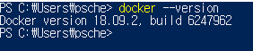
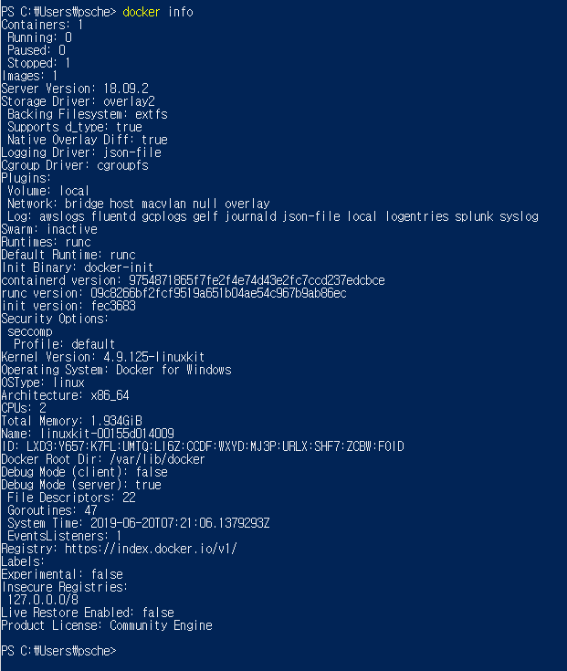
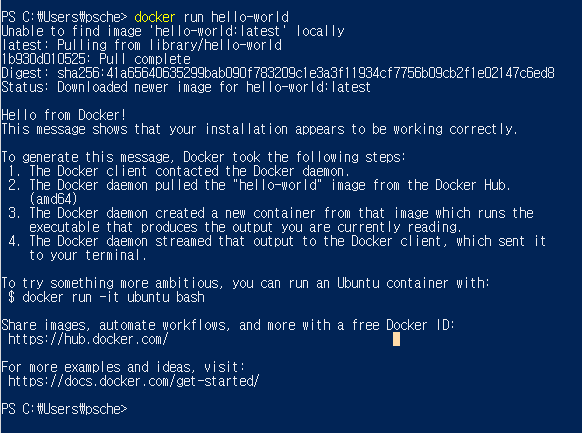
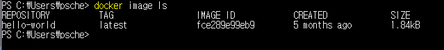

# Docker 기본 명령어

- **docker --version** :  현재 버전정보를 알 수 있다.
```
$ docker --version
```



* **docker info or docker system info** 도커가 설치된 상세정보를 볼 수 있다.
```
$ docker info
or
$ docker system info
```




* **docker run [이미지 이름]** : 도커 이미지를 설치한다.
```
$ docker run hello-world
```



* **docker image [Commands]** : 도커 이미지와 관련된 명령을 수 행할 수 있다.
```
$ docker image ls //도커 이미지 목록
```



* **docker container run <Docker 이미지명> <실행할 명령>**  : Docker 컨테이너를 작성 및 실행할 때는 docker container run 명령을 사용
```docker
$ docker container run <Docker 이미지명> <실행할 명령>

ex)
$ docker container run ubuntu:latest /bin/echo 'Hello world'
```

**$ docker container run ubuntu:latest /bin/echo 'Hello world'** 명령을 실행하면 docker이미지가 로컬환경에 있는지 확인하고 없다면 Docker 리포지토리에서 Docker 이미지를 다운받고 아래와 같이 Hello world가 출력된다.
'ubunt:latest'는 우분투 최신 버전의 이미지(latest)를 취득한다는 의미고 다운이 완료되면 컨테이너가 시작되어 리눅스 echo 명령을 수행한다.(두 번재부터는 다운을 받지 않음)


* **docker system df** : 도커가 사용하고 있는 디스크 사용정보를 출력
```
$ docker system df
```

