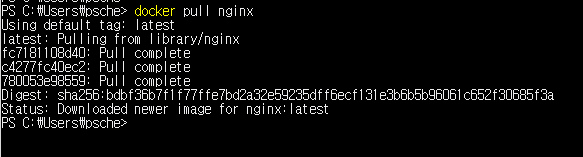
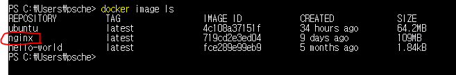
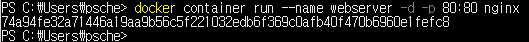
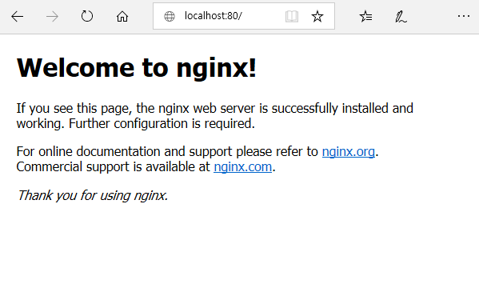
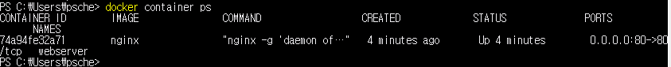
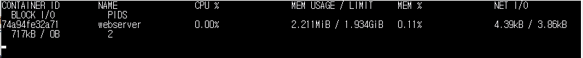

#도커에서 웹 서버 작동하기(Nginx 설치하기)


#### 1. 이미지 다운로드

* Docker 컨테이너를 시작하기 위해서는 Docker 컨테이너의 바탕이 되는 'Docker 이미지'가 필요
  - Docker repository인 docker hub에 가면 [Nginx](https://hub.docker.com/_/nginx)의 공식 이미지를 제공한다.

> **이미지 다운로드**

```
$ docker pull nginx
```



> **$ docker image ls** 를 통해 다운로드 확인




#### 2. Nginx 작동
- Docker 이미지를 사용하여 Nginx 서버를 가동한다. 이때 브라우저에서 HTTP(80 포트)에 대한 엑세스를 허가하기 위해 -p 옵션을 붙여 컨테이너가 보내는 전송을 허가한다.

```
$ docker container run --name webserver -d -p 80:80 nginx
```




> 아래 그림처럼 localhost:80 포트가 잘 적용되어 서버거 작동하고 있는것을 확인 할 수 있다.




#### 3. 상태확인

Nginx가 잘 사용중인지 상태를 확인하려면 **$ docker container ps** 명령어를 사용하면 된다.

```
$ docker container ps
```




**$ docker container stats webserver** 명령어를 이용하면 컨테이너의 상세내용을 확인 할 수 있다.

```
$ docker container stats webserver
```



#### 4. 기동 및 정지

* 컨테이너 정지
```
$ docker stop webserver
```
* 컨테이너 기동
```
$ docker start webserver
```


> Docker Hub 로그아웃(docker logout)

```
$ docker logout
```
