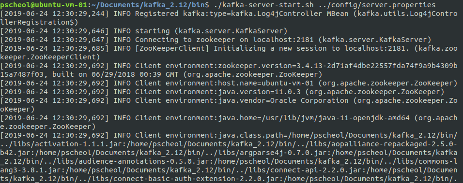

# QuickStart And Clustering

#### Step 1: 카프카 다운로드
아파치 카프카를 다운로드 받는다. (버전 2.12-2.2.0) [Download](https://www.apache.org/dyn/closer.cgi?path=/kafka/2.2.0/kafka_2.12-2.2.0.tgz)

다운을 다 받으면 압축을 풀고 폴더로 가면 아래와 같이 파일 목록들을 볼 수 있다.(폴더명은 kafka_2.12-2.2.0에서 kafka_2.12로 변경함)

```shell
$ tar -xzf kafka_2.12-2.2.0.tgz
$ cd kafka_2.12-2.2.0
pscheol@ubuntu-vm-01:~/Documents/kafka_2.12$ ls
bin  config  libs  LICENSE  logs  NOTICE  site-docs
```

* bin 폴더에는 실행파일들이 담겨있다.

```shell
pscheol@ubuntu-vm-01:~/Documents/kafka_2.12$ cd bin
pscheol@ubuntu-vm-01:~/Documents/kafka_2.12/bin$ ls
connect-distributed.sh               kafka-reassign-partitions.sh
connect-standalone.sh                kafka-replica-verification.sh
kafka-acls.sh                        kafka-run-class.sh
kafka-broker-api-versions.sh         kafka-server-start.sh
kafka-configs.sh                     kafka-server-stop.sh
kafka-console-consumer.sh            kafka-streams-application-reset.sh
kafka-console-producer.sh            kafka-topics.sh
kafka-consumer-groups.sh             kafka-verifiable-consumer.sh
kafka-consumer-perf-test.sh          kafka-verifiable-producer.sh
kafka-delegation-tokens.sh           trogdor.sh
kafka-delete-records.sh              windows
kafka-dump-log.sh                    zookeeper-security-migration.sh
kafka-log-dirs.sh                    zookeeper-server-start.sh
kafka-mirror-maker.sh                zookeeper-server-stop.sh
kafka-preferred-replica-election.sh  zookeeper-shell.sh
kafka-producer-perf-test.sh

```

* config에는 각종 환경변수 설정들이 담겨있다.

```shell
pscheol@ubuntu-vm-01:~/Documents/kafka_2.12$ cd config
pscheol@ubuntu-vm-01:~/Documents/kafka_2.12/config$ ls
connect-console-sink.properties    consumer.properties
connect-console-source.properties  log4j.properties
connect-distributed.properties     producer.properties
connect-file-sink.properties       server.properties
connect-file-source.properties     tools-log4j.properties
connect-log4j.properties           trogdor.conf
connect-standalone.properties      zookeeper.properties

```

나머지 폴더들은 생략.


#### Step 2: Start the server
- 카프카는 [ZooKeeper](https://zookeeper.apache.org/)를 사용하므로 만약 Zookeeper 서버가 없다면 먼저 서버를 시작해야 한다.

> ZooKeeper 서버 시작
(카프카 폴더 안에 zookeeper-server-start.sh가 있다.)

```shell
$ cd kafka_2.12/bin

$ ./zookeeper-server-start.sh ../config/zookeeper.properties
```


 > kafka 서버 시작


 ```shell
 $ cd kafka_2.12/bin

 $ ./kafka-server-start.sh ../config/server.properties
 ```


#### Step 3: Create a topic
 - 'test'라는 topic이름으로 싱글 파티션과 하나의 복사본을 생성한다.
 ```shell
$ ./kafka-topics.sh --create --bootstrap-server localhost:9092 --replication-factor 1 --partitions 1 --topic test
 ```

- test라는 topic이 생성되었는지 확인

```shell
$ ./kafka-topics.sh --list --bootstrap-server localhost:9092
```


topic을 수동으로 생성할 수 있거나, 존재하지 않는 topic이 게시될 때 topic을 자동으로 생성주는 broker들을 구성할 수 있다.


#### Step 4: 메시지 전송
- kafka는 클라이언트에서 파일입력 또는 표준 입력을 받아 kafka클러스터에 메시지를 보낸다. 기본적으로 각줄의 분리된 메시지를 보낸다.
```shell
$ ./kafka-console-producer.sh --broker-list localhost:9092 --topic test
hello world
hello message
```


#### Step 5: consumer 시작

- kafka commoand line consumer 에 표준 출력으로 덤프한다.

```shell
$ ./kafka-console-consumer.sh --bootstrap-server localhost:9092 --topic test --from-beginning
hello world
hello message
```


- producer 명령을 수행하면 kafka 클러스터에 메시지를 보내고 consumer에서 받을 수 있다.

#### Step 6 : Multi-broker 클러스터 설정
- 클러스터 모드로 사용하면 2가지 장점이 있다.
  - 첫 번째는 병렬처리(Parallelism)를 통해 클러스터 맴버 사이에서 동시에 작업을 수행한다.
  - 두 번째는 중복성(redundancy)인데 하나의 카프카 노드에 장애가 나면 다른 노드에 의해 접근이 가능하도록 안정성을 제공한다.


* 사용 : 3개의 클러스터 노드 확장

1. 각 브로커에 대한 설정 파일을 생성

```shell
$ cd kafka_2.12/config
$ cp server.properties server-1.properties
$ cp server.properties server-2.properties
```

cp 명령어(파일복사)를 통해 server-1.properties, server-2.properties 파일을 복제한다.


2. 브로커가 포트와 로그파일을 오버라이딩 하지 않게 하기위해 server-1.properties, server-2.properties에 들어가서 broker.id, listeners, log.dirs를 설정해준다.

- broker.id 는 클러스터의 각 노드에 대한 고유한 영구적인 이름이다.

```shell
## server-1.properties 설정
 $ vi server-1.properties

## Server Basics에 broker.id
broker.id=1
## Socket Server Setting에 listeners=
listeners=PLAINTEXT://:9093
## Log Basics에 log.dirs
log.dirs=/tmp/kafka-logs-1

## 저장하고 server-1.properties 종료

$ vi server-1.properties
## Server Basics에 broker.id
broker.id=2
## Socket Server Setting에 listeners=
listeners=PLAINTEXT://:9094
## Log Basics에 log.dirs
log.dirs=/tmp/kafka-logs-2

## 저장하고 server-2.properties 종료

## 주키퍼의 연결문자열의 기본 값은 아래와 같은데 이 값은 kafka broer가 zookeeper와 동일한 컴퓨터일 경우 가능하다.
zookeeper.connect=localhost:2181

## 만약 다른 컴퓨터에서 실행중인 주키퍼를 지정하려면 다음과 같이 해야한다.
## 주키퍼가 localhost에 2181 포트와 192.168.0.2의 IP주소를 가진 컴퓨터의 2183포트
## 192.168.0.3의 IP 주소를 가진 컴퓨터의 2182포트에서 구동 중임을 말한다.
## 주키퍼의 기본포트는 2181를 사용하므로 해당 위치에서 실행해야한다.
zookeeper.connect=localhost:2181, 192.168.0.2:2183, 192.168.0.3:2182

```


3. server-1, server-2 properties에 대한 카프카 서버를 실행한다.

```shell
$ bin/kafka-server-start.sh config/server-1.properties
...
$ bin/kafka-server-start.sh config/server-2.properties
...

```


4.  my-replicated-topic 이란 topic을 새로 생성해주고 replication 값은 3으로 해준다.

```shell
$ bin/kafka-topics.sh --create --bootstrap-server localhost:9092 --replication-factor 3 --partitions 1 --topic my-replicated-topic
```

아래 그림의 로그를 보면 my-replicated-topic 이 생성된 것을 확인 할 수 있다.


* 클러스터에서 broker가 무엇을 하고 있는지 알려면 '--describe' 옵션을 사용하면 알 수 있다.
  - "leader" :  주어진 파티션에 대한 모든 읽기 및 쓰기를 담당하는 노드입니다. 각 노드는 임의로 선택된 파티션 부분의 leader가 된다.
  - "replicas" : 리더 또는 현재 살아 있는지 여부에 관계 없이 파티션의 로그 복제된 리스트 또는 노드들이다.
  - "isr" : 동기화된 복제본의 집합니다. 현재 살아있고 leader에게 포착된 복제품의 부분집합이다.


* test에대한 topic의 정보다.
```
$ bin/kafka-topics.sh --describe --bootstrap-server localhost:9092 --topic test
Topic:test  PartitionCount:1    ReplicationFactor:1 Configs:
    Topic: test Partition: 0    Leader: 0   Replicas: 0 Isr: 0
```


* 위 그림의 my-replicated-topic의 leader 1번을 종료해보자

```
## ps 에서 server.properties 프로세스를 확인한다(leader 1번은 server-1.properties)
$ ps aux | grep server-1.properties

## 30546 프로세스를 죽인다(my pc process id)

$ kill -9 22490
```
 30546 프로세스를 죽인 결과 아래 화면처럼 첫번 째 서버는 죽었고 나머지 server0과 server-2만 살아남아 있는 걸 확인 할 수 있다.


그리고 kafka-topics.sh --describe 명령을 수행하여 leader 값을 확인해본다.

```
$ bin/kafka-topics.sh --describe --bootstrap-server localhost:9092 --topic my-replicated-topic
```
아래와 같이 leader가 0으로 바뀐 것을 확인 할 수 있다.


* 그러면 producer와 consumer를 실행하여 잘 작동하는 걸 확인해본다.

```shell
## kafka /bin 안에서 수행함
## producer 실행
$ ./kafka-console-producer.sh --broker-list localhost:9092 --topic my-replicated-topic
## consumer 실행
$ ./kafka-console-consumer.sh --bootstrap-server localhost:9092 --topic  my-replicated-topic --from-beginning
```


#### 7. import/export 기능 사용하기
- Kafka는 콘솔에 입력하는 것 뿐만아니라, import/export 기능을 제공한다.

```shell
## step1 : 먼저 echo 명령어 test.txt파일을 만들어낸다
$ echo -e "foo/\nbar" > test.txt

## step 2: 아래 명령어를 수행
$ bin/connect-standalone.sh config/connect-standalone.properties config/connect-file-source.properties config/connect-file-sink.properties

```

그러면 kafka 폴더 에 파일명.sink.txt라는 파일이 만들어진다.
그 파일을 실행해보면 아래와 같이 출력된다.

```shell
$ more test.sink.txt
foo
bar
```


또한 저장된 test파일을 kafka consumer console에서 실행하여 볼 수 있다.
a
```shell
bin/kafka-console-consumer.sh --bootstrap-server localhost:9092 --topic connect-test --from-beginning
```


참조 : https://kafka.apache.org/quickstart
