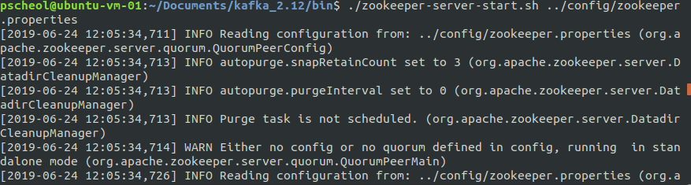
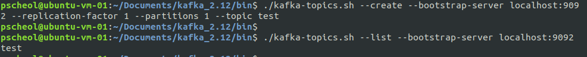
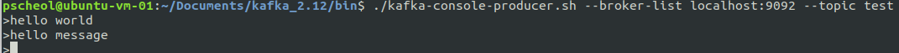
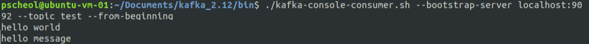
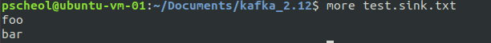
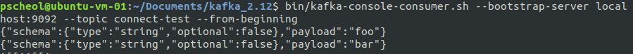

# Kafka QuickStart

#### Step 1: 카프카 다운로드
아파치 카프카를 다운로드 받는다. (버전 2.12-2.2.0) [Download](https://www.apache.org/dyn/closer.cgi?path=/kafka/2.2.0/kafka_2.12-2.2.0.tgz)

다운을 다 받으면 압축을 풀고 폴더로 가면 아래와 같이 파일 목록들을 볼 수 있다.(폴더명은 kafka_2.12-2.2.0에서 kafka_2.12로 변경함)

```shell
$ tar -xzf kafka_2.12-2.2.0.tgz
$ cd kafka_2.12-2.2.0
pscheol@ubuntu-vm-01:~/Documents/kafka_2.12$ ls
bin  config  libs  LICENSE  logs  NOTICE  site-docs
```

* bin 폴더에는 실행파일들이 담겨있다.

```shell
pscheol@ubuntu-vm-01:~/Documents/kafka_2.12$ cd bin
pscheol@ubuntu-vm-01:~/Documents/kafka_2.12/bin$ ls
connect-distributed.sh               kafka-reassign-partitions.sh
connect-standalone.sh                kafka-replica-verification.sh
kafka-acls.sh                        kafka-run-class.sh
kafka-broker-api-versions.sh         kafka-server-start.sh
kafka-configs.sh                     kafka-server-stop.sh
kafka-console-consumer.sh            kafka-streams-application-reset.sh
kafka-console-producer.sh            kafka-topics.sh
kafka-consumer-groups.sh             kafka-verifiable-consumer.sh
kafka-consumer-perf-test.sh          kafka-verifiable-producer.sh
kafka-delegation-tokens.sh           trogdor.sh
kafka-delete-records.sh              windows
kafka-dump-log.sh                    zookeeper-security-migration.sh
kafka-log-dirs.sh                    zookeeper-server-start.sh
kafka-mirror-maker.sh                zookeeper-server-stop.sh
kafka-preferred-replica-election.sh  zookeeper-shell.sh
kafka-producer-perf-test.sh

```

* config에는 각종 환경변수 설정들이 담겨있다.

```shell
pscheol@ubuntu-vm-01:~/Documents/kafka_2.12$ cd config
pscheol@ubuntu-vm-01:~/Documents/kafka_2.12/config$ ls
connect-console-sink.properties    consumer.properties
connect-console-source.properties  log4j.properties
connect-distributed.properties     producer.properties
connect-file-sink.properties       server.properties
connect-file-source.properties     tools-log4j.properties
connect-log4j.properties           trogdor.conf
connect-standalone.properties      zookeeper.properties

```

나머지 폴더들은 생략.


#### Step 2: Start the server
- 카프카는 [ZooKeeper](https://zookeeper.apache.org/)를 사용하므로 만약 Zookeeper 서버가 없다면 먼저 서버를 시작해야 한다.

> ZooKeeper 서버 시작
(카프카 폴더 안에 zookeeper-server-start.sh가 있다.)

```shell
$ cd kafka_2.12/bin

$ ./zookeeper-server-start.sh ../config/zookeeper.properties
```



 > kafka 서버 시작


 ```shell
 $ cd kafka_2.12/bin

 $ ./kafka-server-start.sh ../config/server.properties
 ```


#### Step 3: Create a topic
 - 'test'라는 topic이름으로 싱글 파티션과 하나의 복사본을 생성한다.
 ```shell
$ ./kafka-topics.sh --create --bootstrap-server localhost:9092 --replication-factor 1 --partitions 1 --topic test
 ```

- test라는 topic이 생성되었는지 확인

```shell
$ ./kafka-topics.sh --list --bootstrap-server localhost:9092
```



topic을 수동으로 생성할 수 있거나, 존재하지 않는 topic이 게시될 때 topic을 자동으로 생성주는 broker들을 구성할 수 있다.


#### Step 4: 메시지 전송
- kafka는 클라이언트에서 파일입력 또는 표준 입력을 받아 kafka클러스터에 메시지를 보낸다. 기본적으로 각줄의 분리된 메시지를 보낸다.
```shell
$ ./kafka-console-producer.sh --broker-list localhost:9092 --topic test
hello world
hello message
```




#### Step 5: consumer 시작

- kafka commoand line consumer 에 표준 출력으로 덤프한다.

```shell
$ ./kafka-console-consumer.sh --bootstrap-server localhost:9092 --topic test --from-beginning
hello world
hello message
```




- producer 명령을 수행하면 kafka 클러스터에 메시지를 보내고 consumer에서 받을 수 있다.


#### 6. import/export 기능 사용하기
- Kafka는 콘솔에 입력하는 것 뿐만아니라, import/export 기능을 제공한다.

```shell
## step1 : 먼저 echo 명령어 test.txt파일을 만들어낸다
$ echo -e "foo/\nbar" > test.txt

## step 2: 아래 명령어를 수행
$ bin/connect-standalone.sh config/connect-standalone.properties config/connect-file-source.properties config/connect-file-sink.properties

```

그러면 kafka 폴더 에 파일명.sink.txt라는 파일이 만들어진다.
그 파일을 실행해보면 아래와 같이 출력된다.

```shell
$ more test.sink.txt
foo
bar
```



또한 저장된 test파일을 kafka consumer console에서 실행하여 볼 수 있다.
a
```shell
bin/kafka-console-consumer.sh --bootstrap-server localhost:9092 --topic connect-test --from-beginning
```




참조 : https://kafka.apache.org/quickstart
