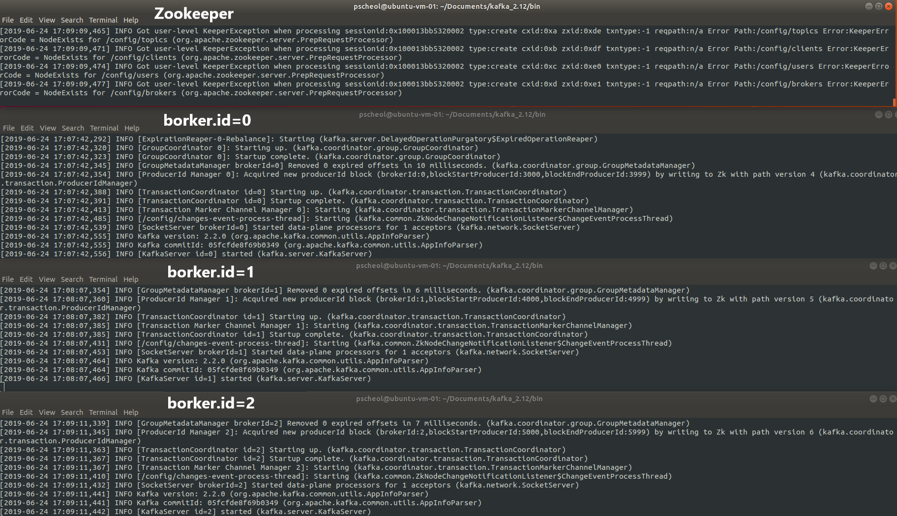

#Kafka clusters

#### Cluster 의 개념
- cluster는 여러대의 시스템이 한대의 시스템처럼 동작하는 시스템의 집합이라고 할 수 있다.

- 클러스터 모드로 사용하면 2가지 장점이 있다.
  - 첫 번째는 병렬처리(Parallelism)를 통해 클러스터 맴버 사이에서 동시에 작업을 수행한다.
  - 두 번째는 중복성(redundancy)인데 하나의 카프카 노드에 장애가 나면 다른 노드에 의해 접근이 가능하도록 안정성을 제공한다.

#### kafka cluster 구축 방법
- kafka에는 세 가지 구축 방법이 있다.
    1. Single Node - Single Broker
    2. Single Node - Multiple Broker
    3. Multiple Node - Multiple Broker


> **1. Single Node - Single Broker cluster구성(SNSB)**

SNSB는 1개의 kafka Node와 1개의 kafka Broker을 구성한다. (1:1구성) 그래서 단일 진입점(entry)이 필요할 때 유용하다.

* 요구사항
   - 유일한 공유 브로커에 동시 접근을 제어
   - 서로 다른 기종의 Producer에서 Broker로 접근을 요청
   - 오직 한 개의 Broker만 존재

다만, Single Broker는 병목현상이 일어나거나 Single point failure이 되기도하는 단점이 있다.

**[SNSB Cluster구성]**


##### 구성하기

1. ZooKeeper 실행

```shell
$ ./bin/zooKeeper-server-start.sh config/zookeeper.properties
```

2. broker 실행

```shell
## server.properties설정
broker.id = 0 ## 개별브로커에대한 식별자 Id
log.dir=/tmp/kafka0-logs ## 로그저장 경로
num.partitions=2 ## topic당 로그 파티션수
listeners=PLAINTEXT://:9092 ## 소켓서버 port
zookeeper.connect=locahost:2181 ## zookeeper URL


$ ./bin/kafka-server-start.sh config/server.properties
```

3. topic 생성
```shell
$ ./bin/kafka-topics.sh --create --bootstrap-server localhost:9092 --replication-factor 1 --partitions 1 --topic
```
[SNSB topic 생성 완료]


4. producer, consumer 실행
```shell
## producer 실행
$ ./bin/kafka-console-producer.sh --broker-list localhost:9092 --topic snsb

## consumer 실행
/bin $ ./kafka-console-consumer.sh --bootstrap-server localhost:9092 --topic snsb --from-beginning
```
[수행결과]


> **2. Single Node - Single Broker cluster구성(SNMB)**

- SNMB는 단일노지만 내부적으로 중복성(redundancy)이 필요한 경우사용
- Kafka에서 topic이 생성되면 해당 시스템은 개별 파티션의 복제가 각각의 broker에 어떻게 매핑될지 결정
- 메시지는 나머지 브로커에게 복제되기 전에, 파티션의 첫 번째 복제로 먼저 전송
- producer는 메시지를 전송할 방법(sync, async)을 고를 수 있고 producer는 zooKeeper에 등록한 watcher로 cluster내에서 가용한 broker와 각각의 파티션을 찾음
- 대용량 topic은 broker당 한 개 이상의 파티션으로 구성되며 더 많은 파티션들은 입 출력에 대한 병렬처리 능력을 향상시키고 consumer에 대한 병럴처리도 향상된다.

파티션을 늘릴경우 단점
- 파일이 많을 수록 더 많은 열린 파일 핸들러가 발생
- consumer가 확인할 더 많은 offset이 생기므로 zookeeper부하가 증가

**[SNMB Cluster구성]**


**구성하기**

* 사용 : 3개의 클러스터 노드 확장

1. 각 브로커에 대한 설정 파일을 생성

```shell
$ cd kafka_2.12/config
$ cp server.properties server-1.properties
$ cp server.properties server-2.properties
```

cp 명령어(파일복사)를 통해 server-1.properties, server-2.properties 파일을 복제한다.


2. 브로커가 포트와 로그파일을 오버라이딩 하지 않게 하기위해 server-1.properties, server-2.properties에 들어가서 broker.id, listeners, log.dirs를 설정해준다.

- broker.id 는 클러스터의 각 노드에 대한 고유한 영구적인 이름이다.

```shell
## server-1.properties 설정
 $ vi server-1.properties

## Server Basics에 broker.id
broker.id=1
## Socket Server Setting에 listeners=
listeners=PLAINTEXT://:9093
## Log Basics에 log.dirs
log.dirs=/tmp/kafka-logs-1

## 저장하고 server-1.properties 종료

$ vi server-1.properties
## Server Basics에 broker.id
broker.id=2
## Socket Server Setting에 listeners=
listeners=PLAINTEXT://:9094
## Log Basics에 log.dirs
log.dirs=/tmp/kafka-logs-2

## 저장하고 server-2.properties 종료

## 주키퍼의 연결문자열의 기본 값은 아래와 같은데 이 값은 kafka broer가 zookeeper와 동일한 컴퓨터일 경우 가능하다.
zookeeper.connect=localhost:2181

## 만약 다른 컴퓨터에서 실행중인 주키퍼를 지정하려면 다음과 같이 해야한다.
## 주키퍼가 localhost에 2181 포트와 192.168.0.2의 IP주소를 가진 컴퓨터의 2183포트
## 192.168.0.3의 IP 주소를 가진 컴퓨터의 2182포트에서 구동 중임을 말한다.
## 주키퍼의 기본포트는 2181를 사용하므로 해당 위치에서 실행해야한다.
zookeeper.connect=localhost:2181, 192.168.0.2:2183, 192.168.0.3:2182

```

> server.properties 정보

```shell
###server.properties

### 기본 값은 0 <= id 이며, 이름은 반드시 클러스터마다 유일 값이어야한다.
### 브로커에 이름을 할당해 다른 호스트나 포트로 이동될 경우 consumer 입장에서는 아무런 변경사항이 없다.
broker.id=0

## 쉼표로 구성된 URI 목록이며 broker는 listener 이름을 기반으로 요청을 대기한다.
listeners=PLAINTEXT://9092
```

3. server-1, server-2 properties에 대한 카프카 서버를 실행한다.

```shell
$ bin/kafka-server-start.sh config/server-1.properties
...
$ bin/kafka-server-start.sh config/server-2.properties
...

```




4.  my-replicated-topic 이란 topic을 새로 생성해주고 replication 값은 3으로 해준다.

```shell
$ bin/kafka-topics.sh --create --bootstrap-server localhost:9092 --replication-factor 3 --partitions 1 --topic my-replicated-topic
```

> kafka-topic.sh의 파라미터

--crate : 새로운 토픽 생성
--topic : 토픽 이름 설정
--replication-factor : 클러스터에서 몇 개의 서버에 토픽이 복제될지 지정(하나의 broker는 오직 한개만 복제할 수 있다)
--partitions : topic이 갖는 파티션 수 (파티션 수는 consumer 측면에서 가능한 병렬처리량을 결정)
--list : topic생성 리스트를 보여줌
--bootstrap-server : 서버 주소 및 포트 입력


아래 그림의 로그를 보면 my-replicated-topic 이 생성된 것을 확인 할 수 있다.


* 클러스터에서 broker가 무엇을 하고 있는지 알려면 '--describe' 옵션을 사용하면 알 수 있다.
  - PartitionCount : 해당 Topic에 존재하는 파티션 수
  - ReplicationFactor : 해당 Topic에 존재하는 복제본의 수
  - Leader :  주어진 파티션에 대한 모든 읽기 및 쓰기를 담당하는 노드입니다. 각 노드는 임의로 선택된 파티션 부분의 leader가 된다.
  - Replicas : 카프카 데이터를 복제하는 브로커 목록으로, 이 중 일부는 못쓰게 되기도 한다. 리더 또는 현재 살아 있는지 여부에 관계 없이 파티션의 로그 복제된 리스트 또는 노드들이다.
  - ISR(In Sync Replicas) : 동기화된 복제본의 집합니다. 현재 살아있고 leader에게 포착된 복제품의 부분집합이다.


* test에대한 topic의 정보다.
```
$ bin/kafka-topics.sh --describe --bootstrap-server localhost:9092 --topic test
Topic:test  PartitionCount:1    ReplicationFactor:1 Configs:
    Topic: test Partition: 0    Leader: 0   Replicas: 0 Isr: 0
```

* 위 그림의 my-replicated-topic의 leader 1번을 종료해보자

```
## ps 에서 server.properties 프로세스를 확인한다(leader 1번은 server-1.properties)
$ ps aux | grep server-1.properties

## 30546 프로세스를 죽인다(my pc process id)

$ kill -9 22490
```
 30546 프로세스를 죽인 결과 아래 화면처럼 첫번 째 서버는 죽었고 나머지 server0과 server-2만 살아남아 있는 걸 확인 할 수 있다.


그리고 kafka-topics.sh --describe 명령을 수행하여 leader 값을 확인해본다.

```
$ bin/kafka-topics.sh --describe --bootstrap-server localhost:9092 --topic my-replicated-topic
```
아래와 같이 leader가 0으로 바뀐 것을 확인 할 수 있다.


* 그러면 producer와 consumer를 실행하여 잘 작동하는 걸 확인해본다.

```shell
## kafka /bin 안에서 수행함
## producer 실행
$ ./kafka-console-producer.sh --broker-list localhost:9092 --topic my-replicated-topic
## consumer 실행
$ ./kafka-console-consumer.sh --bootstrap-server localhost:9092 --topic  my-replicated-topic --from-beginning
```


> kafka-console-producer.sh의 파라미터

- --from-beginning : 처음부터 사용될 메시지를 지정
- --broker-list : 주키퍼 서버를 지정하며, 호스트명과 포트를 콤바로 구분해 지정한다 (localhost:9092)
- --topic : 대상 토픽의 이름을 나타낸다.
- --sync : 메시지가 동기 방식으로 전송되어야 하는지 설정
- --compression-codec : 메시지를 생성하면서 사용할 압축 코덱을 지정. (옵션(기본값 : gzip) : none, gzip, snappy, lz4)
- --batch-size : 동기방식으로 보내지 않을경우, 배치로 전송할 메시지 수(배치의 크기는 byte 단위이다.)
- --message-send-max-retires : 통신실패로 메시지 수신에 실패할 수 있다. 그래서 producer가 메시지를 포기하고 재전송을 시도할 수다. (0 <= n)
- --retry-backoff-ms : leader node 선정시간이 다소 걸릴수 있으므로 leader 선정 이 후 producer가 재시도 하기 전에 대기하는 시간이다. (Nms)
- --timeout : 비동기로 실행중인 경우 메시지가 quque에서 충분한 배치 크기를 갖도록 대기하는 최대시간(Nms)
- --queue-size : 비동기로 실행중일 경우, 메시지가 큐에서 충분한 배치크기를 갖도록 대기하는 최대 메시지 수

> producer에서 console에 입력하지 않고 파일에 입력하고 보낼 수도 있다.

```
$ ./bin/kafka-console-producer.sh --broker-list localhost:9092 --topic  my-replicated-topic < test.txt
```

> kafka-console-consumer.sh의 파라미터

- --fetch-size : 단일 요청에 의해 가져올 데이터 크기. 파라미터 뒤에 지정될 숫자의 단위는 byte이다. (기본값 : 1024 * 1024)
- --socker-buffer-size : TCP RECV의 크기이며 단위는 Byte이다. (기본값 : 2 * 1024 * 1024)
- --formater : 표시할 메시지 형식에 사용할 클래스이름. (기본값 : DefaultMessageFormatter)
- --autocommit.interval.ms : 현재 offset을 지정할 밀리초 단위의 시간주기. (기본값 : 10000)
- --max-messages : 이미 가지고 있는 메시지를 사용하기 전까지의 최대 메시지 수이다. 값이 설정되지 않았으면 메시지를 연속적으로 사용(메시지가 1이면 1개만 출력되고 종료된다.)
- --skip-message-on-error : 메시지를 처리하는 동안 오류가 발생하면 시스템을 중당하는 대신 메시지를 건너뛴다.


> **3. Multiple Node - Multiple Broker cluster구성(MNMB)**

MNMB는 여러 개의 노드와 노드마다 한 개 이상의 브로커를 갖는경우 사용

**[MNMB Cluster구성]**


- 참조
Apache kafka 1.0 Cookbook
https://subscription.packtpub.com/book/big_data_and_business_intelligence/9781787286849
ShareBigD@ta
https://sharebigdata.wordpress.com/2015/09/09/kafka-installation-single-node-setup/
