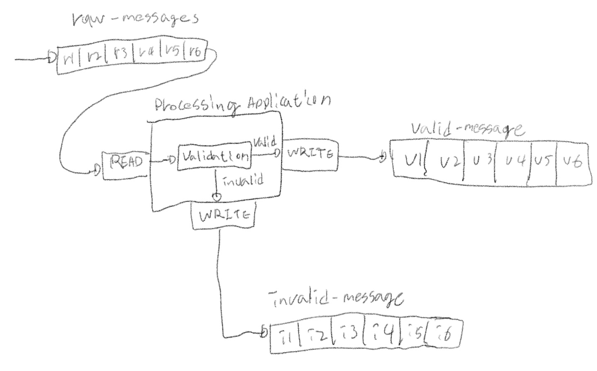
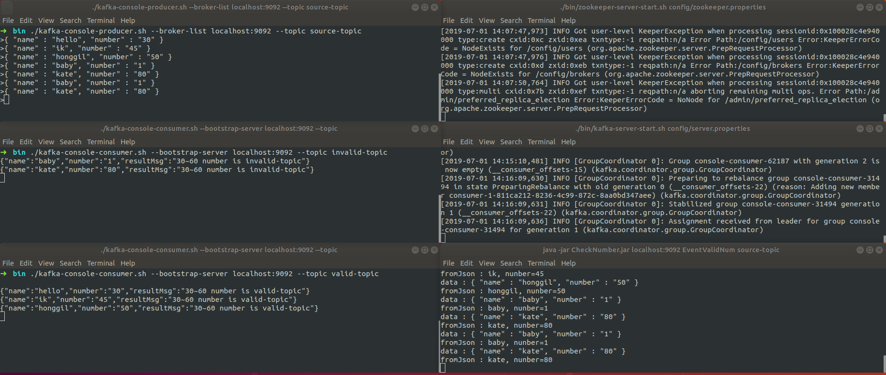

# kafka topic message 처리하기

- Producer와 Consumer를 통해 topic의 메시지를 처리해본다.

> #### 요구사항

임의의 숫자 2개를 설정하여 2개의 숫자 범위 값에 들어오면 valid topic으로 존재하지 않으면 invalid topic으로 분류한다.

```
초기 숫자가 10 20이면
10~20 사이의 수는 valid 그렇지 않으면 invalid topic으로 이동
```

- 원본메시지(raw-message)는 kafka topic에서 각각 이벤트를 읽는다.
- 이벤트를 검사하고 올바른 메시지는 valid-message topic에 쓰고, 잘못된 메시지는 invalid-message 토픽에 기록한다.

**[구성도]**

- raw-messages topic에서 이벤트를 읽고, 메시지를 검사하고, 조건 범위 내에 숫자가 존재하지 않으면 invalid-message topic으로, 정상적인 이벤트는 valid-message topic으로 routing 한다.

 


> #### 구현

0. 모델 정의
1. zooKeeper 실행
2. kafka 서버 실행(prot:9092)
3. 3 개의 topic(source-topic, valid-topic, invalid-topic)을 생성
4. kafka에서 raw-messages(source-topic) topic을 읽고 검사 기능을 처리하는 Producer, Consumer와 작업 구현


 **0. 모델 정의**
  - JSON Data 정의

```json
{ "name" : "hello", "number" : "30" }
{ "name" : "ik", "number" : "45" }
{ "name" : "honggil", "number" : "50" }
{ "name" : "baby", "number" : "1" }
{ "name" : "kate", "number" : "80" }
```


**1. zookeeper 실행**

```shell
$ ./bin/zookeeper-server-start.sh config/zookeeper.properties
```

**2. kafka 서버 실행**

```shell
$ ./bin/kafka-server-start.sh config/server.properties
```

**3. 3개의 topic 생성**

```shell
## source-topic, valid-topic, invalid-topic 3개의 topic 생성
$ ./kafka-topics.sh --create --bootstrap-server localhost:9092 --replication-factor 1 --partitions 1 --topic source-topic

$ ./kafka-topics.sh --create --bootstrap-server localhost:9092 --replication-factor 1 --partitions 1 --topic valid-topic

#
$ ./kafka-topics.sh --create --bootstrap-server localhost:9092 --replication-factor 1 --partitions 1 --topic invalid-topic

## 잘만들어졌는지 확인
$ ./kafka-topics.sh --list --botstrap-server localhost:9092
```
[3개의 toppic 생성 및 확인]


**4. kafka에서 raw-messages(source-topic) topic을 읽고 검사 기능을 처리하는 Producer, Consumer와 작업 구현**

[Consumer.java]

```java
import org.apache.kafka.clients.consumer.ConsumerRecords;

import java.util.Properties;

public interface Consumer {
    public static Properties createConfig(String servers, String groupId) {
        Properties props = new Properties();
        props.put("bootstrap.servers", servers);
        props.put("group.id", groupId);
        props.put("enable.auto.commit", "true");
        props.put("auto.commit.interval.ms", "1000");
        props.put("auto.offset.reset", "earliest");
        props.put("session.timeout.ms", "30000");
        props.setProperty("key.deserializer", "org.apache.kafka.common.serialization.StringDeserializer");
        props.setProperty("value.deserializer", "org.apache.kafka.common.serialization.StringDeserializer");
        return props;
    }

    public ConsumerRecords<String, String> consume();
}

```

[Reader.java]

- consumer의 구현체

```java

import org.apache.kafka.clients.consumer.ConsumerRecords;
import org.apache.kafka.clients.consumer.KafkaConsumer;

import java.time.Duration;
import java.util.Collections;


public class Reader implements Consumer {
    private final KafkaConsumer<String, String> consumer; //1. kafka consumer load
    private final String topic;

    public Reader(String servers, String groupId, String topic) {

        this.consumer = new KafkaConsumer<String, String>(Consumer.createConfig(servers, groupId));
        this.topic = topic;
    }

    @Override
    public ConsumerRecords<String, String> consume() {
        this.consumer.subscribe(Collections.singleton(this.topic)); //2. topic publish
        return consumer.poll(Duration.ofMillis(100)); //3. set timeout
    }
}
```

[Producer.java]

```java
import java.util.Properties;

public interface Producer {

    public void produce(String message);

    public static Properties createConfig(String servers) {
        Properties props = new Properties();
        props.put("bootstrap.servers", servers);
        props.put("acks", "all");
        props.put("retries", 0);
        props.put("batch.size", 1000);
        props.put("linger.ms", 1);
        props.put("key.serializer", "org.apache.kafka.common.serialization.StringSerializer");
        props.put("value.serializer", "org.apache.kafka.common.serialization.StringSerializer");
        return props;
    }
}
```

[Validator.java]
 - producer 구현체

 ```java

import com.google.gson.Gson;
import com.study.kafka.model.CheckNumber;
import org.apache.kafka.clients.producer.KafkaProducer;
import org.apache.kafka.clients.producer.ProducerRecord;

public class Validator implements Producer {
    private final KafkaProducer<String, String> producer;
    private final String validTopic;
    private final String invalidTopic;
    private final int startNum;
    private final int endNum;

    public Validator(String servers, String validTopic, String invalidTopic, int startNum, int endNum) {
        this.producer = new KafkaProducer<String, String>(Producer.createConfig(servers));
        this.validTopic = validTopic;
        this.invalidTopic = invalidTopic;
        this.startNum = startNum;
        this.endNum = endNum;
    }

    @Override
    public void produce(String message) {

        ProducerRecord<String, String> pr = null;
        Gson gson = new Gson();
        CheckNumber chkNum = null;

        System.out.println("data : " + message);
        try {
            chkNum = gson.fromJson(message, CheckNumber.class);

            System.out.println("fromJson : " + chkNum.getName() + ", nunber=" + chkNum.getNumber());

            String topic = validate(Integer.valueOf(chkNum.getNumber()), this.startNum, this.endNum) ? this.validTopic : this.invalidTopic;
            String resultMsg = this.startNum + "~" + this.endNum + " number is " + topic;

            chkNum.setResultMsg(resultMsg);

            pr = new ProducerRecord<String, String>(topic, gson.toJson(chkNum));

            producer.send(pr);

        } catch (Exception e) {
            System.out.println("Exception...");
            pr = new ProducerRecord<String, String>(this.invalidTopic, message);
            producer.send(pr);
            return;
        }
    }

    private boolean validate(int src, int startNum, int endNum) {
        return (src >= startNum && src <= endNum);
    }
}

 ```

[CheckNumber]
```java
import lombok.Data;

@Data
public class CheckNumber {
    private String name;
    private String number;
    private String resultMsg;
}

```

[Main.java]

```java

import com.study.kafka.consumer.Reader;
import com.study.kafka.producer.Validator;
import org.apache.kafka.clients.consumer.ConsumerRecord;
import org.apache.kafka.clients.consumer.ConsumerRecords;

import java.util.Scanner;


public class Main {
    //private static final Logger log = LoggerFactory.getLogger(Reader.class);

    public static void main(String[] args) throws Exception {
        String servers = args[0];
        String groupId = args[1];
        String sourceTopic = args[2];
        String validTopic = args[3];
        String invalidTopic = args[4];

        Scanner scan = new Scanner(System.in);
        System.out.print("input start number ->");
        int startNum = scan.nextInt();
        System.out.print("input end number ->");
        int endNum = scan.nextInt();

        System.out.println();

        Reader reader = new Reader(servers, groupId, sourceTopic);
        Validator validator = new Validator(servers, validTopic, invalidTopic, startNum, endNum);

        while (true) {
            ConsumerRecords<String, String> consumerRecords = reader.consume();
            for (ConsumerRecord<String, String> record : consumerRecords) {
                if (record.value() != null && !record.value().equals(""))
                    validator.produce(record.value());
            }
        }
    }
}

```

[build.gradle]

```gradle
apply plugin: 'java'
apply plugin:'application'
apply plugin: 'idea'

group 'study'
version '1.0-SNAPSHOT'

sourceCompatibility = 1.8


repositories {
    mavenCentral()
}

dependencies {

    annotationProcessor group: 'org.projectlombok', name: 'lombok', version: '1.18.4'
    compileOnly group: 'org.projectlombok', name: 'lombok', version: '1.18.4'

    compile group: 'org.apache.kafka', name: 'kafka-clients', version: '2.2.1'

    compile group: 'com.google.code.gson', name: 'gson', version: '2.8.5'

    testCompile group: 'junit', name: 'junit', version: '4.12'

}

mainClassName = 'com.study.kafka.Main'
jar {
    manifest {
        attributes  'Title': 'My Application',  'Main-Class': mainClassName
    }
    archiveFileName = 'CheckNumber.jar'
    dependsOn configurations.runtime
    from {
        configurations.compile.collect {it.isDirectory()? it: zipTree(it)}
    }{
        exclude "META-INF/*.SF"
        exclude "META-INF/*.DSA"
        exclude "META-INF/*.RSA"
    }
}

sourceSets.main.resources {
    srcDirs = ['src/main/java']
    include '**/*.xml'
}
```


> #### 결과

- source-topic producer console 실행

```shell
$ ./bin/kafka-console-producer.sh --broker-list localhost:9092 --topic source-topic
```

- invalid-topic consumer console 실행

```shell
 $ ./bin/kafka-console-consumer.sh --bootstrap-server localhost:9092 --topic invalid-topic
```

- valid-topic consumer console 실행

```shell
$ ./bin/kafka-console-consumer.sh --bootstrap-server localhost:9092 --topic valid-topic
```

- CheckNumber.jar 실행

```shell
$ java -jar CheckNumber.jar localhost:9092 EventValidNum source-topic valid-topic invalid-topic

```


