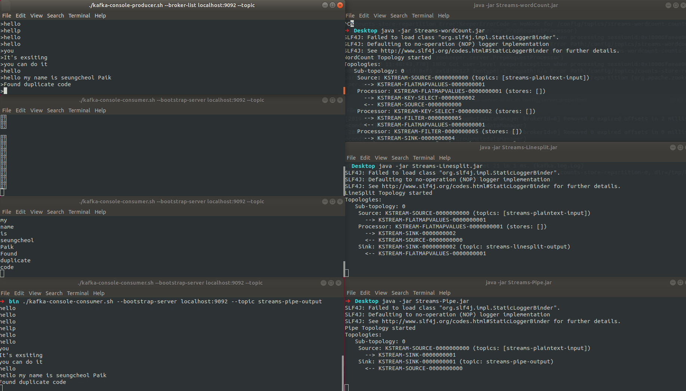

#Kafka Streams

kafka streams는 입출력 데이터가 카프카 클러스터에 kafka에 저장된 데이터를 처리하고 분석하기 위해 개발된 클라이언트 라이브러리다. Kafka Stremas는 클라이언트에서 쓰기가 간편하고, 자바와 스칼라 어플리케이션을 표준으로 작성하고 배포하고, Kafka 서버-사이드 클러스터 기술의 이점을 결합하여 응용프로그램의 확장성과, 탄력성, 내결합성, 분산성등을 향상시킨다. 또한 이벤트 시간과 처리 시간을 분리하여 다루며, 다양한 옵션을 지원하여 실시간 분석을 간단하고 효율적으로 지원한다.

> **kafka streams를 설명하기 전 몇 가지 개념 정리**

- Stream(스트림) : 연속적으로 업데이트되고 무제한으로 진행되는 과정을 의미한다. (무제한은 크기 제한이 없다는 뜻이다.)
- Stream Processing Application(스트림 처리 어플리케이션) : Kafka stream library를 사용하는 프로그램을 말한다.
- Processer Topology(프로세서 토폴로지) : 스트림 처리 애플리케이션이 수행할 데이터 처리에 대한 연산 로직을 정의하는 토폴로지다. 토폴로지는 스트림과 연결된 스트림 프로세서의 그래프이다.
  - 두 가지 구현방법
     1. low-level 프로세서 API를 통하는 방법
     2. kafka Stream DSL을 통하는 방법

- Stream Processor(스트림 프로세서) : 프로세서 토폴로지에 있는 노드로 토폴로지 안에서 처리 과정을 나타내고, 스트림 데이터를 변환하는데 사용. 표준작업, 필터, 조인, 맵, 데이터 종합 등은 kafka stream에서 활용하는 스트림 프로세서 사례다.

- Windowing(윈도잉) : 데이터 레코드를 시간단위로 보기 위해 스트림 프로세서가 시간 단위 묶음으로 나눈다. 주로 데이터 취합이나 조인할 때 필요.
- join(조인) : 새로운 스트림을 생성하는 작업으로, 두 개 이상의 스트림이 데이터 레코드의 키를 기반으로 합쳐지면 새로운 스트림이 생성된다.
- Aggregation(취합) : 새로운 스트림을 생성하는 작업으로, 새로운 스트림은 하나의 입력 스트림을 통해 여러 개의 입력 레코드를 조합해 단일 출력 레코드로 만들어낸다.

[Kafka Stream Architecture]


#### kafka streams 구현

- Dependency 추가

```shell
## Gradle
compile group: 'org.apache.kafka', name: 'kafka-streams', version: '2.2.1'

## Maven

<dependency>
    <groupId>org.apache.kafka</groupId>
    <artifactId>kafka-streams</artifactId>
    <version>2.2.1</version>
</dependency>
```


> **Pipe 스트림 어플리케이션**

- streams-plaintext-input topic의 데이터를 streams-pipe-output topic으로 전달하는 어플리케이션


1. Properties 설정

```java
Properties props = new Properties();
//kafka streams application을 유일할게 구분할 ID
props.put(StreamsConfig.APPLICATION_ID_CONFIG, "streams-pipe");
//kafka application에 접근할 broker 정보
props.put(StreamsConfig.BOOTSTRAP_SERVERS_CONFIG, "localhost:9092");
//데이터를 어떤 형식으로 read/write할지 결정(key-value type)
props.put(StreamsConfig.DEFAULT_KEY_SERDE_CLASS_CONFIG, Serdes.String().getClass());
props.put(StreamsConfig.DEFAULT_VALUE_SERDE_CLASS_CONFIG, Serdes.String().getClass());
```

2. StreamsBuilder를 통해 topic과 topology 세팅 후 KafkaStreams 생성
```java
//data stream으로 구성된 Topology 를 정의할 builder
final StreamsBuilder builder = new StreamsBuilder();
//input stream topic, output streams topic 설정
builder.stream("streams-plaintext-input").to("streams-pipe-output"); //topic 설정
//topology 생성
final Topology topology = builder.build();
//KafkaStreams 생성
final KafkaStreams streams = new KafkaStreams(topology, props);

```
3. Stream 시작

```java
//다른 쓰레드들에서 일련의 작업이 완료 될 때까지 대기하도록 Sync를 맞춰주는 기능
final CountDownLatch latch = new CountDownLatch(1);

//JVM이 shutdown 될때 이벤트를 가로채어 안전하게 종료 해준다.
Runtime.getRuntime().addShutdownHook(new Thread("streams-shutdown-hook") {
    @Override
    public void run() {
        streams.close();
        latch.countDown();
    }
});

try {
    //Kafka Streams 시작
    streams.start();
    System.out.println("Pipe Topology started");
    System.out.println(topology.describe());
    latch.await();
} catch (Exception e) {
    System.exit(1);
}

```

4. 완성코드

[Pipe.java]

```java
import org.apache.kafka.common.serialization.Serdes;
import org.apache.kafka.streams.KafkaStreams;
import org.apache.kafka.streams.StreamsBuilder;
import org.apache.kafka.streams.StreamsConfig;
import org.apache.kafka.streams.Topology;

import java.util.Properties;
import java.util.concurrent.CountDownLatch;

public class Pipe {
    public static void pipeStart() {
        Properties props = new Properties();
        props.put(StreamsConfig.APPLICATION_ID_CONFIG, "streams-pipe"); //kafka streams application을 유일할게 구분할 ID
        props.put(StreamsConfig.BOOTSTRAP_SERVERS_CONFIG, "localhost:9092"); //kafka application에 접근할 broker 정보
        //데이터를 어떤 형식으로 read/write할지 결정(key-value type)
        props.put(StreamsConfig.DEFAULT_KEY_SERDE_CLASS_CONFIG, Serdes.String().getClass());
        props.put(StreamsConfig.DEFAULT_VALUE_SERDE_CLASS_CONFIG, Serdes.String().getClass());


        //data stream으로 구성된 Topology 를 정의할 builder
        final StreamsBuilder builder = new StreamsBuilder();
        //input stream topic, output streams topic 설정
        builder.stream("streams-plaintext-input").to("streams-pipe-output"); //topic 설정

        final Topology topology = builder.build();

        final KafkaStreams streams = new KafkaStreams(topology, props);

        final CountDownLatch latch = new CountDownLatch(1);

        Runtime.getRuntime().addShutdownHook(new Thread("streams-shutdown-hook") {
            @Override
            public void run() {
                streams.close();
                latch.countDown();
            }
        });

        try {
            streams.start();
            System.out.println("Pipe Topology started");
            System.out.println(topology.describe());
            latch.await();
        } catch (Exception e) {
            System.exit(1);
        }
    }
}
```

[Main.java]
```java
public class Main {
    public static void main(String[] args) {
        Pipe.pipeStart();
    }
}
```

> **LineSplit 애플리케이션**

- LineSplit은 한 문장의 단어를 쪼개어 streams-linesplit-output topic에 데이터가 쌓이게도록하는 애플리케이션이다.


**flatMapValues** 는 key-value 형식으로 리스트의 각 요소를 스트링으로 flat하는 메소드다. 그래서 데이터를 나누는작업으로 문장을 단어별로 쪼개어 Array에 담고 stremas-linesplit-output topic에 데이터를 담도록 처리해준다.

```java
KStream<String, String> source = builder.stream("streams-plaintext-input");
 // \W+ 한개 이상의 알파벳 또는 숫자를 분리
source.flatMapValues(value -> Arrays.asList(value.split("\\W+"))).to("streams-linesplit-output");
```

[LineSplit.java]

```java

import org.apache.kafka.common.serialization.Serdes;
import org.apache.kafka.streams.KafkaStreams;
import org.apache.kafka.streams.StreamsBuilder;
import org.apache.kafka.streams.StreamsConfig;
import org.apache.kafka.streams.Topology;
import org.apache.kafka.streams.kstream.KStream;

import java.util.Arrays;
import java.util.Properties;
import java.util.concurrent.CountDownLatch;

public class LineSplit {
    public static void lineSplitStart() {
        Properties props = new Properties();
        props.put(StreamsConfig.APPLICATION_ID_CONFIG, "streams-linesplit");
        props.put(StreamsConfig.BOOTSTRAP_SERVERS_CONFIG, "localhost:9092"); //kafka application에 접근할 broker 정보
        //데이터를 어떤 형식으로 read/write할지 결정(key-value type)
        props.put(StreamsConfig.DEFAULT_KEY_SERDE_CLASS_CONFIG, Serdes.String().getClass());
        props.put(StreamsConfig.DEFAULT_VALUE_SERDE_CLASS_CONFIG, Serdes.String().getClass());

        final StreamsBuilder builder = new StreamsBuilder();
        KStream<String, String> source = builder.stream("streams-plaintext-input");
        source.flatMapValues(value -> Arrays.asList(value.split("\\W+"))) // \W+ 한개 이상의 알파벳 또는 숫자를 분리
                .to("streams-linesplit-output");

        final Topology topology = builder.build();
        final KafkaStreams streams = new KafkaStreams(topology, props);
        final CountDownLatch latch = new CountDownLatch(1);

        Runtime.getRuntime().addShutdownHook(new Thread("streams-shutdown-hook") {
            @Override
            public void run() {
                streams.close();
                latch.countDown();
            }
        });

        try {
            streams.start();
            System.out.println("LineSplit Topology started");
            System.out.println(topology.describe());
            latch.await();
        } catch (Exception e) {
            System.exit(1);
        }

    }
}
```

[Main.java]
```java
public class Main {
    public static void main(String[] args) {
        LineSplit.lineSplitStart();
    }
}
```

> **WordCount** 애플리케이션

- groupBy() : 그룹핑해서 동일 단어별로 묶어준다.
- count() : 키값으로 몇개의 요소가 있는지 체크하는 function.으로 데이터를 Store(KeyValueStore<Bytes,byte[]> counts-store)에 담고 변경이 있는 KTable에 대해서만 결과값을 리턴

```java
KStream<String, String> source = builder.stream("streams-plaintext-input");
source.flatMapValues(value -> Arrays.asList(value.toLowerCase(Locale.getDefault()).split("\\W+")))
        .groupBy((key, value) -> value)
        //count() : 키값으로 몇개의 요소가 있는지 체크하는 function.으로
        //데이터를 Store(KeyValueStore<Bytes,byte[]> counts-store)에 담고 변경이 있는 KTable에 대해서만 결과값을 리턴
        .count(Materialized.<String, Long, KeyValueStore<Bytes, byte[]>>as("counts-store"))
        .toStream()
        .to("streams-wordcount-output", Produced.with(Serdes.String(), Serdes.Long()));
```

[WordCount.java]
```java
import org.apache.kafka.common.serialization.Serdes;
import org.apache.kafka.common.utils.Bytes;
import org.apache.kafka.streams.KafkaStreams;
import org.apache.kafka.streams.StreamsBuilder;
import org.apache.kafka.streams.StreamsConfig;
import org.apache.kafka.streams.Topology;
import org.apache.kafka.streams.kstream.KStream;
import org.apache.kafka.streams.kstream.Materialized;
import org.apache.kafka.streams.kstream.Produced;
import org.apache.kafka.streams.state.KeyValueStore;

import java.util.Arrays;
import java.util.Locale;
import java.util.Properties;
import java.util.concurrent.CountDownLatch;

public class WordCount {
    public static void wordCountStart() {
        Properties props = new Properties();
        props.put(StreamsConfig.APPLICATION_ID_CONFIG, "streams-wordcount");
        props.put(StreamsConfig.BOOTSTRAP_SERVERS_CONFIG, "localhost:9092");
        props.put(StreamsConfig.DEFAULT_KEY_SERDE_CLASS_CONFIG, Serdes.String().getClass());
        props.put(StreamsConfig.DEFAULT_VALUE_SERDE_CLASS_CONFIG, Serdes.String().getClass());

        final StreamsBuilder builder = new StreamsBuilder();

        KStream<String, String> source = builder.stream("streams-plaintext-input");
        source.flatMapValues(value -> Arrays.asList(value.toLowerCase(Locale.getDefault()).split("\\W+")))
                .groupBy((key, value) -> value)
                //count() : 키값으로 몇개의 요소가 있는지 체크하는 function.으로
                //데이터를 Store(KeyValueStore<Bytes,byte[]> counts-store)에 담고 변경이 있는 KTable에 대해서만 결과값을 리턴
                .count(Materialized.<String, Long, KeyValueStore<Bytes, byte[]>>as("counts-store"))
                .toStream()
                .to("streams-wordcount-output", Produced.with(Serdes.String(), Serdes.Long()));

        final Topology topology = builder.build();
        final KafkaStreams streams = new KafkaStreams(topology, props);
        final CountDownLatch latch = new CountDownLatch(1);

        Runtime.getRuntime().addShutdownHook(new Thread("streams-shutdown-hook") {
            @Override
            public void run() {
                streams.close();
                latch.countDown();
            }
        });

        try {
            streams.start();
            System.out.println("WordCount Topology started");
            System.out.println(topology.describe());
            latch.await();
        } catch (Exception e) {
            System.exit(1);
        }
    }
}
```

[Main.java]
```java
public class Main {
    public static void main(String[] args) {
        WordCount.wordCountStart();
    }
}
```

#### 실행결과


참조 : https://kafka.apache.org/23/documentation/streams/architecture
