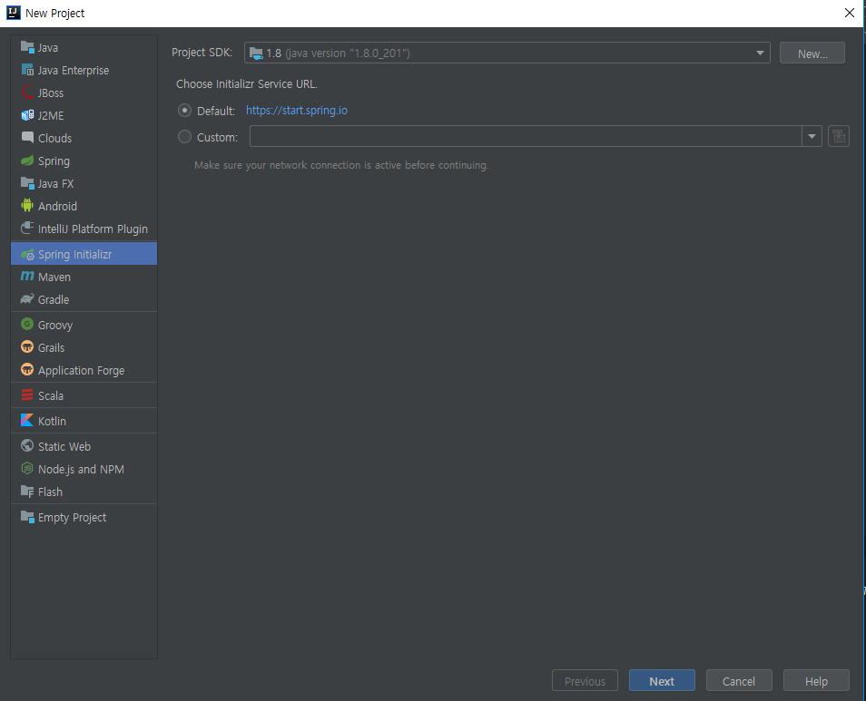
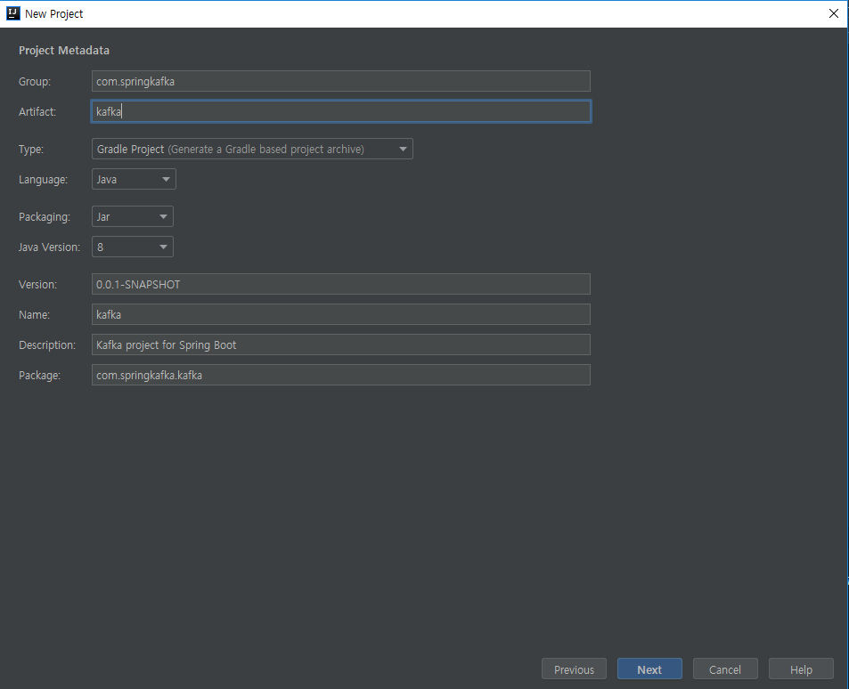
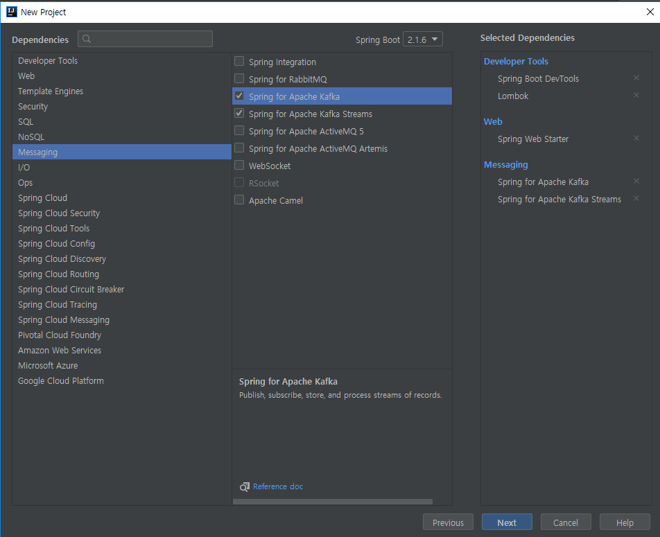
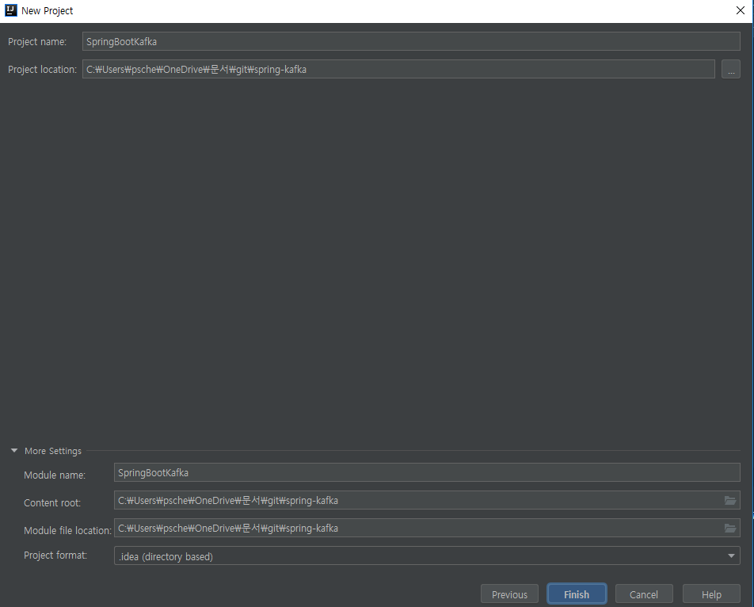
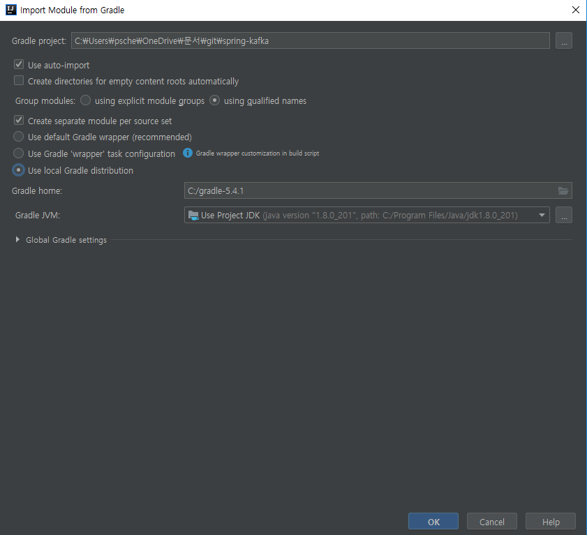
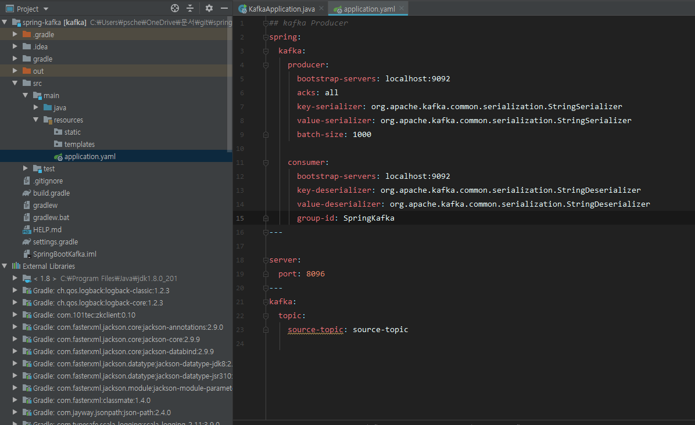
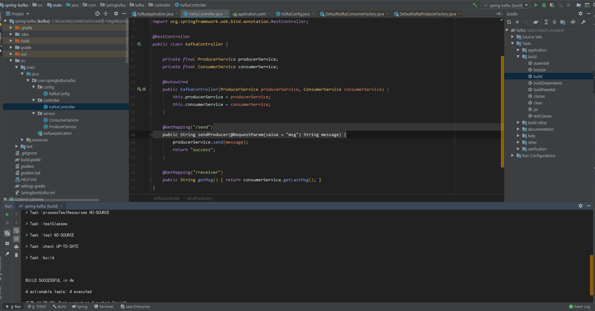
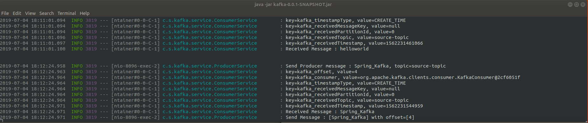
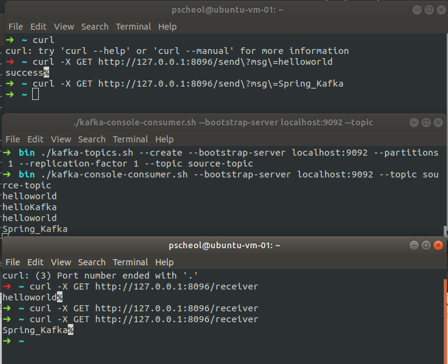
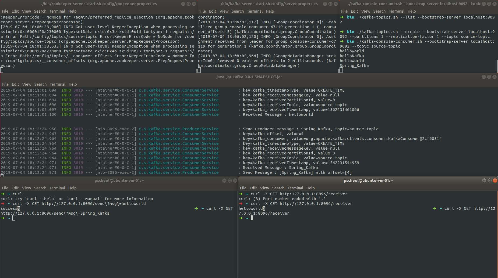

# Spring boot에서 kafka 구축

Spring Boot를 이용하여 kafka API를 사용해보고자 한다.

### 사전조건

* kafka 설치 상태
* 개발도구 설치 상태


### 개발환경

- jdk : 1.8
- IDE : intelliJ
- build : gradle
- kafka 서버는 Ubuntu 18.04LTS에 설치되어 있다.

### 준비

- Producer를 통해 메시지를 보내고 Consumer를 통해 topic에 있는 데이터를 받아오는 프로그램을 간단하게 만들어보자.

|URL |내용  |
|---|---|
|/send?msg=| Kafka source-topic에 메시지를 보낸다.|
|/receiver|Kafka source-topic에 들어간 메시지 한개 받는다.|


### 진행

> #### 1. zooKeeper, kafka 실행

**Zookeeper실행**

```sheel
$ ./bin/kafka-zookeeper-server-start.sh config/zookeeper.properties
```

**Kafka 실행**

```shell
$ ./bin/kafka-server-start.sh config/server.properties
```

> #### 2. Kafka topic 생성

- source-topic을 생성한다.

```shell
$ ./bin/kafka-topics.sh --create --replication-factor 1 --partitions 1 --topic source-topic
```

> #### 3. 구현

**1. 프로젝트 생성**

File -> module or project 선택





**2. Prject Metadata 설정**



**3. Dependencies 설정**

* Web > Spring Web Starter 선택
* Developer Tools > Spring Boot DevTools, Lombok 선택
* Messaging > Spring for Apache kafka, Spring for ApacheKafka Streams 선택




**4. 프로젝트 명 설정**



**5. Gradle 설정**




**6. kafka Producer, Consumer Properties 설정**

- 스프링 부트 프로젝트를 생성하면 application.properties 가 생성되는데 application.properties는 지우고 application.yaml으로 바꿔서 사용했다.

아래와 같이 설정

[application.yaml]
```yaml
## kafka Producer
spring:
  kafka:
    producer:
      bootstrap-servers: localhost:9092
      acks: all
      key-serializer: org.apache.kafka.common.serialization.StringSerializer
      value-serializer: org.apache.kafka.common.serialization.StringSerializer
      batch-size: 1000

    consumer:
      bootstrap-servers: localhost:9092
      key-deserializer: org.apache.kafka.common.serialization.StringDeserializer
      value-deserializer: org.apache.kafka.common.serialization.StringDeserializer
      group-id: SpringKafka
---

server:
  port: 8096
---
kafka:
  topic:
    source-topic: source-topic

```




**7. Producer, Consumer Config 설정**

- @EnableKafka : Kafka를 사용할 수 있도록 자동으로 와이어링 해준다.

```java
@EnableKafka
@Configuration
public class KafkaConfig {
}
```
- Producer 설정
  - producerProps()는 Producer를 실행하기위한 정보를 설정한다.
  - ProducerFactory는 properties의 정보를 넣고 transaction을 설정할 수 있다.
  - KafkaTemplate은 Kafka broker의 topic으로 데이터를 전송하도록 도와주는 역할을 한다.

```java
    @Bean
    public Map<String, Object> producerProps() {
        Map<String, Object> props = new HashMap<>();
        props.put(ProducerConfig.BOOTSTRAP_SERVERS_CONFIG, env.getProperty("spring.kafka.producer.bootstrap-servers"));
        props.put(ProducerConfig.ACKS_CONFIG, env.getProperty("spring.kafka.producer.acks"));
        props.put(ProducerConfig.KEY_SERIALIZER_CLASS_CONFIG, env.getProperty("spring.kafka.producer.key-serializer"));
        props.put(ProducerConfig.VALUE_SERIALIZER_CLASS_CONFIG, env.getProperty("spring.kafka.producer.value-serializer"));
        props.put(ProducerConfig.RETRIES_CONFIG, 0);
        return props;
    }

    @Bean
    public ProducerFactory<String, String> producerFactory() {
        return new DefaultKafkaProducerFactory<String, String>(producerProps());
    }

    @Bean
    public KafkaTemplate<String, String> kafkaTemplate() {
        return new KafkaTemplate<>(producerFactory());
    }
```

- Consumer설정
  - consumerProps()는 Consumer 환경설정 정보를 설정해준다.
  - ConsumerFactory는 consumerProps()의 정보를 초기화를 해준다.
  - KafkaListenerContainerFactory는 여러 개의 컨테이너를 만들 수 있고, 여러개의 factor를 구성할 수도 있다. ConcurrentMessageListenerContainer는 @KafkaListener 를 사용할 수 있게되고 해당 어노테이션을 통해 카프카 Consumer 데이터를 가져올 수 있다.

```java

    public Map<String, Object> consumerProps() {
        Map<String, Object> props = new HashMap<>();
        props.put(ConsumerConfig.BOOTSTRAP_SERVERS_CONFIG, env.getProperty("spring.kafka.consumer.bootstrap-servers"));
        props.put(ConsumerConfig.KEY_DESERIALIZER_CLASS_CONFIG, env.getProperty("spring.kafka.consumer.key-deserializer"));
        props.put(ConsumerConfig.VALUE_DESERIALIZER_CLASS_CONFIG, env.getProperty("spring.kafka.consumer.value-deserializer"));
        props.put(ConsumerConfig.GROUP_ID_CONFIG, env.getProperty("spring.kafka.consumer.group-id"));

        return props;
    }

    @Bean
    public ConsumerFactory<Integer, String> consumerFactory() {
        return new DefaultKafkaConsumerFactory<>(consumerProps());
    }

    @Bean
    KafkaListenerContainerFactory<ConcurrentMessageListenerContainer<Integer, String>> kafkaListenerContainerFactory() {
        ConcurrentKafkaListenerContainerFactory<Integer, String> factory = new ConcurrentKafkaListenerContainerFactory<>();
        factory.setConsumerFactory(consumerFactory());
        factory.setConcurrency(3);
        factory.getContainerProperties().setPollTimeout(3000);
        return factory;
    }
```
[KafkaConfig.java]

```java

import org.apache.kafka.clients.consumer.ConsumerConfig;
import org.apache.kafka.clients.producer.ProducerConfig;
import org.springframework.beans.factory.annotation.Autowired;
import org.springframework.context.annotation.Bean;
import org.springframework.context.annotation.Configuration;
import org.springframework.core.env.Environment;
import org.springframework.kafka.annotation.EnableKafka;
import org.springframework.kafka.config.ConcurrentKafkaListenerContainerFactory;
import org.springframework.kafka.config.KafkaListenerContainerFactory;
import org.springframework.kafka.core.*;
import org.springframework.kafka.listener.ConcurrentMessageListenerContainer;

import java.util.HashMap;
import java.util.Map;

@EnableKafka
@Configuration
public class KafkaConfig {

    private Environment env;

    @Autowired
    public KafkaConfig(Environment env) {
        this.env = env;
    }

    /**
     * Producer Properties
     *
     * @return
     */
    @Bean
    public Map<String, Object> producerProps() {
        Map<String, Object> props = new HashMap<>();
        props.put(ProducerConfig.BOOTSTRAP_SERVERS_CONFIG, env.getProperty("spring.kafka.producer.bootstrap-servers"));
        props.put(ProducerConfig.ACKS_CONFIG, env.getProperty("spring.kafka.producer.acks"));
        props.put(ProducerConfig.KEY_SERIALIZER_CLASS_CONFIG, env.getProperty("spring.kafka.producer.key-serializer"));
        props.put(ProducerConfig.VALUE_SERIALIZER_CLASS_CONFIG, env.getProperty("spring.kafka.producer.value-serializer"));
        props.put(ProducerConfig.RETRIES_CONFIG, 0);
        return props;
    }

    /**
     * Producer Factory
     *
     * @return
     */
    @Bean
    public ProducerFactory<String, String> producerFactory() {
        return new DefaultKafkaProducerFactory<String, String>(producerProps());
    }

    /**
     * KafkaTemplate는 kafka broker의 topic으로 데이터를 전송하도록 도와주는 역할을 한다.
     *
     *
     * @return
     */
    @Bean
    public KafkaTemplate<String, String> kafkaTemplate() {
        return new KafkaTemplate<>(producerFactory());
    }

    /**
     * Consumer Properties
     *
     * @return
     */
    @Bean
    public Map<String, Object> consumerProps() {
        Map<String, Object> props = new HashMap<>();
        props.put(ConsumerConfig.BOOTSTRAP_SERVERS_CONFIG, env.getProperty("spring.kafka.consumer.bootstrap-servers"));
        props.put(ConsumerConfig.KEY_DESERIALIZER_CLASS_CONFIG, env.getProperty("spring.kafka.consumer.key-deserializer"));
        props.put(ConsumerConfig.VALUE_DESERIALIZER_CLASS_CONFIG, env.getProperty("spring.kafka.consumer.value-deserializer"));
        props.put(ConsumerConfig.GROUP_ID_CONFIG, env.getProperty("spring.kafka.consumer.group-id"));

        return props;
    }

    /**
     * Consumer Factory
     *
     * @return
     */
    @Bean
    public ConsumerFactory<Integer, String> consumerFactory() {
        return new DefaultKafkaConsumerFactory<>(consumerProps());
    }

    /**
     * Consumer Container factory
     *ConcurrentKafkaListenerContainerFactory는
     * @return
     */
    @Bean
    KafkaListenerContainerFactory<ConcurrentMessageListenerContainer<Integer, String>> kafkaListenerContainerFactory() {
        ConcurrentKafkaListenerContainerFactory<Integer, String> factory = new ConcurrentKafkaListenerContainerFactory<>();
        factory.setConsumerFactory(consumerFactory());
        factory.setConcurrency(3);
        factory.getContainerProperties().setPollTimeout(3000);
        return factory;
    }
}

```

**8. Producer 구현**

- Producer는 KafkaTemplate를 통해 메시지를 해당 Topic에게 전송할 수 있다.

**kafkaTemplate.send(topic, message);** 이 Kafka 서버로 해당 Topic으로 데이터를 전송하는 역할을 하고 ListenableFuture를 통해 Collback을 받을 수 있다.

```java
ListenableFuture<SendResult<String, String>> future = kafkaTemplate.send(topic, message);
       future.addCallback(new ListenableFutureCallback<SendResult<String, String>>() {
           @Override
           public void onSuccess(SendResult<String, String> result) {
               log.info("Send Message : [{}] with offset=[{}]", message, result.getRecordMetadata().offset());
           }

           @Override
           public void onFailure(Throwable ex) {
               log.info("fail Message : {}, Exception : {}", message, ex.getMessage());
           }
       });
```

[ProducerService.java]

```java
import lombok.extern.slf4j.Slf4j;
import org.springframework.beans.factory.annotation.Autowired;
import org.springframework.beans.factory.annotation.Value;
import org.springframework.kafka.core.KafkaTemplate;
import org.springframework.kafka.support.SendResult;
import org.springframework.stereotype.Service;
import org.springframework.util.concurrent.ListenableFuture;
import org.springframework.util.concurrent.ListenableFutureCallback;

@Slf4j
@Service
public class ProducerService {

    private final KafkaTemplate<String, String> kafkaTemplate;

    @Autowired
    public ProducerService(KafkaTemplate<String, String> kafkaTemplate) {
        this.kafkaTemplate = kafkaTemplate;
    }

    @Value("${kafka.topic.source-topic}")
    private String topic;

    public void send(String message) {
        log.info("Send Producer message : {}, topic={}", message, topic);
        ListenableFuture<SendResult<String, String>> future = kafkaTemplate.send(topic, message);
        future.addCallback(new ListenableFutureCallback<SendResult<String, String>>() {
            @Override
            public void onSuccess(SendResult<String, String> result) {
                log.info("Send Message : [{}] with offset=[{}]", message, result.getRecordMetadata().offset());
            }

            @Override
            public void onFailure(Throwable ex) {
                log.info("fail Message : {}, Exception : {}", message, ex.getMessage());
            }
        });
    }
}

```

**9. Consumer 구현**

- @KafkaListener 어노테이션을 통해 Consumer 정보를 받을 수 있다. 원래는 KafkaConsumer 객체를 통해 topic을 구독하고 consumer.poll() 을통해 topic정보를 Polling 했지만, Spring Kafka에서는 @KafkaListener를 통해 이 역할을 수행한다.
- @KafkaListener 의 상세정보를 보려면 [Spring for Apache Kafka reference](https://docs.spring.io/spring-kafka/reference/html/#kafka-listener-annotation)를 참조

기존 Kafka API호출
```java
private final KafkaConsumer<String, String> consumer = new KafkaConsumer<String, String>(Consumer.createConfig(servers, groupId));

public ConsumerRecords<String, String> consume() {
     this.consumer.subscribe(Collections.singleton(this.topic)); //2. topic publish
     return consumer.poll(Duration.ofMillis(100)); //3. set timeout
 }

```

Spring-Kafka API를 사용할 경우

[ConsumerService.java]
```java
import lombok.Data;
import lombok.extern.slf4j.Slf4j;
import org.springframework.kafka.annotation.KafkaListener;
import org.springframework.messaging.MessageHeaders;
import org.springframework.messaging.handler.annotation.Headers;
import org.springframework.messaging.handler.annotation.Payload;
import org.springframework.stereotype.Service;

@Slf4j
@Data
@Service
public class ConsumerService {

    private String LastMsg;

    @KafkaListener(topics = "${kafka.topic.source-topic}")
    public void receiver(@Payload String message, @Headers MessageHeaders headers) {
        headers.keySet().forEach(key -> log.info("key={}, value={}", key, headers.get(key)));
        log.info("Received Message : {}", message);
        setLastMsg(message);

    }
}
```

**10. Controller 구현**

```java

import com.springkafka.kafka.service.ConsumerService;
import com.springkafka.kafka.service.ProducerService;
import org.springframework.beans.factory.annotation.Autowired;
import org.springframework.web.bind.annotation.GetMapping;
import org.springframework.web.bind.annotation.RequestParam;
import org.springframework.web.bind.annotation.RestController;

@RestController
public class KafkaController {

    private final ProducerService producerService;
    private final ConsumerService consumerService;

    @Autowired
    public KafkaController(ProducerService producerService, ConsumerService consumerService) {
        this.producerService = producerService;
        this.consumerService = consumerService;
    }

    @GetMapping("/send")
    public String sendProducer(@RequestParam(value = "msg") String message) {
        producerService.send(message);
        return "success";
    }

    @GetMapping("/receiver")
    public String getMsg() {
        return consumerService.getLastMsg();
    }
}

```

**11. build**

- 오른쪽 창에서 gradle -> Tasks -> build 에서 clean을 한 후 build를 수행한다.




**12. 실행 결과**

1. build 한 jar파일 실행(war를 만들었으면 톰캣에서 실행하면된다. Spring Boot Web을 선택했기에 내장 톰캣이 있어서 jar로 도 실행가능)

```shell
### .java -jar 파일명.jar
java -jar spring-kafka.jar
```

[spring-kafka.jar 실행]



2. kafka-console-consumer.sh를 실행하여 topic 데이터가 잘들어오는지 확인해보자

```shell
$ ./bin/kafka-console-consumer.sh --bootstrap-server localhost:9092 --topic source-topic
```

3. curl을 통해 테스트 수행
```
## /send?msg 요청
$ curl -X GET http://127.0.0.1:8096/send?msg=helloworld

## /receiver 요청
$ curl -X GET http://127.0.0.1:8096/receiver
```

[API 테스트 요청결과]



[전체 결과]




**참조 사이트**
 https://docs.spring.io/spring-kafka/reference/html/
