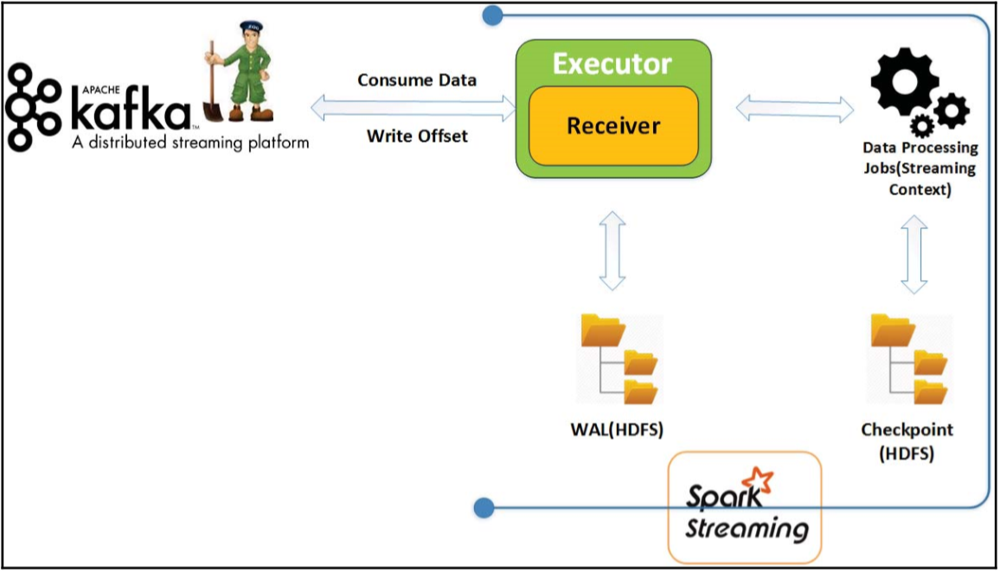
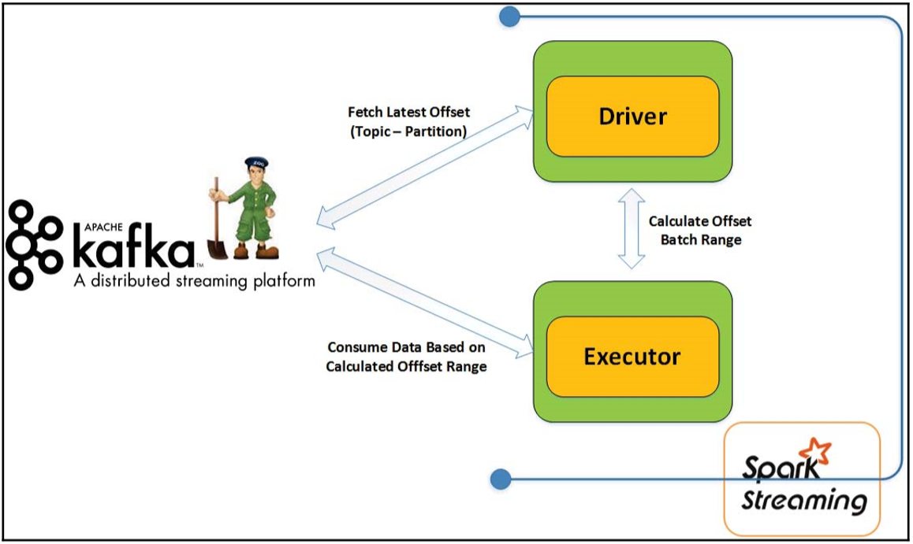

# Kafka에 Spark 스트리밍 연결

### Spark Streaming
스파크 스트리밍은 빠르고 확장성이 용이하며, 빠른 처리성능과 내결함성을 지원하는 실시간 처리 시스템이다. 데이터 스트리밍은 생산 로그, 클릭 흐름(click stream) 데이터, kafka, AWS Kinesis, flume 등의 다양한 데이터를 제공하는 시스템을 데이터 소스로 활용한다. 또한 데이터를 수신하는 API를 제공하고, 데이터에서 가치있는 값을 얻기 위해 복잡한 알고리즘을 적용한다. 최종적으로 가공된 데이터는 일종의 저장소 시스템으로 향하게 된다.

스파크에는 두 가지 접근 방식이 있다.

- 수신자 기반 접근방식(Receiver-based approach)
- 직접 접근 방식(Direct approach)

##### **1. 수신자 기반 통합 접근방식(Receiver-based approach)**

스파크는 수신자를 구현하기 위해 상위 레벨의 컨슈머 API를 사용한다. kafka Topic Partition에서 받은 데이터는 스파크 실행기와 스트리밍 잡(Streaming Job) 프로세스에 저장된다. 하지만 스파크 수신자는 모든 실행기에 걸쳐 메시지를 복제하는데. 이것은 하나의 실행기가 실패할 경우 다른 실행기가 처리할 복제된 데이터를 제공할 수 있어야 하기 때문이다. 스파크는 이런 방식으로 데이터에 대한 내 결함성을 제공한다.

스파크 수신자는 메시지가 성공적으로 실행기에 복제될 때만 브로커에게 통지를 하는데, 그렇지 않으면 주키퍼에 메시지 오프셋이 커밋되지 않고, 메시지는 아직 읽지 않은 상태로 남게 된다.

> 스파크 드라이버에 장애가 나게 될 경우 모든 실행 프로그램을 종료하므로 실행기에서 사용할 수 있는 데이터가 손실된다. 스파크 수신자가 그러한 메시지에 대해 이미 ACK를 보냈고, 주키퍼로 오프셋을 성공적으로 커밋을 했으면 레코드가 처리됐거나 처리되지 않았는지 알 수 없으므로 레코드를 잃어버리게 된다.

이 문제를 방지하기 위한 방법
1. 로그 선행 기입(WAL : Write-Ahead Log)
2. 정확한 1회 처리
3. 검사점(checkpoint)

**수신자 기반 통합 접근 방식의 단점**

- 처리성능 : 로그 선행 기입과 검사점 활성화로 인한 처리성능이 저하될 수 있다.
- 저장소 : 스파크 실행기 버퍼에 한 세트의 데이터를 저장하고, 동일 데이터에 대한 하나의 세트를 선행 기입 로그용 HDFS에 저장한다.
- 데이터 손실 : 로그 선행 기입을 활성화하지 않았다면 데이터를 손실할 가능성이 크고, 일부 중요한 어플리케이션에 심각한 영향을 줄 수 도 있다.

##### **2. 직접 접근 방식(Direct Approach)**

수신자 기방 통합 접근방식의 문제점과 단점을 극복하기 위한 방식으로 배치라고 하는 일정 범위의 오프셋으로 카프카에서 메시지를 주기적으로 질의해온다. 스파크는 하위 레벨 컨슈머 API를 사용하고, 정의된 오프셋 범위로 카프카에서 직접 메시지를 가져온다. 병렬 처리라는 카프카에서 파티션 단위로 정의되며, 스파크의 직접 접근 방식은 파티션 장점으로 활용한다.

기능

- 병렬 처리와 처리 성능 : RDD 안의 파티션 수는 카프카 토픽 하나의 파티션 개수에 의해 정의되고, 카프카 토픽 파티션에서 병렬로 메시지를 읽는다.
- 로그 선행 기입 배제 : 데이터 손실을 막기 위해 로그 선행 기입을 하지 않고, 카프카에서 데이터를 직접 읽고 처리된 메시지를 검사점에서 커밋한다.
- 주키퍼 배제 : 기본값으로 스파크에 의해 사용되는 오프셋을 커밋하기 위해 주키퍼를 사용하지 않는다.
- 정확한 1회 처리 : 정확하게 한 번만 처리할 수 있는 기회를 제공한다.
